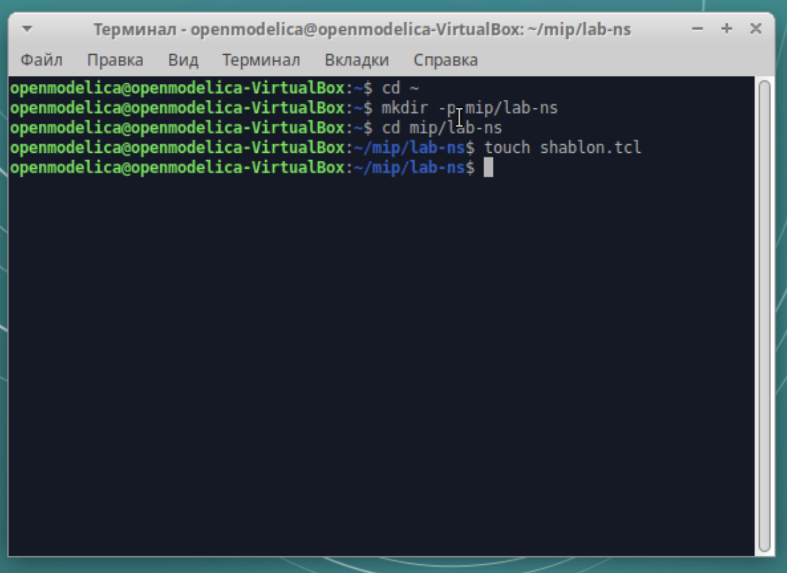
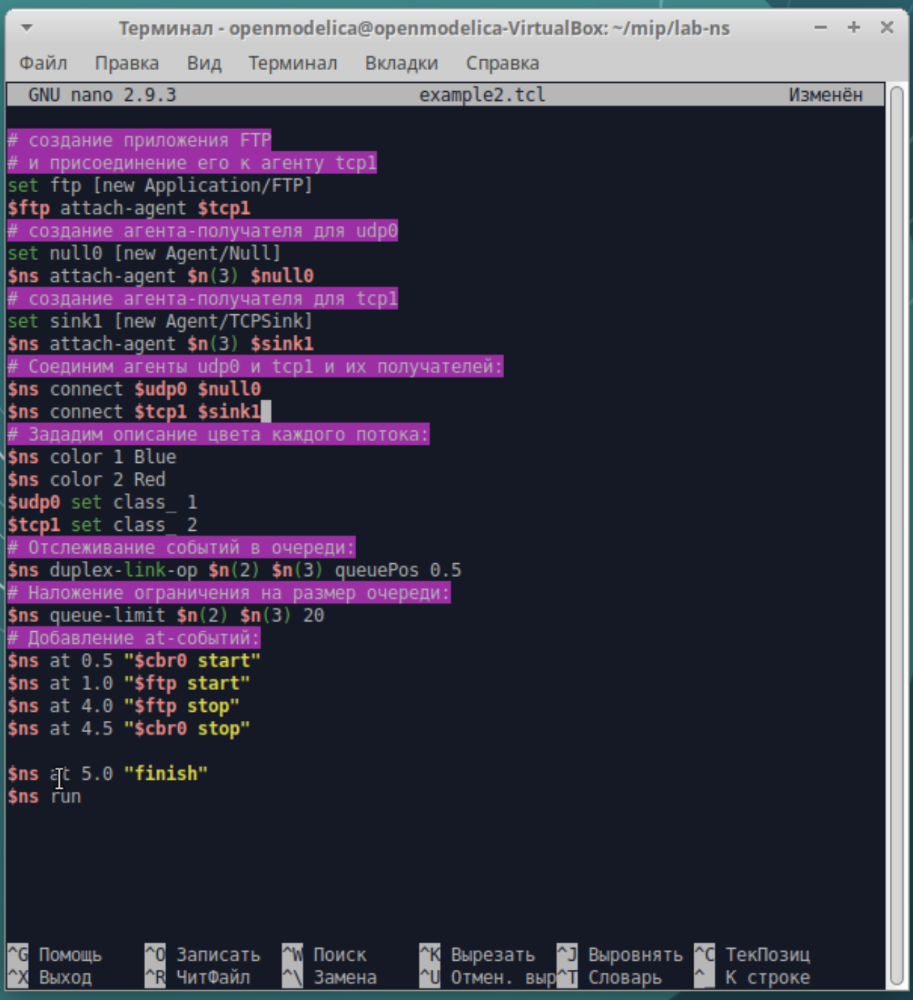
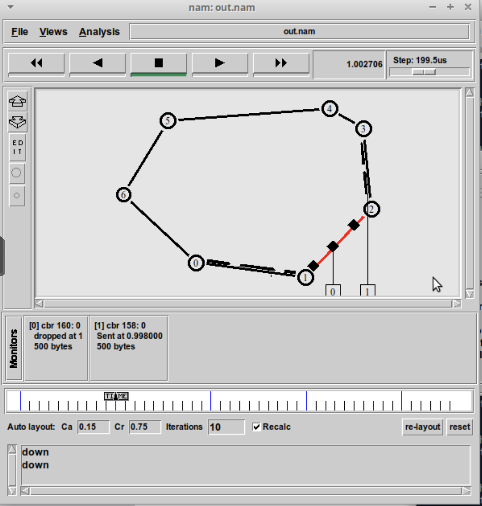
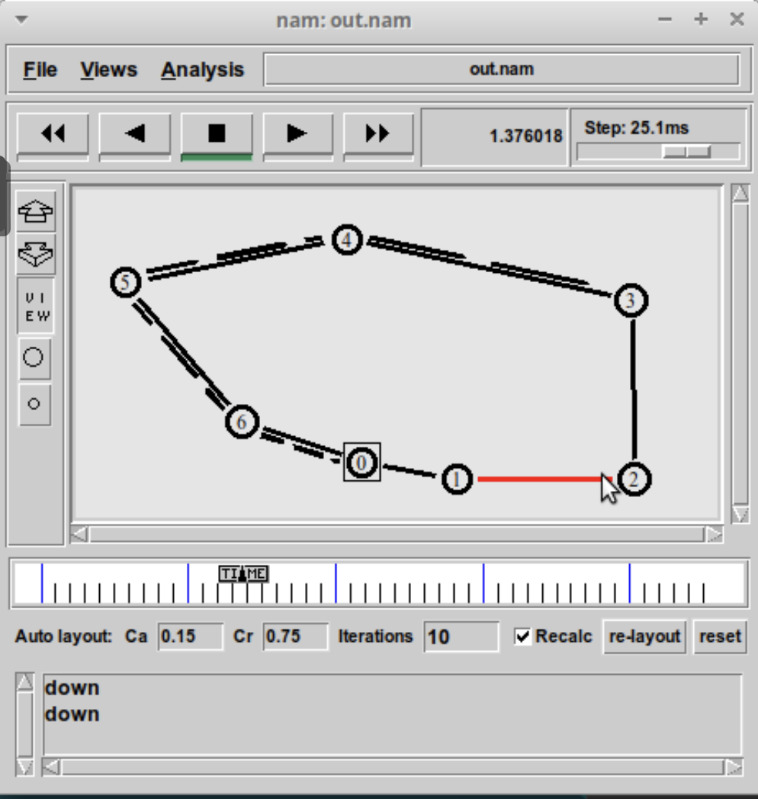
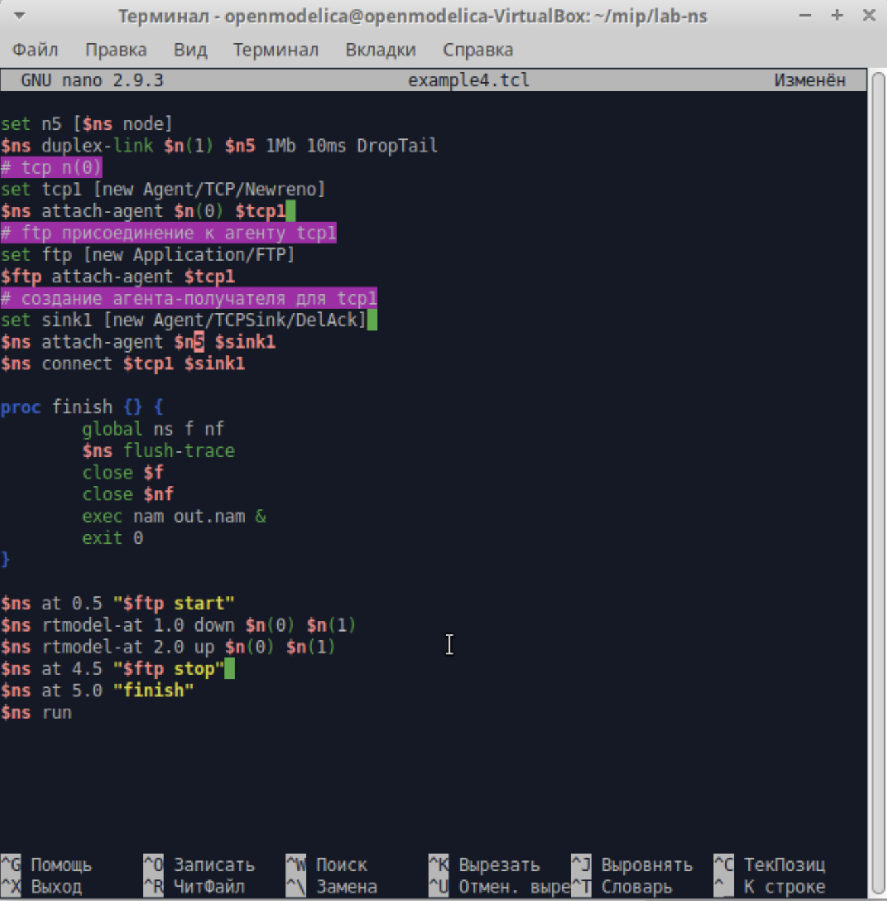
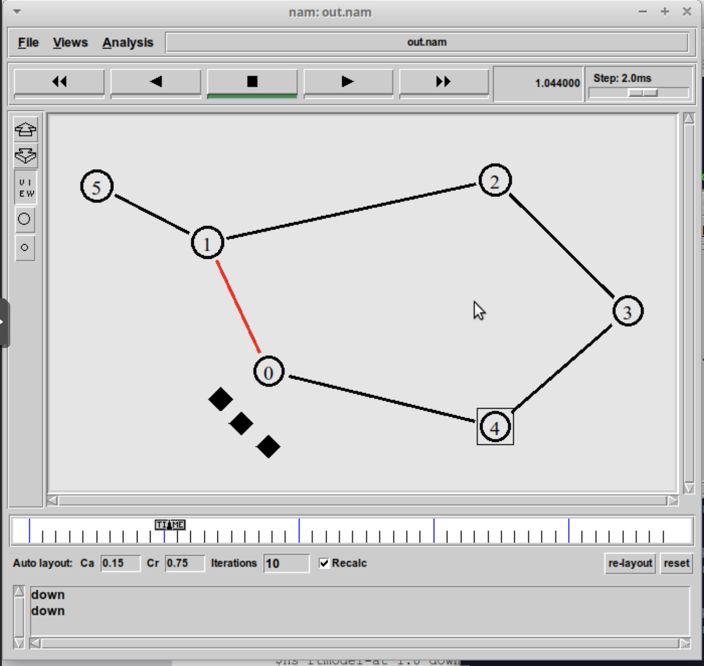
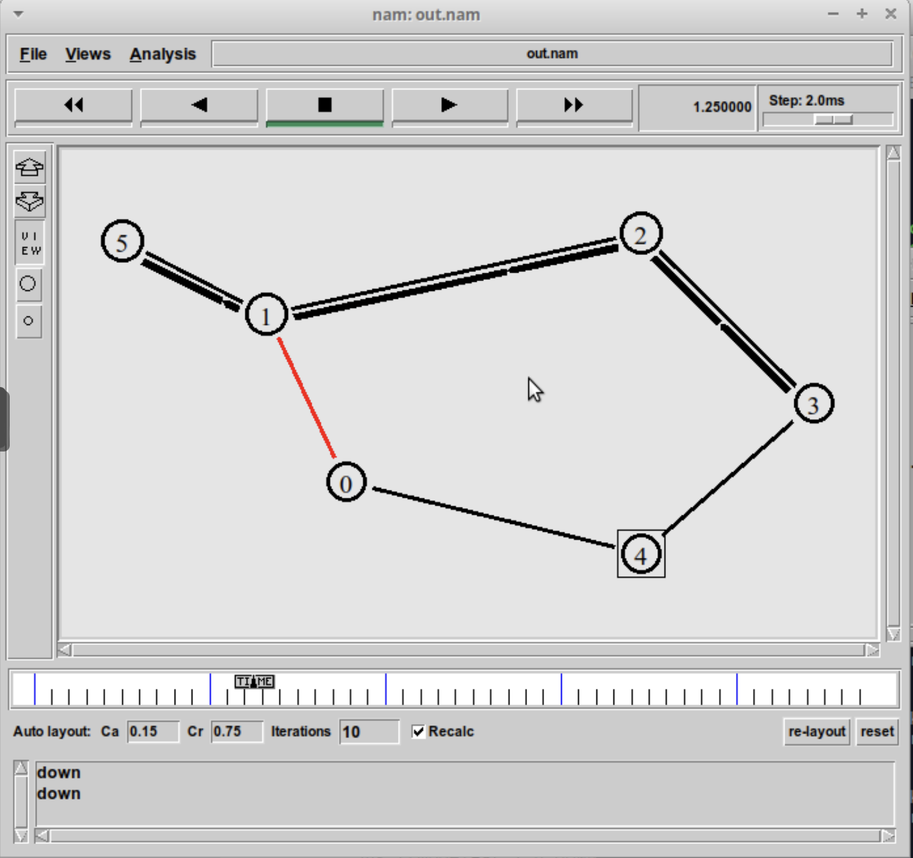
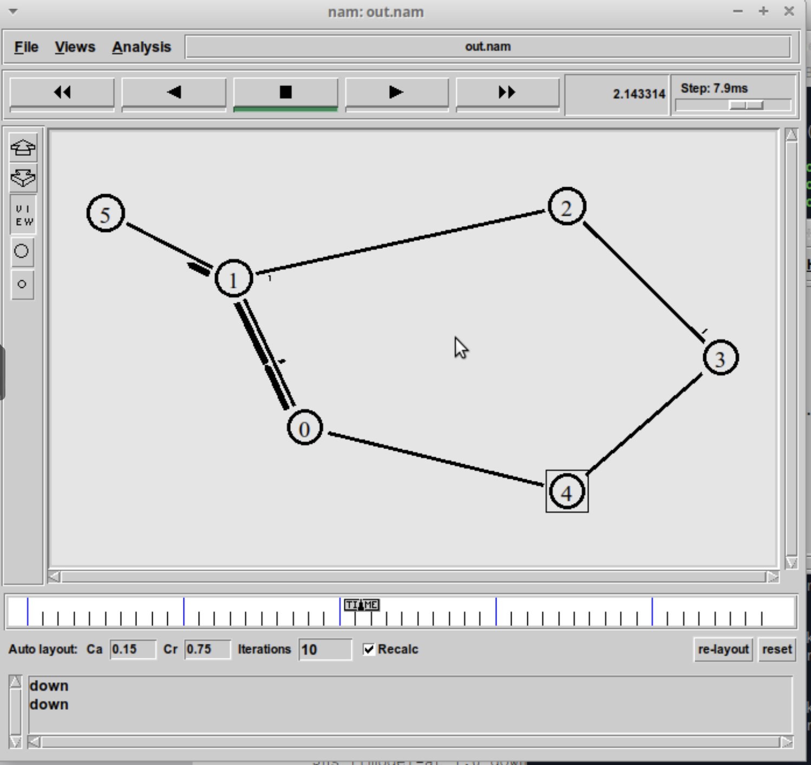

---
# Preamble

## Author
author:
  name: Шубнякова Дарья НКНбд-01-22
  email: 1132226452@pfur.ru
  affiliation:
    - name: Российский университет дружбы народов
      country: Российская Федерация
      postal-code: 117198
      city: Москва
      address: ул. Миклухо-Маклая, д. 6
## Title
title: Лабораторная работа №1
subtitle: Простые модели компьютерной сети
license: CC BY
## Generic options
lang: ru-RU
crossref:
  fig-title: "Рисунок"
  tbl-title: "Таблица"
  lst-title: "Листинг"
## Formats
format:
### Pdf output format
  beamer:
    toc: true
    toc-title: Содержание
    number-sections: true
    colorlinks: false
    toc-depth: 2
    slide-level: 2
    aspectratio: 169
    section-titles: true
    theme: metropolis
    theme-options:
      - progressbar=frametitle
      - sectionpage=progressbar
      - numbering=fraction
    pdf-engine: xelatex
    include-in-header:
      text: |
        \usepackage{fontspec}
        \setmainfont{Times New Roman}
        \setsansfont{Arial}
        \setmonofont{Courier New}
        \usepackage{polyglossia}
        \setdefaultlanguage{russian}
        \setotherlanguage{english}
        \usepackage{caption}
        \captionsetup[figure]{name=Рисунок}

### Html output
  revealjs:
    transition: slide
    margin: 0.2
    smaller: false
    output-ext: html
    theme: beige
    logo: _resources/image/logo_rudn.png
---

# Вводная часть

## Цели и задачи

Приобретение навыков моделирования сетей передачи данных с помощью средства имитационного моделирования NS-2, а также анализ полученных результатов моделирования.

# Основная часть

## Выполнение лабораторной работы
Создаем директорию mip для работы с NS и создаем шаблон для дальнейшего выполнения лабораторной.

{width=70%}

## Берем шаблон из задания и у нас запускается пустой симулятор.

{width=70%}

## Работаем с первым примером из задания, смотрим, что будет происходить.

{width=70%}

## У нас появилась сеть из двух узлов и идущие пакеты из 0 в 1.

{width=70%}

## Берем код для второго примера и вставляем его, параллельно читая все комментарии к тому, что делаем.

{width=70%}

## {width=70%}

## {width=70%}

## При запуске скрипта можно заметить, что по соединениям между узлами n(0)–n(2) и n(1)–n(2) к узлу n(2) передаётся данных больше, чем способно передаваться по соединению от узла n(2) к узлу n(3). Действительно, мы передаём 200 пакетов в секунду от каждого источника данных в узлах n(0) и n(1), а каждый пакет имеет размер 500 байт. Таким образом, полоса каждого соединения 0,8 Mb, а суммарная — 1,6 Mb.

{width=70%}

## Но соединение n(2)–n(3) имеет полосу лишь 1 Mb. Следовательно, часть пакетов должна теряться. В окне аниматора можно видеть пакеты в очереди, а также те пакеты, которые отбрасываются при переполнении.

{width=70%}

## Далее мы строим третий пример с кольцевой топологией сети. Вводим код, данный в задании.

{width=70%}

## Видим, как у нас идут пакеты из 0 в 3.

{width=70%}

## Во время разрыва соединения у нас происходит утечка пакетов.

{width=70%}

## И наши пакеты начинают двигаться по более длинному пути.

{width=70%}

## После восстановления сети пакеты снова движутся по короткому пути.

{width=70%}

## Пишем код для упражнения. Его можно найти в моем репозитории на GitHub dishubnyakova/simmod в документах к первой лабораторной работе.

{width=70%}

{width=70%}

## Тут все как с примером с кольцевой топологией сети кроме того, что нам пришлось подключить узел 5. Видим, как у нас идут пакеты.

{width=70%}

## Потом сеть разрывается, мы теряем пакеты.

{width=70%}

## Они находят себе новый путь.

{width=70%}

## А после восстановления сети, восстанавливается и передача пакетов.

{width=70%}

# Результаты

Мы научились делать три вида моделей, из которых потом создали свою собственную из упражнения, где:

* Передача данных осуществляется от узла n(0) до узла n(5) по кратчайшему пути в течение 5 секунд модельного времени;
* Передача данных должна идти по протоколу TCP (тип Newreno), на принимающей стороне используется TCPSink-объект типа DelAck; поверх TCP работает протокол FTP с 0,5 до 4,5 секунд модельного времени;
* С 1 по 2 секунду модельного времени происходит разрыв соединения между узлами n(0) и n(1);
* При разрыве соединения маршрут передачи данных должен измениться на резервный, после восстановления соединения пакеты снова должны пойти по кратчайшему пути.

