---
# Preamble

## Author
author:
  - name: Шубнякова Дарья НКНбд-01-22
    email: 1132226452@pfur.ru
    affiliation:
      - name: Российский университет дружбы народов
        country: Российская Федерация
        postal-code: 117198
        city: Москва
        address: ул. Миклухо-Маклая, д. 6

## Title
title: "Лабораторная работа №1"
subtitle: "Простые модели компьютерной сети"
license: "CC BY"

## Generic options
lang: ru-RU
number-sections: true
toc: true
toc-title: "Содержание"
toc-depth: 2

## Formats
format:
  ### Pdf output format
  pdf:
    toc: true
    number-sections: true
    colorlinks: false
    toc-depth: 2
    documentclass: article
    papersize: a4
    fontsize: 12pt
    linestretch: 1.5
    babel-lang: russian
    babel-otherlangs: english
    indent: true
    header-includes: |
      \usepackage{indentfirst}
      \usepackage{float}
      \floatplacement{figure}{H}
      \usepackage{fontspec}
      \setmainfont{Times New Roman}
      \usepackage{titling}
      \renewcommand{\maketitlehooka}{\null\vfill}
      \renewcommand{\maketitlehookd}{\vfill\null\newpage}

  ### Docx output format
  docx:
    toc: true
    number-sections: true
    toc-depth: 2
---

\newpage

# Цель работы

Приобретение навыков моделирования сетей передачи данных с помощью средства имитационного моделирования NS-2, а также анализ полученных результатов моделирования.

# Задание

Ознакомиться с программой NS-2. Реализовать 4 модели.

# Теоретическое введение

Network Simulator (NS-2) — один из программных симуляторов моделирования процессов в компьютерных сетях. NS-2 позволяет описать топологию сети, конфигурацию источников и приёмников трафика, параметры соединений (полосу пропускания, задержку, вероятность потерь пакетов и т.д.) и множество других параметров моделируемой системы. Данные о динамике трафика, состоянии соединений и объектов сети, а также информация о работе протоколов фиксируются в генерируемом trace-файле.

# Выполнение лабораторной работы

Создаем директорию mip для работы с NS-и создаем шаблон для дальнейшего выполения лабораторной([рис. @fig-001]).

{#fig-001 width=70%}

Берем шаблон из задания и у нас запускается пустой симулятор([рис. @fig-002]).

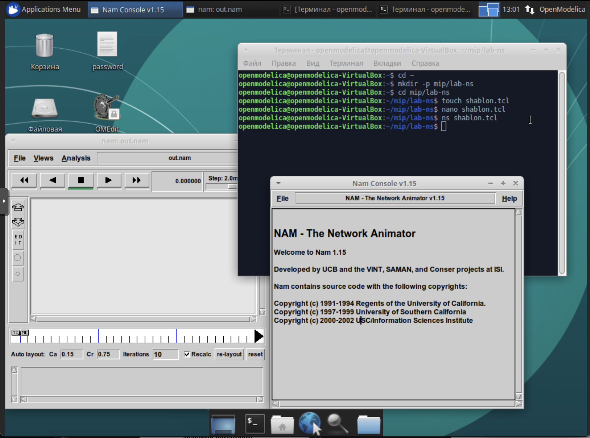{#fig-002 width=70%}

Работаем с первым примером из задания смотрим, что будет происходить([рис. @fig-003]).

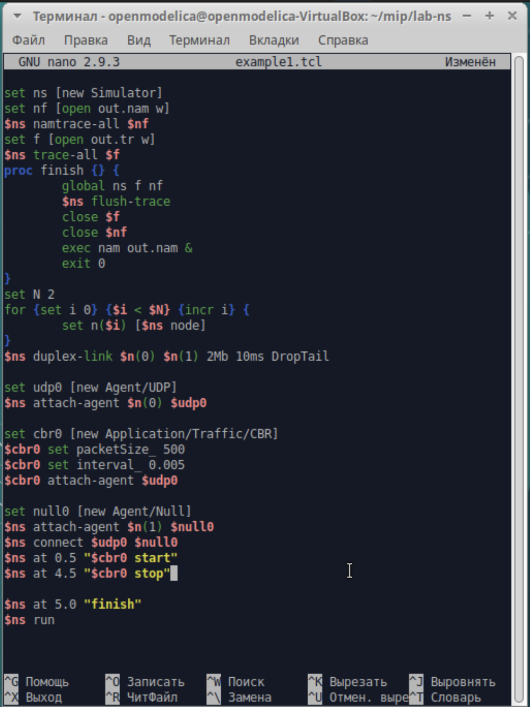{#fig-003 width=70%}

У нас появилась сеть из двух узлов и идущие пакеты из 0 в 1([рис. @fig-004]).

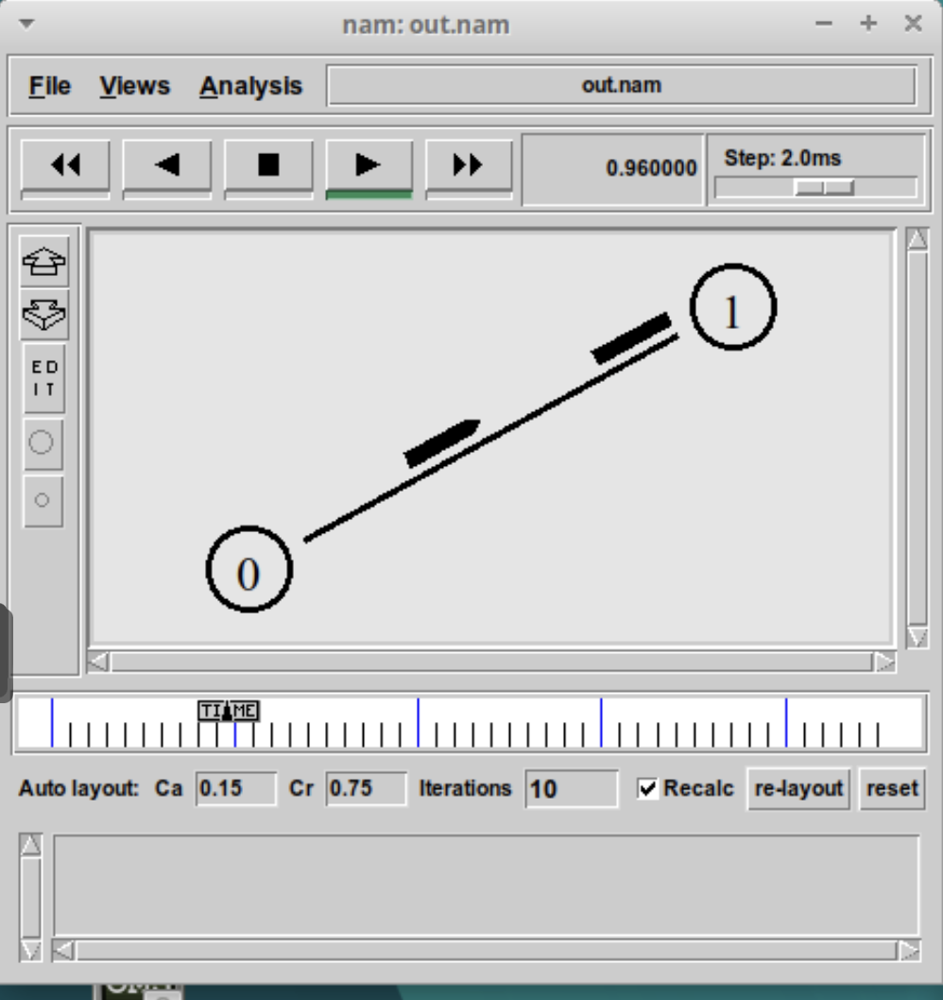{#fig-004 width=70%}

Берем код для второго примера и вставляем его, параллельно читая все комментарии к тому, что делаем([рис. @fig-005] [рис. @fig-006] [рис. @fig-007]).

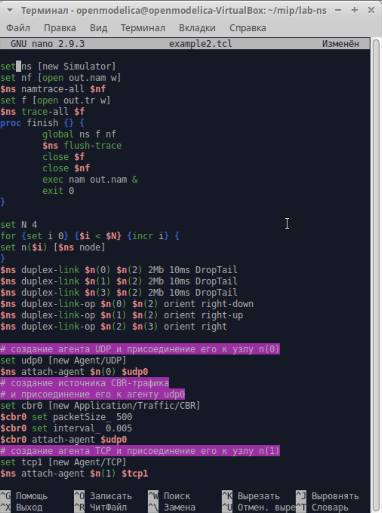{#fig-005 width=70%}

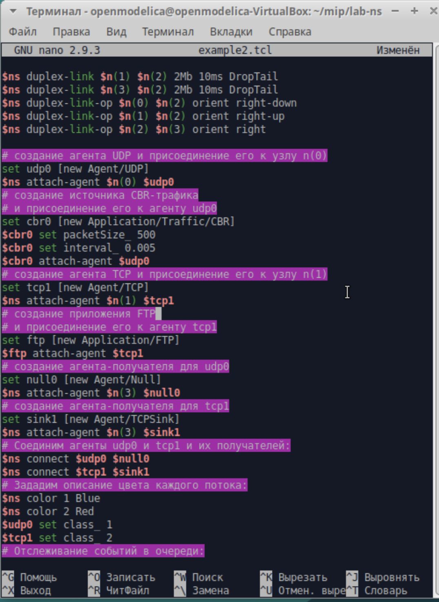{#fig-006 width=70%}

{#fig-007 width=70%}

При запуске скрипта можно заметить, что по соединениям между узлами n(0)–n(2) и n(1)–n(2) к узлу n(2) передаётся данных больше, чем способно передаваться по соединению от узла n(2) к узлу n(3). Действительно, мы передаём 200 пакетов в секунду от каждого источника данных в узлах n(0) и n(1), а каждый пакет имеет размер 500 байт. Таким образом, полоса каждого соединения 0,8 Mb, а суммарная — 1,6 Mb([рис. @fig-008]).

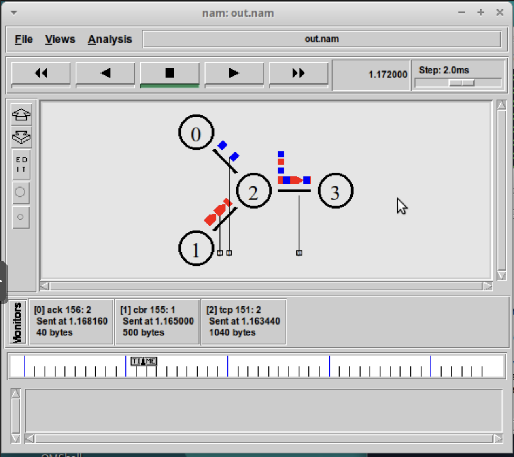{#fig-008 width=70%}

Но соединение n(2)–n(3) имеет полосу лишь 1 Mb. Следовательно, часть пакетов должна теряться. В окне аниматора можно видеть пакеты в очереди, а также те пакеты, которые отбрасываются при переполнении([рис. @fig-009]).

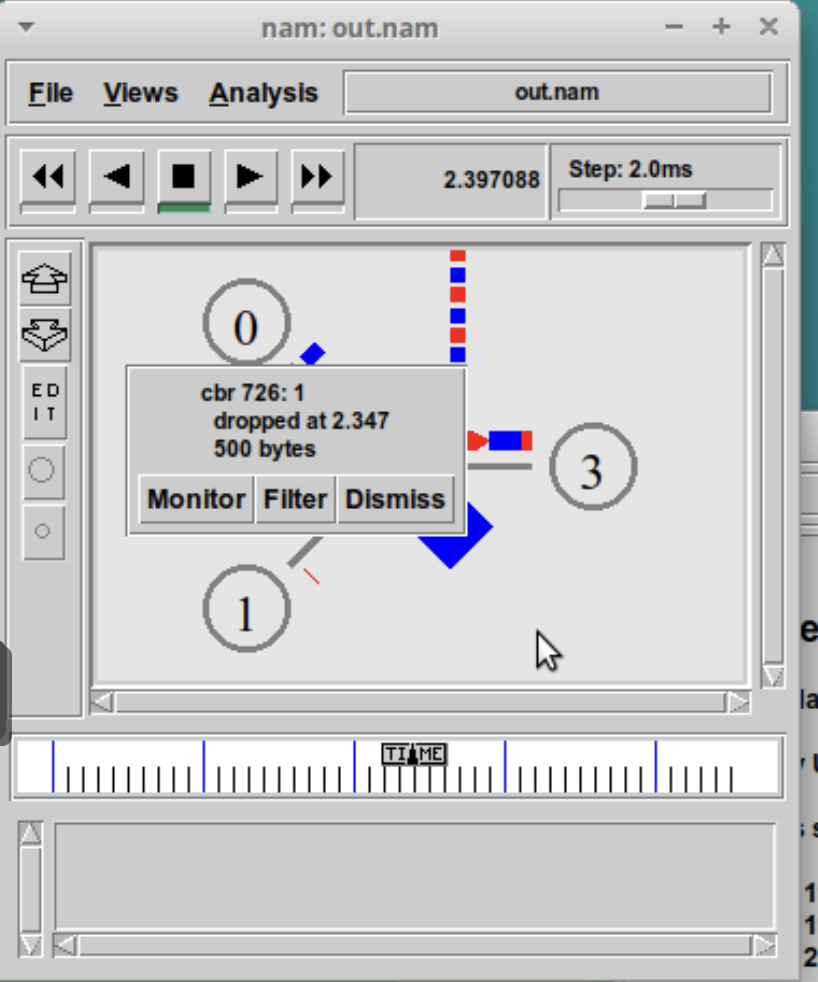{#fig-009 width=70%}

Далее мы строим третий пример с кольцевой топологией сети. Вводим код, данный в задании ([рис. @fig-010]).

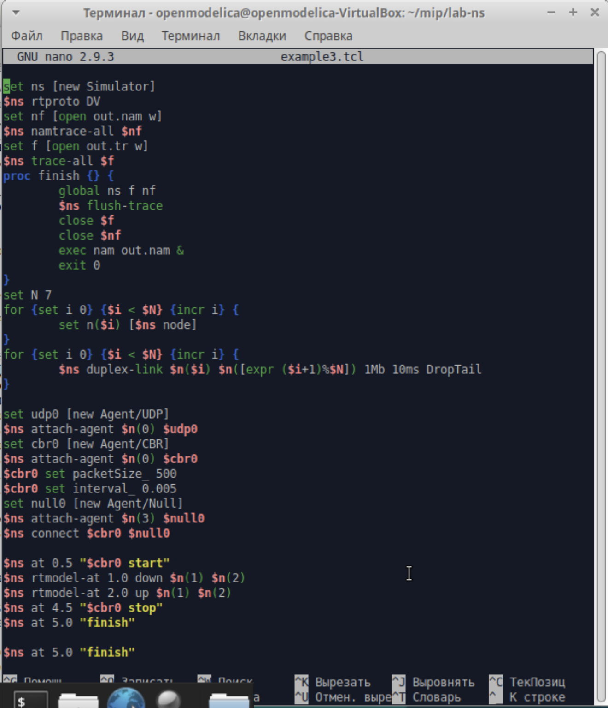{#fig-010 width=70%}

Видим, как у нас идут пакеты из 0 в 3 ([рис. @fig-011]).

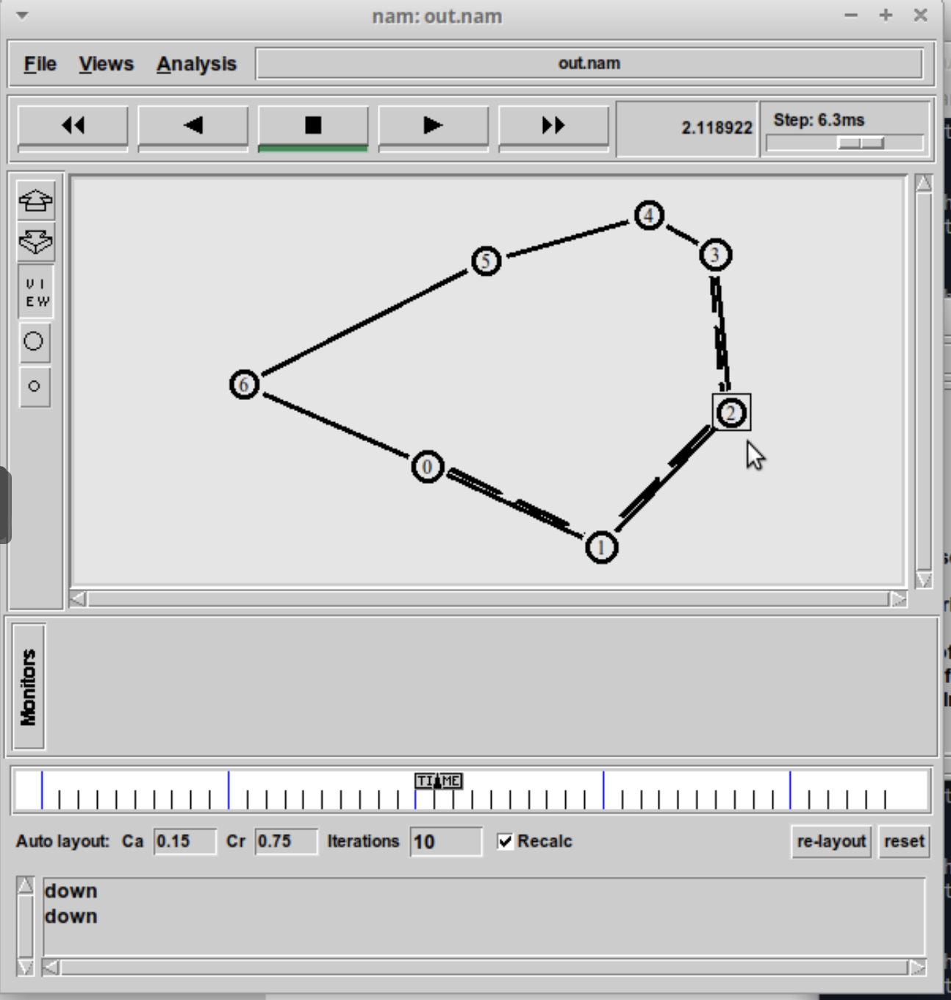{#fig-011 width=70%}

Во время разрыва соединения у нас происходит утечка пакетов ([рис. @fig-012]).

{#fig-012 width=70%}

И наши пакеты начинают двигаться по более длинному пути ([рис. @fig-013]).

{#fig-013 width=70%}

После восстановления сети пакеты снова движутся по короткому пути ([рис. @fig-014]).

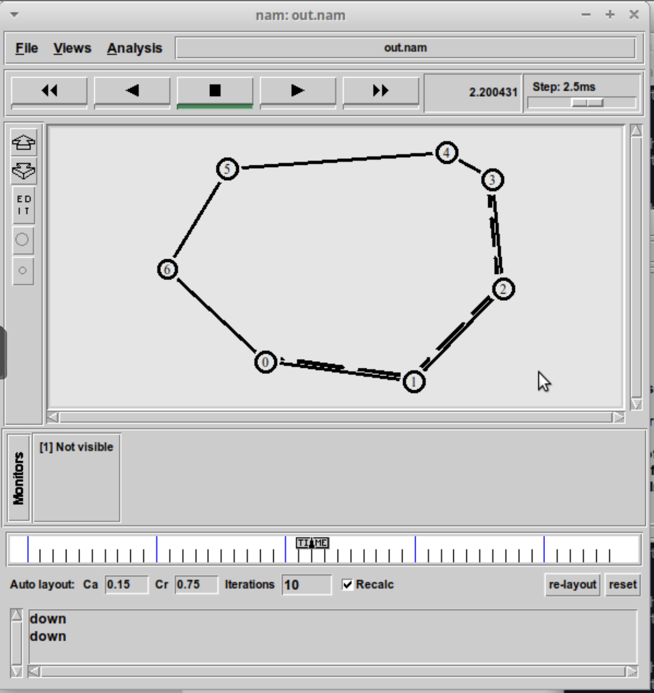{#fig-014 width=70%}

Пишем код для упражнения. Его можно найти в моем репозитории на GitHub dishubnyakova/simmod в документах к первой лабораторной работе ([рис. @fig-015]).

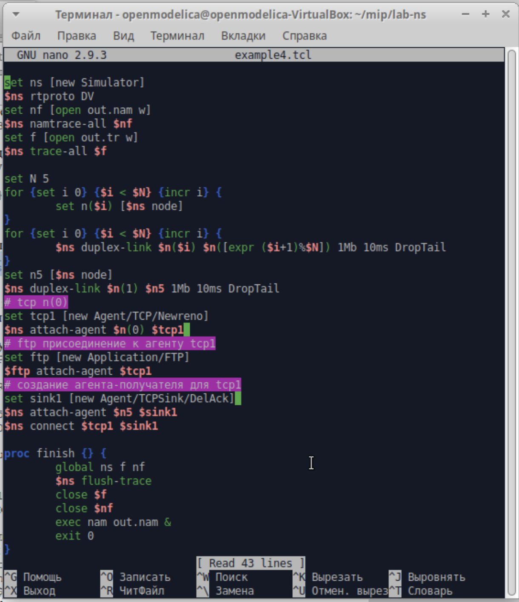{#fig-015 width=70%}

{#fig-016 width=70%}

Тут все как с примером с кольцевой топологией сети кроме того, что нам пришлось подключить узел 5. Видим, как у нас идут пакеты ([рис. @fig-017]).

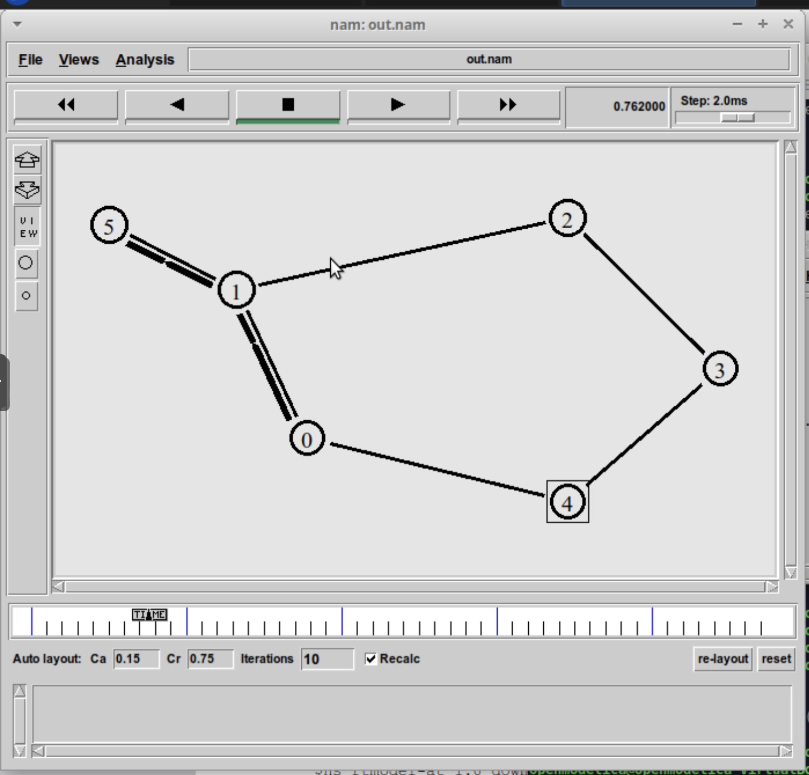{#fig-017 width=70%}

Потом сеть разрывается, мы теряем пакеты ([рис. @fig-018]).

{#fig-018 width=70%}

Они находят себе новый путь ([рис. @fig-019]).

{#fig-019 width=70%}

А после восстановления сети, восстанавливается и передача пакетов ([рис. @fig-020]).

{#fig-020 width=70%}

# Выводы

Мы научились делать три вида моделей, из которых потом создали свою собственную из упражнения, где:
- передача данных осуществляется от узла n(0) до узла n(5) по кратчайшему пути в течение 5 секунд модельного времени;
- передача данных должна идти по протоколу TCP (тип Newreno), на принимающей стороне используется TCPSink-объект типа DelAck; поверх TCP работает протокол FTP с 0,5 до 4,5 секунд модельного времени;
- с 1 по 2 секунду модельного времени происходит разрыв соединения между узлами n(0) и n(1);
- при разрыве соединения маршрут передачи данных должен измениться на резервный, после восстановления соединения пакеты снова должны пойти по кратчайшему пути.
