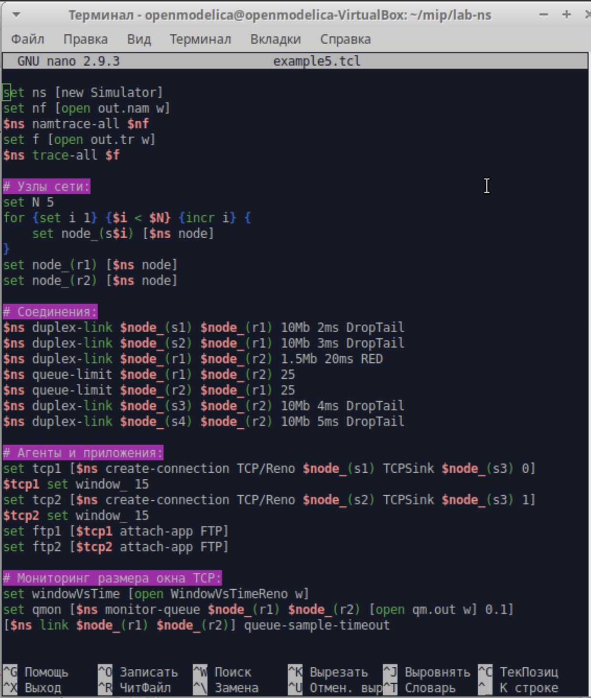
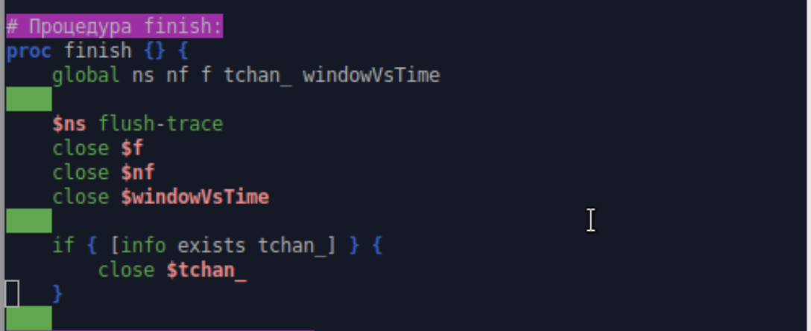
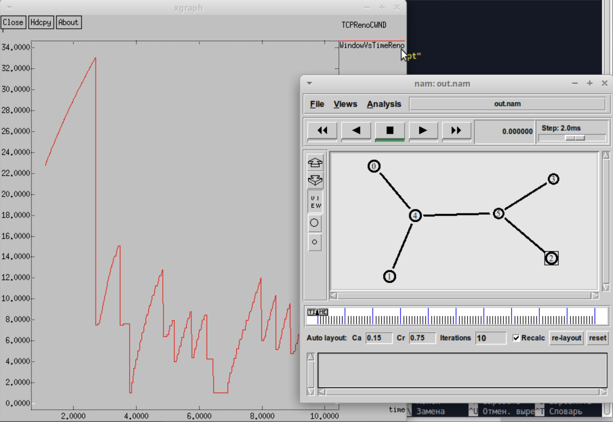
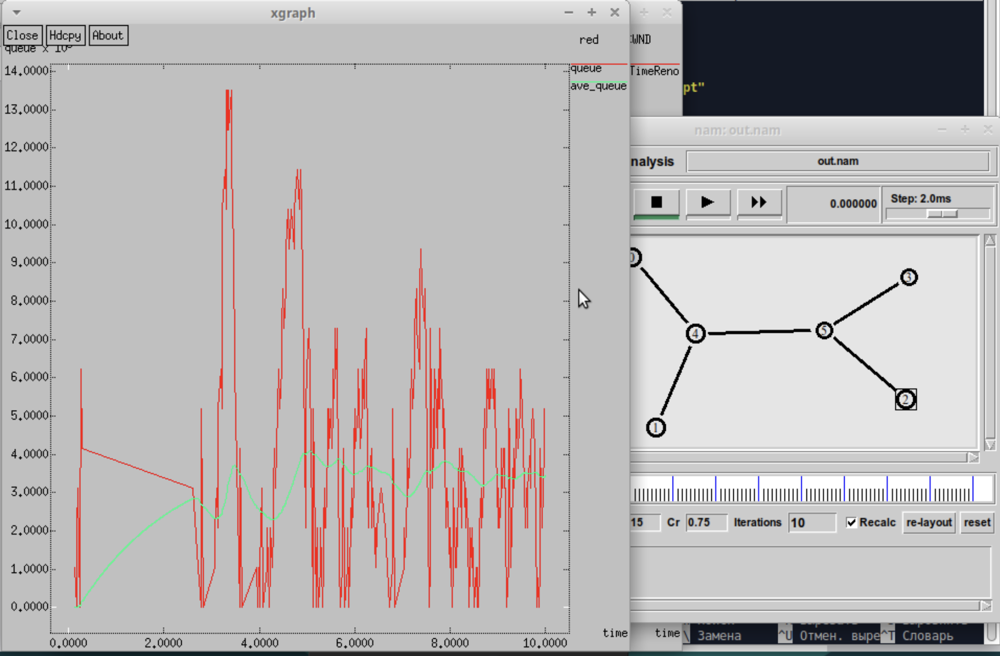
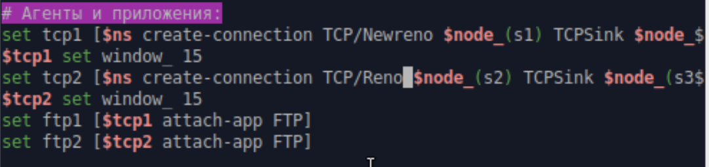
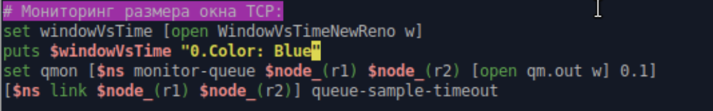

---
# Preamble

## Author
author:
  name: Шубнякова Дарья НКНбд-01-22
  email: 1132226452@pfur.ru
  affiliation:
    - name: Российский университет дружбы народов
      country: Российская Федерация
      postal-code: 117198
      city: Москва
      address: ул. Миклухо-Маклая, д. 6
## Title
title: Лабораторная работа №2
subtitle: Исследование протокола TCP и алгоритма управления очередью RED
license: CC BY
## Generic options
lang: ru-RU
crossref:
  fig-title: "Рисунок"
  tbl-title: "Таблица"
  lst-title: "Листинг"
## Formats
format:
### Pdf output format
  beamer:
    toc: true
    toc-title: Содержание
    number-sections: true
    colorlinks: false
    toc-depth: 2
    slide-level: 2
    aspectratio: 169
    section-titles: true
    theme: metropolis
    theme-options:
      - progressbar=frametitle
      - sectionpage=progressbar
      - numbering=fraction
    pdf-engine: xelatex
    include-in-header:
      text: |
        \usepackage{fontspec}
        \setmainfont{Times New Roman}
        \setsansfont{Arial}
        \setmonofont{Courier New}
        \usepackage{polyglossia}
        \setdefaultlanguage{russian}
        \setotherlanguage{english}
        \usepackage{caption}
        \captionsetup[figure]{name=Рисунок}

### Html output
  revealjs:
    transition: slide
    margin: 0.2
    smaller: false
    output-ext: html
    theme: beige
    logo: _resources/image/logo_rudn.png
---

# Вводная часть

## Цели и задачи

- Исследовать протокол TCP и алгоритм управления очередью RED. Требуется разработать сценарий, реализующий модель, построить в Xgraph график изменения TCP-окна, график изменения длины очереди и средней длины очереди.
– Изменить в модели на узле s1 тип протокола TCP с Reno на NewReno, затем на
Vegas. Сравните и поясните результаты.
– Внести изменения при отображении окон с графиками (измените цвет фона,
цвет траекторий, подписи к осям, подпись траектории в легенде).

# Основная часть

## Выполнение лабораторной работы
Создаем нужную нам модель с дуплексными узлами. Берем алгоритм из лабораторной работы.

{width=70%}

## Вот так будет выглядеть процедура финиш.

{width=70%}

## {width=70%}

## И пишем часть для отображения графиков в Xgraph.

{width=70%}

## Так будет выглядеть график динамики размера окна TCP Reno.

{width=70%}

## А здесь мы видим график динамики длины очереди и средней длины очереди.

{width=70%}

## Меняем на алгоритм NewReno, важно соблюдать именно такое написание, как на скриншоте.

{width=70%}

## Меняем цвет линий графика, фон графика, слегка меняем подписи осей, легенду и названия окон, чтобы показать освоение навыков в Xgraph.

{width=70%}

## Меняем так же цвет линии в графике динамики размера окна TCP.

{width=70%}

## Видим, что все изменения были применены, и оцениваем график TCP NewReno.

{width=70%}

## Меняем цвет линии на графике динамики размера окна TCP и на первом узле ставим TCP Vegas.

{width=70%}

## И меняем тайтлы и цвета для графика средней и текущей очередей.

{width=70%}

## Оцениваем работу при TCP Vegas.

{width=70%}

# Результаты

Графики динамики размера окна у Reno и NewReno довольно похожи, второй действует чуть более плавно и нет таких сильных разбросов на протяжении работы. График динамики размера окна TCP Vegas очень ступенчатый, перепады резкие, нет плавных линий. В сети с RED очередью:
- Reno: постоянно "прощупывает" пределы пропускной способности
- Vegas: находит оптимальный уровень и держится near него
- При изменении условий Vegas делает шаг к новому оптимальному уровню

# Результаты

График средней и текущей очередей у NewReno и Reno опять же похожи, но текущая очередь у NewReno сразу начинает выравниваться после пика, а у Reno это происходит постепенно. График Vegas опять же в отличие от первых двух начинается с падения.
TCP Reno/NewReno:
- Текущая очередь: резкие пики и провалы, хаотичные колебания
- Средняя очередь: менее изменчивая, но все равно волнистая
- Причина: реагируют только на потери, постоянно "перескакивают" оптимальный уровень
TCP Vegas:
- Текущая очередь: более стабильная, плавные изменения
- Средняя очередь: почти прямая линия near оптимального уровня
- Причина: proactively регулирует окно на основе задержки, предотвращает переполнение очереди

