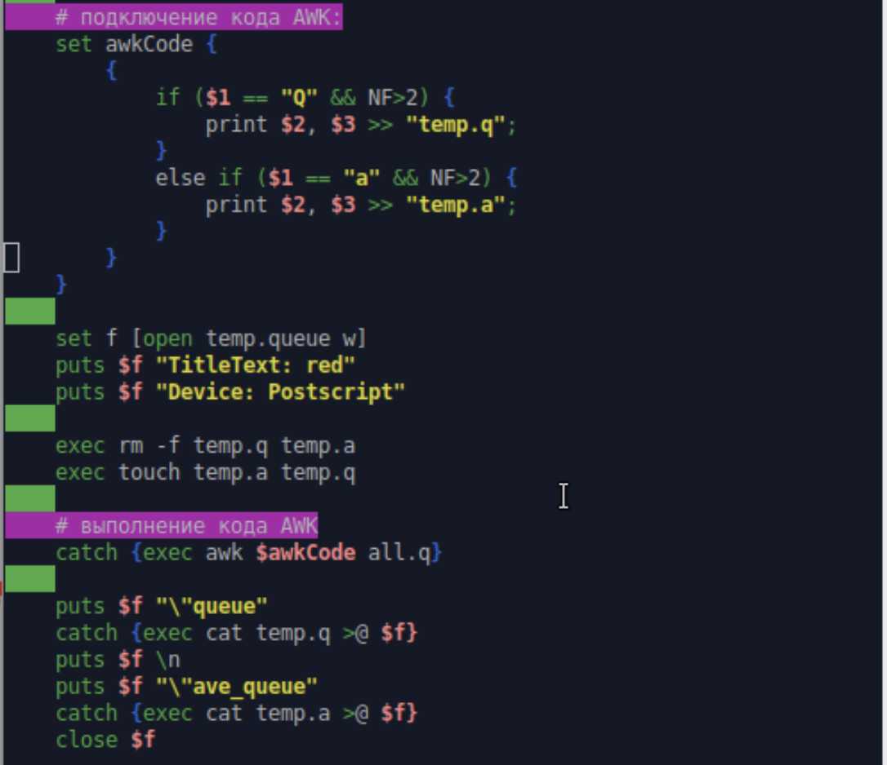
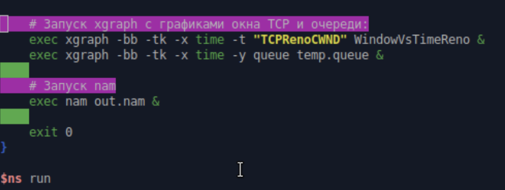
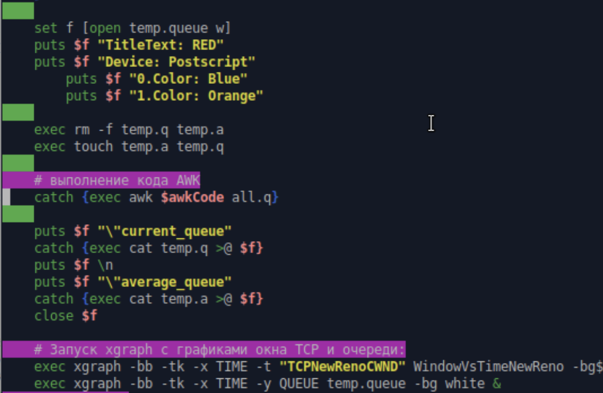
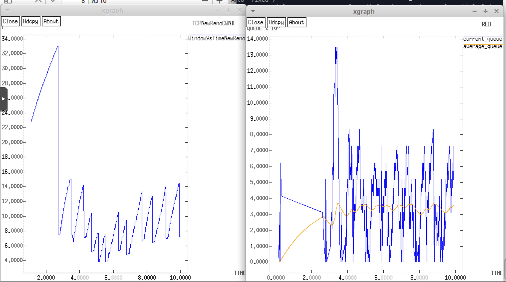
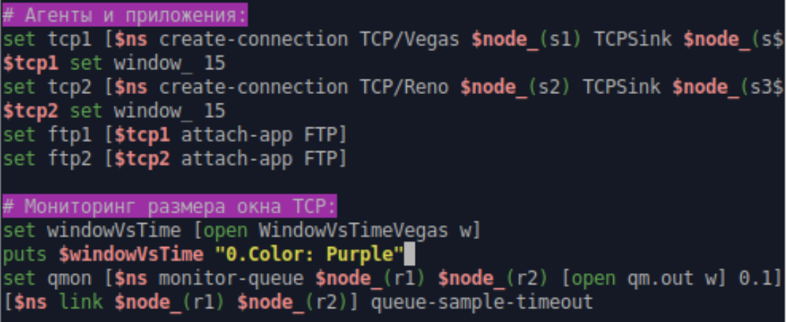
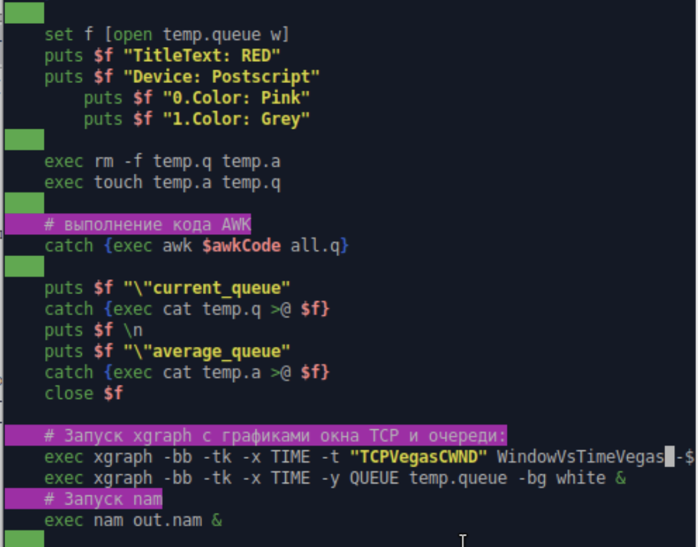
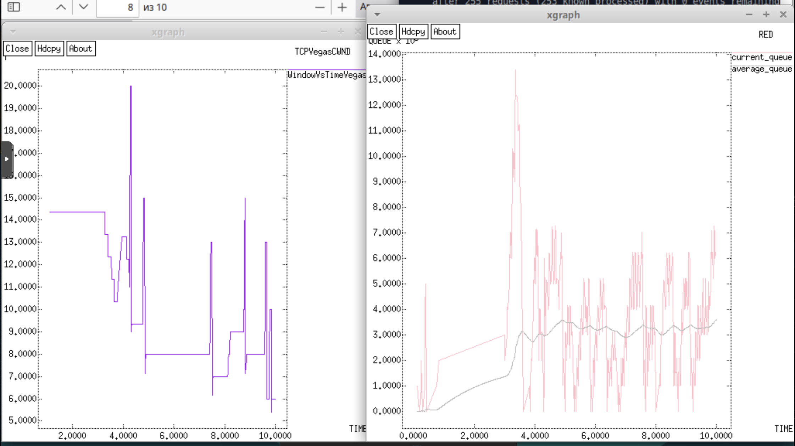

---
# Preamble

## Author
author:
  - name: Шубнякова Дарья НКНбд-01-22
    email: 1132226452@pfur.ru
    affiliation:
      - name: Российский университет дружбы народов
        country: Российская Федерация
        postal-code: 117198
        city: Москва
        address: ул. Миклухо-Маклая, д. 6

## Title
title: "Лабораторная работа №2"
subtitle: "Исследование протокола TCP и алгоритма управления очередью RED"
license: "CC BY"

## Generic options
lang: ru-RU
number-sections: true
toc: true
toc-title: "Содержание"
toc-depth: 2

## Formats
format:
  ### Pdf output format
  pdf:
    toc: true
    number-sections: true
    colorlinks: false
    toc-depth: 2
    documentclass: article
    papersize: a4
    fontsize: 12pt
    linestretch: 1.5
    babel-lang: russian
    babel-otherlangs: english
    indent: true
    header-includes: |
      \usepackage{indentfirst}
      \usepackage{float}
      \floatplacement{figure}{H}
      \usepackage{fontspec}
      \setmainfont{Times New Roman}
      \usepackage{titling}
      \renewcommand{\maketitlehooka}{\null\vfill}
      \renewcommand{\maketitlehookd}{\vfill\null\newpage}

  ### Docx output format
  docx:
    toc: true
    number-sections: true
    toc-depth: 2
---

\newpage

# Цель работы

Исследовать протокол TCP и алгоритм управления очередью RED. Требуется разработать сценарий, реализующий модель, построить в Xgraph график изменения TCP-окна, график изменения длины очереди и средней длины очереди.

# Задание

– Измените в модели на узле s1 тип протокола TCP с Reno на NewReno, затем на
Vegas. Сравните и поясните результаты.
– Внесите изменения при отображении окон с графиками (измените цвет фона,
цвет траекторий, подписи к осям, подпись траектории в легенде).

# Теоретическое введение

Протокол управления передачей (Transmission Control Protocol, TCP) имеет сред- ства управления потоком и коррекции ошибок, ориентирован на установление соединения.
TCP Reno:
- медленный старт (Slow-Start);
- контроль перегрузки (Congestion Avoidance);
- быстрый повтор передачи (Fast Retransmit);
- процедура быстрого восстановления (Fast Recovery);
- метод оценки длительности цикла передачи (Round Trip Time, RTT), используемой для установки таймера повторной передачи (Retransmission TimeOut, RTO).

Алгоритм RED (Random Early Detection) – это метод управления перегрузками в сетевых маршрутизаторах, который заблаговременно отбрасывает пакеты, чтобы предотвратить полную перегрузку очереди. В отличие от простых методов, RED обнаруживает и реагирует на потенциальную перегрузку на ранних стадиях, случайным образом снижая количество передаваемых пакетов, что помогает стабилизировать работу сети.

# Выполнение лабораторной работы

Создаем нужную нам модель с дуплексными узлами. Берем алгоритм из лабораторной работы([рис. @fig-001]).

{#fig-001 width=70%}

Вот так будет выглядеть процедура финиш([рис. @fig-002]) ([рис. @fig-003]).

{#fig-002 width=70%}

{#fig-003 width=70%}

И пишем часть для отображения графиков в Xgraph([рис. @fig-004]).

{#fig-004 width=70%}

Так будет выглядеть график динамики размера окна TCP Reno([рис. @fig-005]).

{#fig-005 width=70%}

А здесь мы видим график динамики длины очереди и средней длины очереди([рис. @fig-006]).

{#fig-006 width=70%}

Меняем на алгоритм NewReno, важно соблюдать именно такое написание, как на скриншоте([рис. @fig-007]).

{#fig-007 width=70%}

Меняем цвет линий графика, фон графика, слегка меняем подписи осей, легенду и названия окон, чтобы показать освоение навыков в Xgraph([рис. @fig-008]).

{#fig-008 width=70%}

Меняем так же цвет линии в графике динамики размера окна TCP([рис. @fig-009]).

{#fig-009 width=70%}

Видим, что все изменения были применены, и оцениваем график TCP NewReno([рис. @fig-010]).

{#fig-010 width=70%}

Меняем цвет линии на графике динамики размера окна TCP и на первом узле ставим TCP Vegas([рис. @fig-011]).

{#fig-011 width=70%}

И меняем тайтлы и цвета для графика средней и текущей очередей([рис. @fig-012]).

{#fig-012 width=70%}

Оцениваем работу при TCP Vegas([рис. @fig-013]).

{#fig-013 width=70%}

# Выводы
Графики динамики размера окна у Reno и NewReno довольно похожи, второй действует чуть более плавно и нет таких сильных разбросов на протяжении работы. График динамики размера окна TCP Vegas очень ступенчатый, перепады резкие, нет плавных линий. В сети с RED очередью:
- Reno: постоянно "прощупывает" пределы пропускной способности
- Vegas: находит оптимальный уровень и держится near него
- При изменении условий Vegas делает шаг к новому оптимальному уровню

График средней и текущей очередей у NewReno и Reno опять же похожи, но текущая очередь у NewReno сразу начинает выравниваться после пика, а у Reno это происходит постепенно. График Vegas опять же в отличие от первых двух начинается с падения.
TCP Reno/NewReno:
- Текущая очередь: резкие пики и провалы, хаотичные колебания
- Средняя очередь: менее изменчивая, но все равно волнистая
- Причина: реагируют только на потери, постоянно "перескакивают" оптимальный уровень
TCP Vegas:
- Текущая очередь: более стабильная, плавные изменения
- Средняя очередь: почти прямая линия near оптимального уровня
- Причина: proactively регулирует окно на основе задержки, предотвращает переполнение очереди
