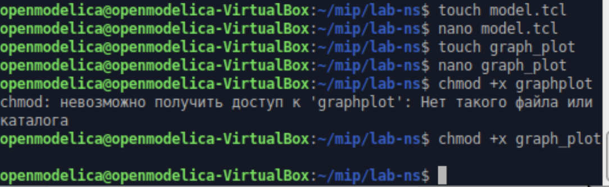
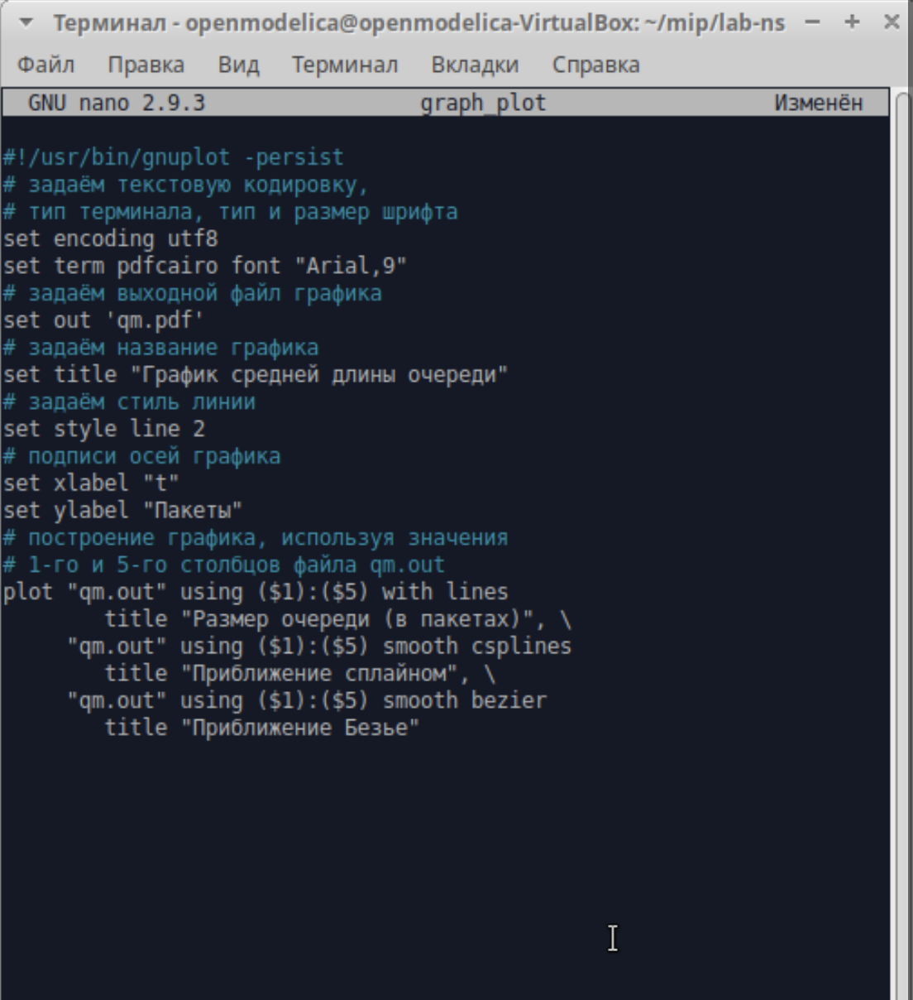
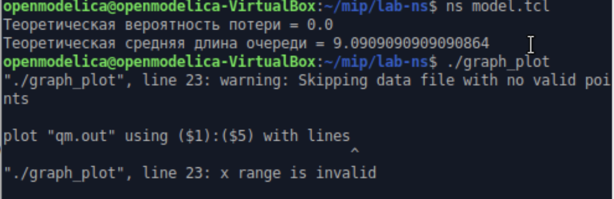
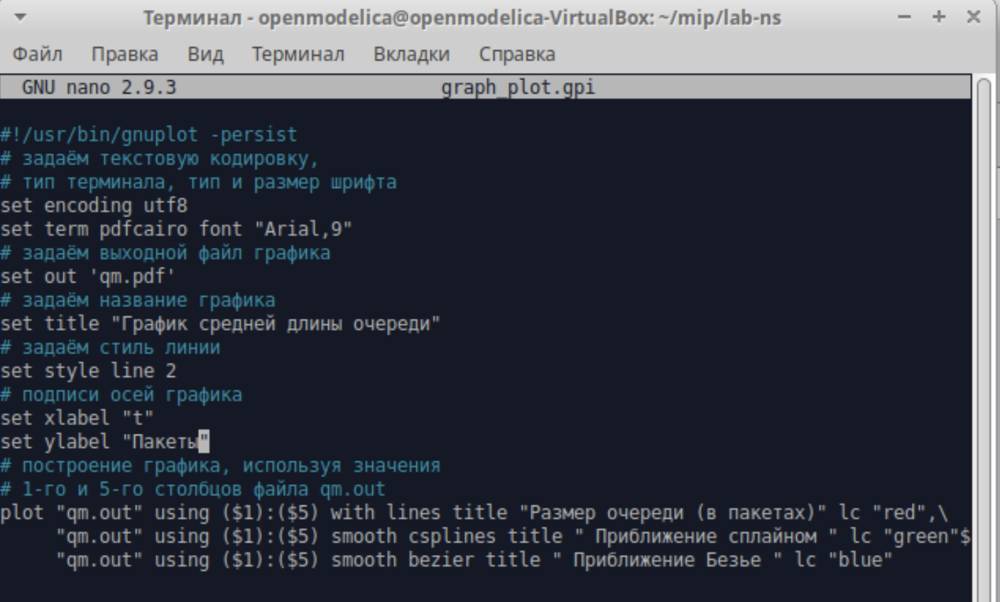

---
# Preamble

## Author
author:
  - name: Шубнякова Дарья НКНбд-01-22
    email: 1132226452@pfur.ru
    affiliation:
      - name: Российский университет дружбы народов
        country: Российская Федерация
        postal-code: 117198
        city: Москва
        address: ул. Миклухо-Маклая, д. 6

## Title
title: "Лабораторная работа №3"
subtitle: "Моделирование стохастических процессов"
license: "CC BY"

## Generic options
lang: ru-RU
number-sections: true
toc: true
toc-title: "Содержание"
toc-depth: 2

## Formats
format:
  ### Pdf output format
  pdf:
    toc: true
    number-sections: true
    colorlinks: false
    toc-depth: 2
    documentclass: article
    papersize: a4
    fontsize: 12pt
    linestretch: 1.5
    babel-lang: russian
    babel-otherlangs: english
    indent: true
    header-includes: |
      \usepackage{indentfirst}
      \usepackage{float}
      \floatplacement{figure}{H}
      \usepackage{fontspec}
      \setmainfont{Times New Roman}
      \usepackage{titling}
      \renewcommand{\maketitlehooka}{\null\vfill}
      \renewcommand{\maketitlehookd}{\vfill\null\newpage}

  ### Docx output format
  docx:
    toc: true
    number-sections: true
    toc-depth: 2
---

\newpage

# Цель работы

Познакомиться с однолинейными СМО с двумя видами накопителей:
* с накопителем конечной ёмкости R
* с накопителем бесконечной ёмкости
Рассмотреть теоретические сведения и реализовать их на практике.

# Задание

* Реализовать модель на NS-2
* Построить график в GNUplot
* Отредактировать его до желаемого результата

# Теоретическое введение

Моделирование стохастических процессов является важным инструментом исследования систем с случайным характером функционирования. В данной работе рассматривается классическая система массового обслуживания типа M/M/1, где входящий поток заявок и время обслуживания подчиняются экспоненциальному распределению. Практическая реализация модели выполнена в среде сетевого симулятора NS-2, который позволяет имитировать поведение очереди пакетов в компьютерной сети. Для визуализации результатов моделирования используется пакет GNUplot, строящий графики зависимости длины очереди от времени. Полученные экспериментальные данные сравниваются с теоретическими расчетами характеристик системы, что позволяет оценить адекватность математической модели и точность имитационного эксперимента.

# Выполнение лабораторной работы

Создаем модель по предложенному в лабораторной работе коду, который будет прикреплен в релизе данной лабоаторной работы на GitHub, т.к. он довольно объёмный. Создаем так же файл graph_plot и открываем на редактирование, после чего делаем его исполняемым([рис. @fig-001]).

{#fig-001 width=70%}

Предварительно мы вставили нужный нам код из лабораторной работы([рис. @fig-002]).

{#fig-002 width=70%}

Запускаем модель, видим показатели теоретической вероятности потери и теоретической средней длины очереди, а затем запускаем файл graph_plot, чтобы получить наглядный результат на графике qm.pdf([рис. @fig-003]).

{#fig-003 width=70%}

Получаем этот файл и видим данный график, нам же надо сделать его таким же, каким он представлен в конце лабораторной работы([рис. @fig-004]).

{#fig-004 width=70%}

Вносим корректировки, меняем цвет линий([рис. @fig-005]).

{#fig-005 width=70%}

Запускаем скрипт снова и получаем желаемый результат([рис. @fig-006]).

{#fig-007 width=70%}

# Выводы
Мы получили предварительные сведения по двум видам СМО. Мы смоделировали поведение однолинейной СМО М|M|1 с накопителем бесконечной ёмкости, а также апроксимировали результаты с помощью сплайнов и кривых Безье, приобрели навыки работы с GNUplot.
