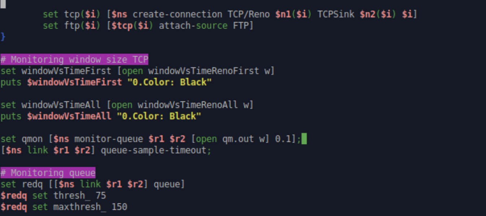
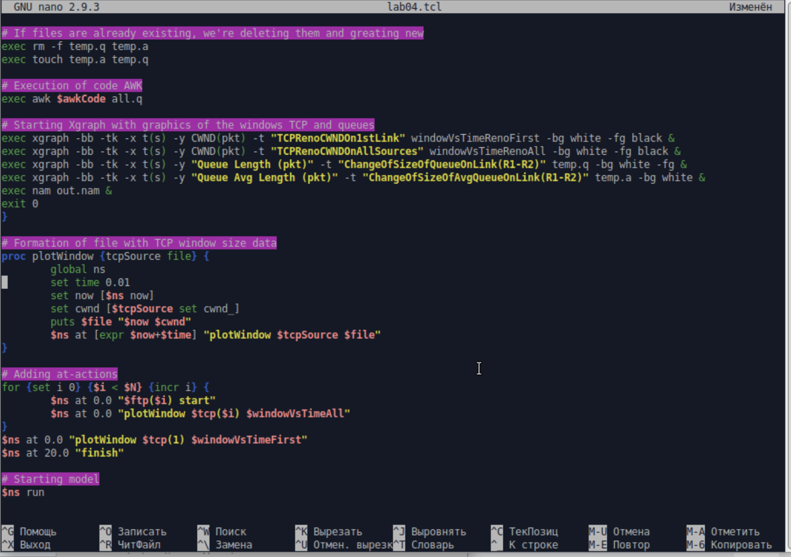
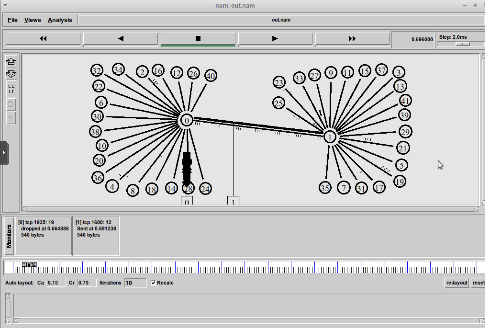
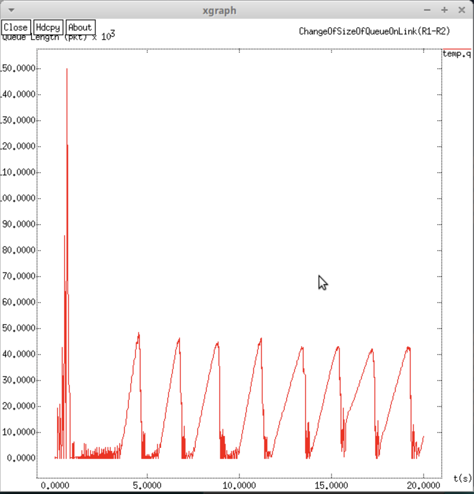
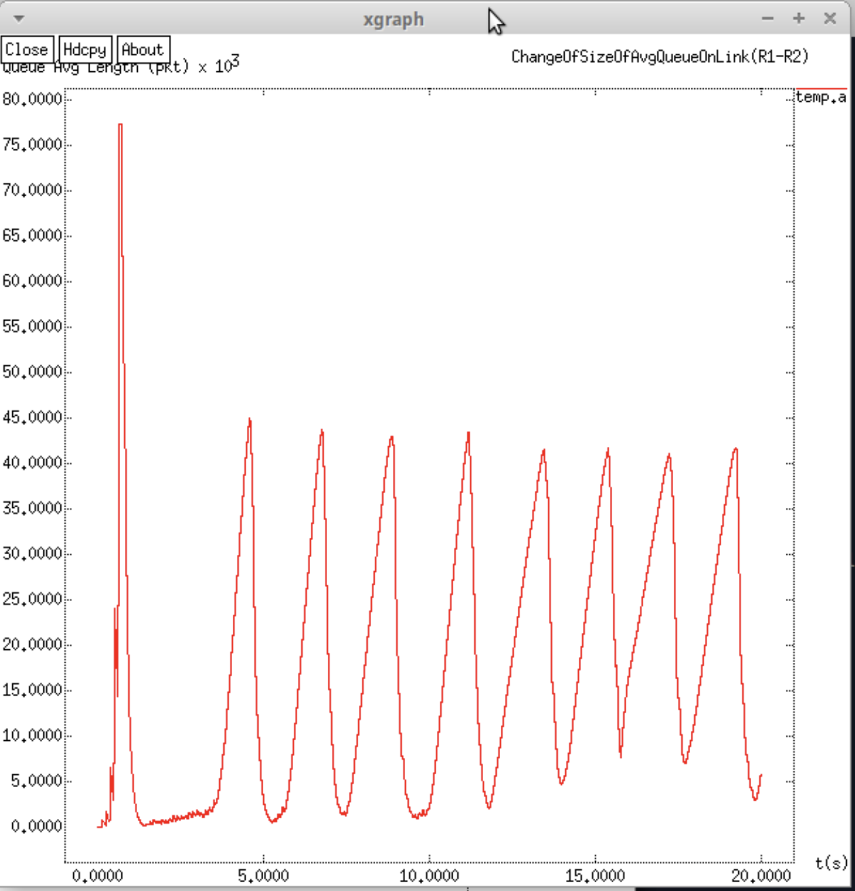
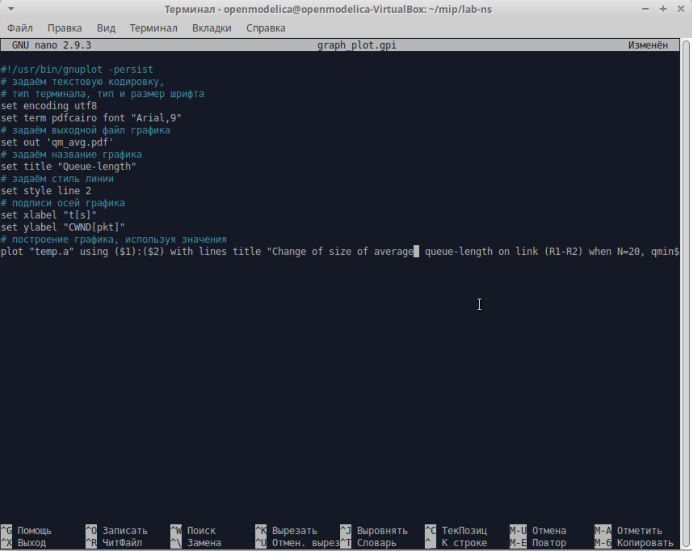
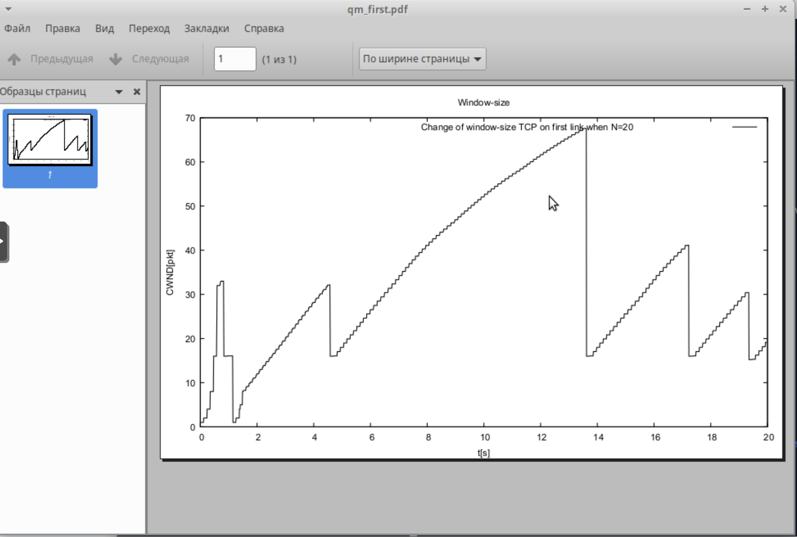
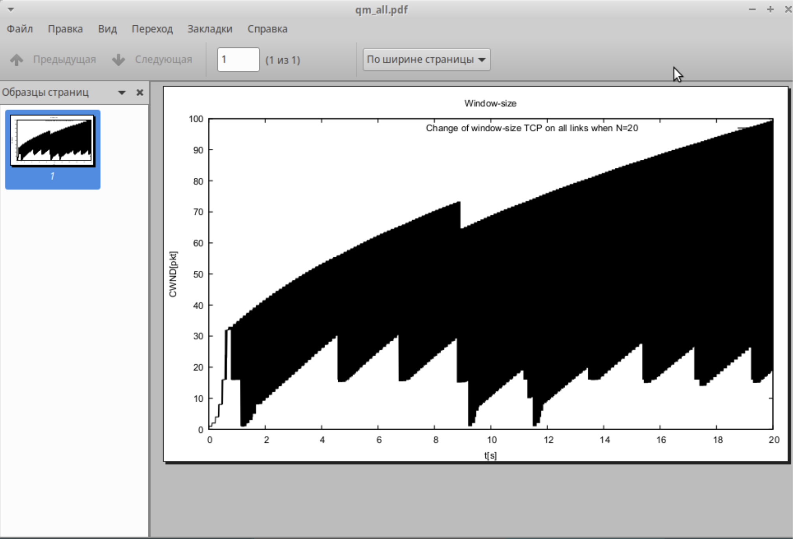
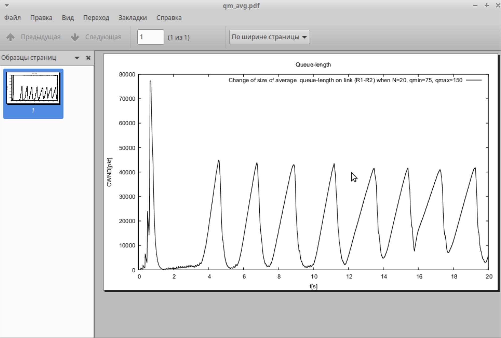

---
# Preamble

## Author
author:
  name: Шубнякова Дарья НКНбд-01-22
  email: 1132226452@pfur.ru
  affiliation:
    - name: Российский университет дружбы народов
      country: Российская Федерация
      postal-code: 117198
      city: Москва
      address: ул. Миклухо-Маклая, д. 6
## Title
title: Лабораторная работа №4
subtitle: Задание для самостоятельного выполнения
license: CC BY
## Generic options
lang: ru-RU
crossref:
  fig-title: "Рисунок"
  tbl-title: "Таблица"
  lst-title: "Листинг"
## Formats
format:
### Pdf output format
  beamer:
    toc: true
    toc-title: Содержание
    number-sections: true
    colorlinks: false
    toc-depth: 2
    slide-level: 2
    aspectratio: 169
    section-titles: true
    theme: metropolis
    theme-options:
      - progressbar=frametitle
      - sectionpage=progressbar
      - numbering=fraction
    pdf-engine: xelatex
    include-in-header:
      text: |
        \usepackage{fontspec}
        \setmainfont{Times New Roman}
        \setsansfont{Arial}
        \setmonofont{Courier New}
        \usepackage{polyglossia}
        \setdefaultlanguage{russian}
        \setotherlanguage{english}
        \usepackage{caption}
        \captionsetup[figure]{name=Рисунок}

### Html output
  revealjs:
    transition: slide
    margin: 0.2
    smaller: false
    output-ext: html
    theme: beige
    logo: _resources/image/logo_rudn.png
---

# Вводная часть

## Цели и задачи

Самостоятельно реализовать модель в NS-2 и наглядно продемонстрировать результаты в Xgraph и GNUPlot.
1. Для приведённой схемы разработать имитационную модель в пакете NS-2.
2. Построить график изменения размера окна TCP (в Xgraph и в GNUPlot);
3. Построить график изменения длины очереди и средней длины очереди на первом
маршрутизаторе.
4. Оформить отчёт о выполненной работе.

# Основная часть

## Выполнение лабораторной работы

Описание моделируемой сети:
– сеть состоит из N TCP-источников, N TCP-приёмников, двух маршрутизаторов
R1 и R2 между источниками и приёмниками (N — не менее 20);
– между TCP-источниками и первым маршрутизатором установлены дуплексные соединения с пропускной способностью 100 Мбит/с и задержкой 20 мс очередью
типа DropTail;
– между TCP-приёмниками и вторым маршрутизатором установлены дуплексные
соединения с пропускной способностью 100 Мбит/с и задержкой 20 мс очередью типа DropTail;
– между маршрутизаторами установлено симплексное соединение (R1–R2) с пропускной способностью 20 Мбит/с и задержкой 15 мс очередью типа RED, размером буфера 300 пакетов; в обратную сторону — симплексное соедине- ние (R2–R1) с пропускной способностью 15 Мбит/с и задержкой 20 мс очередью типа DropTail;
– данные передаются по протоколу FTP поверх TCPReno;
– параметры алгоритма RED: qmin = 75, qmax = 150, qw = 0, 002, pmax = 0.1;
– максимальныйразмерTCP-окна32;размер передаваемого пакета 500 байт;время
моделирования — не менее 20 единиц модельного времени.

## Начинаем с написания лабораторной работы. С кодом можно ознакомиться в моем гитхабе. Прописываем код с подробными комментариями.

{width=70%}

## Прописываем код с подробными комментариями.

{width=70%}

## Прописываем код с подробными комментариями.

{width=70%}

## Прописываем код с подробными комментариями.

{width=70%}

## Получаем работающую модель, отмечены потерянные пакеты и сам трафик.

{width=70%}

## Код для отображения в Xgraph включен в код самой модели. Изменение размера окна TCP на линке 1-го источника при N=20.

{width=70%}

## Изменение размера окна TCP на всех источниках при N=20.

{width=70%}

## Изменение размера длины очереди на линке (R1–R2) при N=20, qmin = 75, qmax = 150.

{width=70%}

## Изменение размера средней длины очереди на линке (R1–R2) при N=20, qmin = 75, qmax = 150.

{width=70%}

## Теперь сделаем такие же графики в GNUPlot. Для этого меняем наш скрипт graph_plot.gpi из прошлой лабораторной работы.

{width=70%}

## Изменение размера окна TCP на линке 1-го источника при N=20.

{width=70%}

## Изменение размера окна TCP на всех источниках при N=20.

{width=70%}

## Изменение размера длины очереди на линке (R1–R2) при N=20, qmin = 75, qmax = 150.

{width=70%}

## Изменение размера средней длины очереди на линке (R1–R2) при N=20, qmin = 75, qmax = 150.

{width=70%}

# Результаты

Мы смогли с помощью ранее полученных шаблонов и знаний реализовать сложную модель, наглядно продемонстрировать результаты ее работы и закончили прохождение данной темы.

