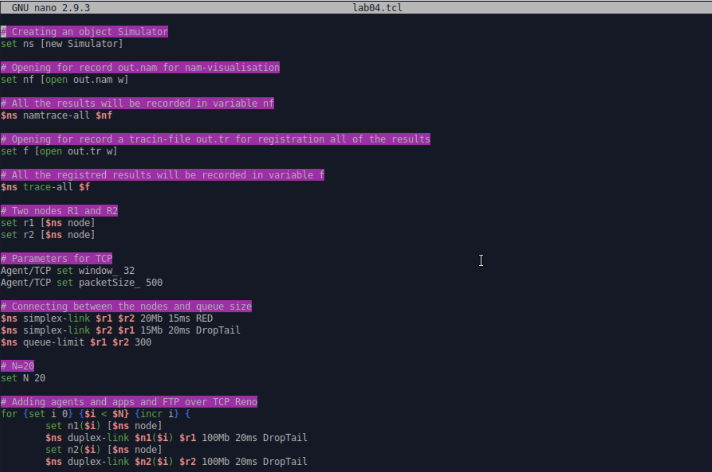
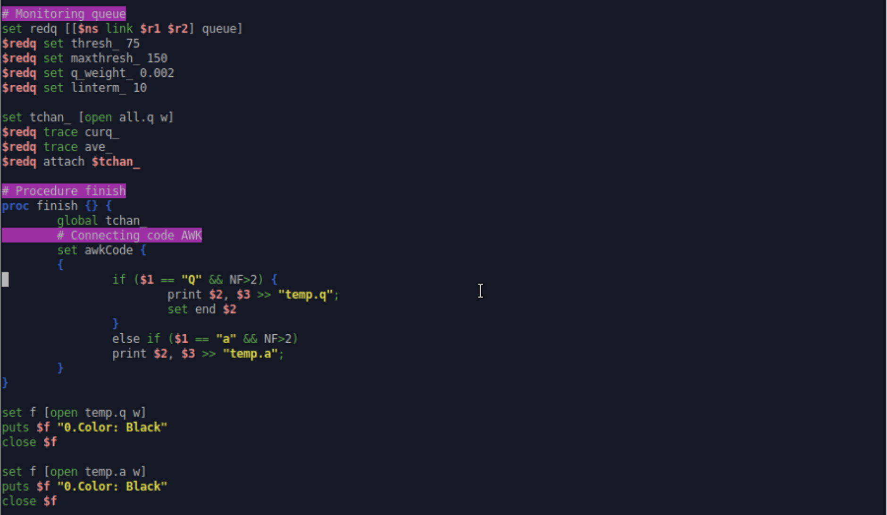
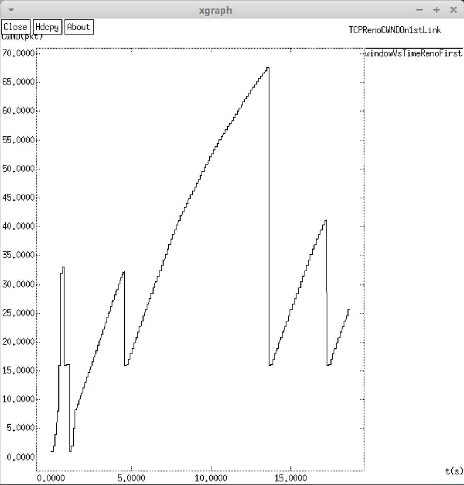
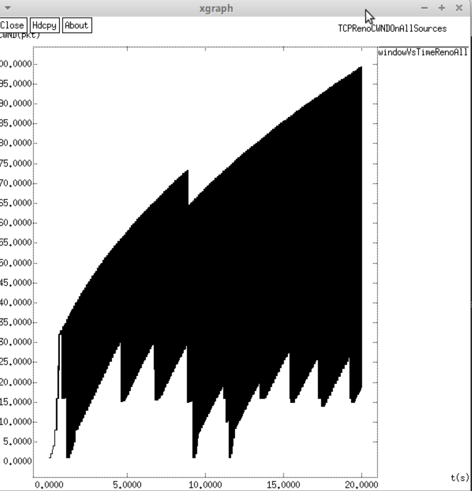
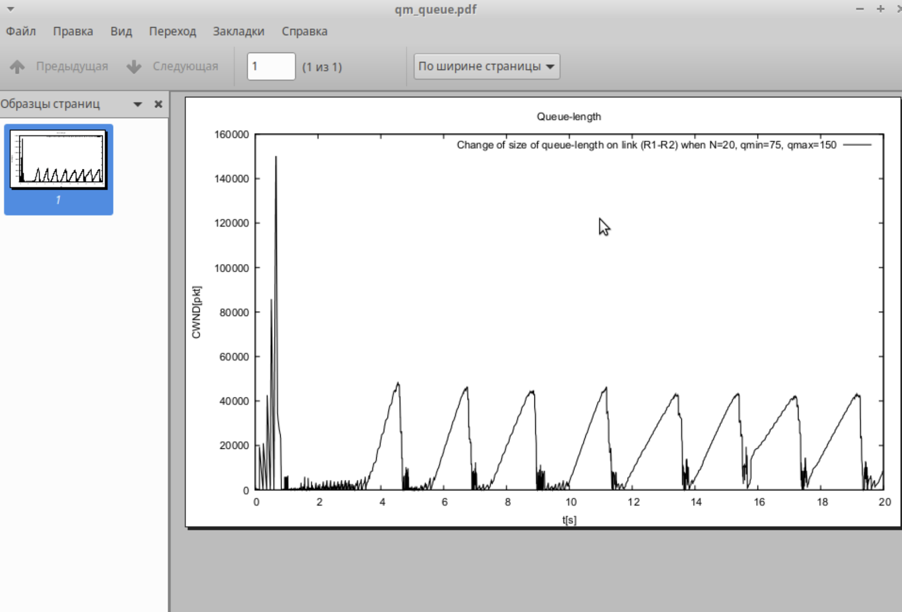

---
# Preamble

## Author
author:
  - name: Шубнякова Дарья НКНбд-01-22
    email: 1132226452@pfur.ru
    affiliation:
      - name: Российский университет дружбы народов
        country: Российская Федерация
        postal-code: 117198
        city: Москва
        address: ул. Миклухо-Маклая, д. 6

## Title
title: "Лабораторная работа №4"
subtitle: "Задание для самостоятельного выполнения"
license: "CC BY"

## Generic options
lang: ru-RU
number-sections: true
toc: true
toc-title: "Содержание"
toc-depth: 2

## Formats
format:
  ### Pdf output format
  pdf:
    toc: true
    number-sections: true
    colorlinks: false
    toc-depth: 2
    documentclass: article
    papersize: a4
    fontsize: 12pt
    linestretch: 1.5
    babel-lang: russian
    babel-otherlangs: english
    indent: true
    header-includes: |
      \usepackage{indentfirst}
      \usepackage{float}
      \floatplacement{figure}{H}
      \usepackage{fontspec}
      \setmainfont{Times New Roman}
      \usepackage{titling}
      \renewcommand{\maketitlehooka}{\null\vfill}
      \renewcommand{\maketitlehookd}{\vfill\null\newpage}

  ### Docx output format
  docx:
    toc: true
    number-sections: true
    toc-depth: 2
---

\newpage

# Цель работы

Самостоятельно реализовать модель в NS-2 и наглядно продемонстрировать результаты в Xgraph и GNUPlot.

# Задание

1. Для приведённой схемы разработать имитационную модель в пакете NS-2.
2. Построить график изменения размера окна TCP (в Xgraph и в GNUPlot);
3. Построить график изменения длины очереди и средней длины очереди на первом
маршрутизаторе.
4. Оформить отчёт о выполненной работе.

# Теоретическое введение

Описание моделируемой сети:
– сеть состоит из N TCP-источников, N TCP-приёмников, двух маршрутизаторов
R1 и R2 между источниками и приёмниками (N — не менее 20);
– между TCP-источниками и первым маршрутизатором установлены дуплексные соединения с пропускной способностью 100 Мбит/с и задержкой 20 мс очередью
типа DropTail;
– между TCP-приёмниками и вторым маршрутизатором установлены дуплексные
соединения с пропускной способностью 100 Мбит/с и задержкой 20 мс очередью типа DropTail;
– между маршрутизаторами установлено симплексное соединение (R1–R2) с пропускной способностью 20 Мбит/с и задержкой 15 мс очередью типа RED, размером буфера 300 пакетов; в обратную сторону — симплексное соедине- ние (R2–R1) с пропускной способностью 15 Мбит/с и задержкой 20 мс очередью типа DropTail;
– данные передаются по протоколу FTP поверх TCPReno;
– параметры алгоритма RED: qmin = 75, qmax = 150, qw = 0, 002, pmax = 0.1;
– максимальныйразмерTCP-окна32;размер передаваемого пакета 500 байт;время
моделирования — не менее 20 единиц модельного времени.

# Код реализованной программы

```
# Creating an object Simulator
set ns [new Simulator]

# Opening for record out.nam for nam-visualisation
set nf [open out.nam w]

# All the results will be recorded in variable nf
$ns namtrace-all $nf

# Opening for record a tracin-file out.tr for registration all of the results
set f [open out.tr w]

# All the registred results will be recorded in variable f
$ns trace-all $f

# Two nodes R1 and R2
set r1 [$ns node]
set r2 [$ns node]

# Parameters for TCP
Agent/TCP set window_ 32
Agent/TCP set packetSize_ 500

# Connecting between the nodes and queue size
$ns simplex-link $r1 $r2 20Mb 15ms RED
$ns simplex-link $r2 $r1 15Mb 20ms DropTail
$ns queue-limit $r1 $r2 300

# N=20
set N 20

# Adding agents and apps and FTP over TCP Reno
for {set i 0} {$i < $N} {incr i} {
        set n1($i) [$ns node]
        $ns duplex-link $n1($i) $r1 100Mb 20ms DropTail
        set n2($i) [$ns node]
        $ns duplex-link $n2($i) $r2 100Mb 20ms DropTail
        set tcp($i) [$ns create-connection TCP/Reno $n1($i) TCPSink $n2($i) $i]
        set ftp($i) [$tcp($i) attach-source FTP]
}

# Monitoring window size TCP
set windowVsTimeFirst [open windowVsTimeRenoFirst w]
puts $windowVsTimeFirst "0.Color: Black"

set windowVsTimeAll [open windowVsTimeRenoAll w]
puts $windowVsTimeAll "0.Color: Black"

set qmon [$ns monitor-queue $r1 $r2 [open qm.out w] 0.1];
[$ns link $r1 $r2] queue-sample-timeout;

# Monitoring queue
set redq [[$ns link $r1 $r2] queue]
$redq set thresh_ 75
$redq set maxthresh_ 150
$redq set q_weight_ 0.002
$redq set linterm_ 10

set tchan_ [open all.q w]
$redq trace curq_
$redq trace ave_
$redq attach $tchan_

# Procedure finish
proc finish {} {
        global tchan_
        # Connecting code AWK
        set awkCode {
        {
                if ($1 == "Q" && NF>2) {
                        print $2, $3 >> "temp.q";
                        set end $2
                }
                else if ($1 == "a" && NF>2)
                print $2, $3 >> "temp.a";
        }
}

set f [open temp.q w]
puts $f "0.Color: black"
close $f

set f [open temp.a w]
puts $f "0.Color: black"
close $f

# If files are already existing, we're deleting them and creating new
if { [info exists tchan_] } {
        close $tchan_
}

exec rm -f temp.q temp.a
exec touch temp.q temp.a
# Execution of code AWK
exec awk $awkCode all.q

# Starting Xgraph with graphics of the windows TCP and queues
exec xgraph -bb -tk -x t(s) -y CWND(pkt) -t "TCPRenoCWNDOn1stLink" windowVsTimeRenoFirst -bg white -fg black &
exec xgraph -bb -tk -x t(s) -y CWND(pkt) -t "TCPRenoCWNDOnAllSources" windowVsTimeRenoAll -bg white -fg black &
exec xgraph -bb -tk -x t(s) -y "Queue Length (pkt)" -t "ChangeOfSizeOfQueueOnLink(R1-R2)" temp.q -bg white &
exec xgraph -bb -tk -x t(s) -y "Queue Avg Length (pkt)" -t "ChangeOfSizeOfAvgQueueOnLink(R1-R2)" temp.a -bg white &
exec nam out.nam &
exit 0
}

# Formation of file with TCP window size data
proc plotWindow {tcpSource file} {
        global ns
        set time 0.01
        set now [$ns now]
        set cwnd [$tcpSource set cwnd_]
        puts $file "$now $cwnd"
        $ns at [expr $now+$time] "plotWindow $tcpSource $file"
}

# Adding at-actions
for {set i 0} {$i < $N} {incr i} {
        $ns at 0.0 "$ftp($i) start"
        $ns at 0.0 "plotWindow $tcp($i) $windowVsTimeAll"
}
$ns at 0.0 "plotWindow $tcp(1) $windowVsTimeFirst"
$ns at 20.0 "finish"

# Starting model
$ns run
```

# Выполнение лабораторной работы

Прописываем код с подробными комментариями([рис. @fig-001]).

{#fig-001 width=70%}

Прописываем код с подробными комментариями([рис. @fig-002]).

{#fig-002 width=70%}

Прописываем код с подробными комментариями([рис. @fig-003]).

{#fig-003 width=70%}

Прописываем код с подробными комментариями([рис. @fig-004]).

{#fig-004 width=70%}

Получаем работающую модель, отмечены потерянные пакеты и сам трафик([рис. @fig-005]).

{#fig-005 width=70%}

Код для отображения в Xgraph включен в код самой модели. Изменение размера окна TCP на линке 1-го источника при N=20([рис. @fig-006]).

{#fig-006 width=70%}

Изменение размера окна TCP на всех источниках при N=20([рис. @fig-007]).

{#fig-007 width=70%}

Изменение размера длины очереди на линке (R1–R2) при N=20, qmin = 75, qmax = 150([рис. @fig-008]).

{#fig-008 width=70%}

Изменение размера средней длины очереди на линке (R1–R2) при N=20, qmin = 75, qmax = 150([рис. @fig-009]).

{#fig-009 width=70%}

Теперь сделаем такие же графики в GNUPlot. Для этого меняем наш скрипт graph_plot.gpi из прошлой лабораторной работы([рис. @fig-010]).

{#fig-010 width=70%}

Изменение размера окна TCP на линке 1-го источника при N=20([рис. @fig-011]).

{#fig-011 width=70%}

Изменение размера окна TCP на всех источниках при N=20([рис. @fig-012]).

{#fig-012 width=70%}

Изменение размера длины очереди на линке (R1–R2) при N=20, qmin = 75, qmax = 150([рис. @fig-013]).

{#fig-013 width=70%}

Изменение размера средней длины очереди на линке (R1–R2) при N=20, qmin = 75, qmax = 150([рис. @fig-014]).

{#fig-014 width=70%}

# Выводы

Мы смогли с помощью ранее полученных шаблонов и знаний реализовать сложную модель с N=20 и закончили прохождение данной темы.
