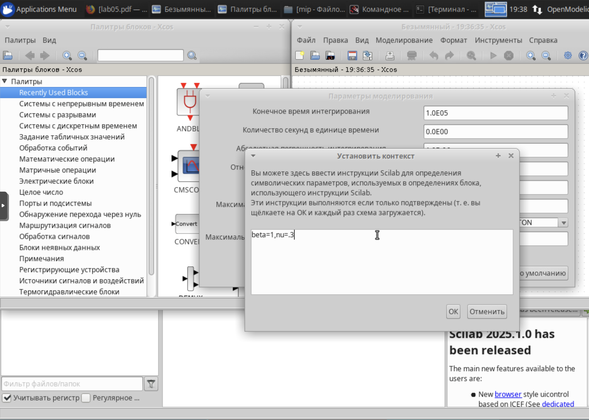
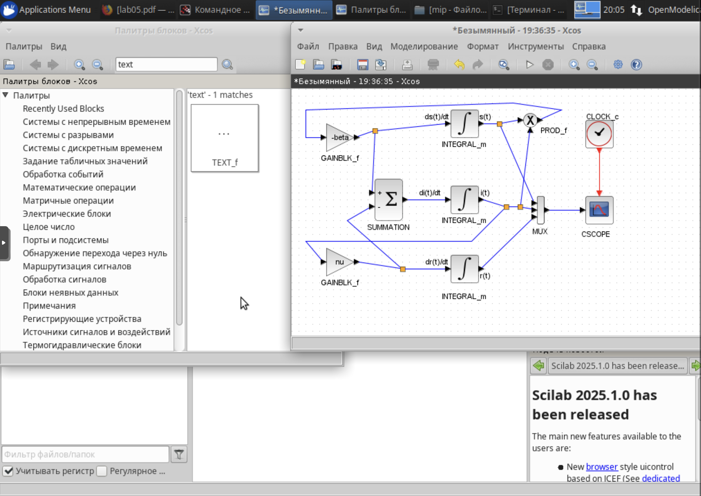
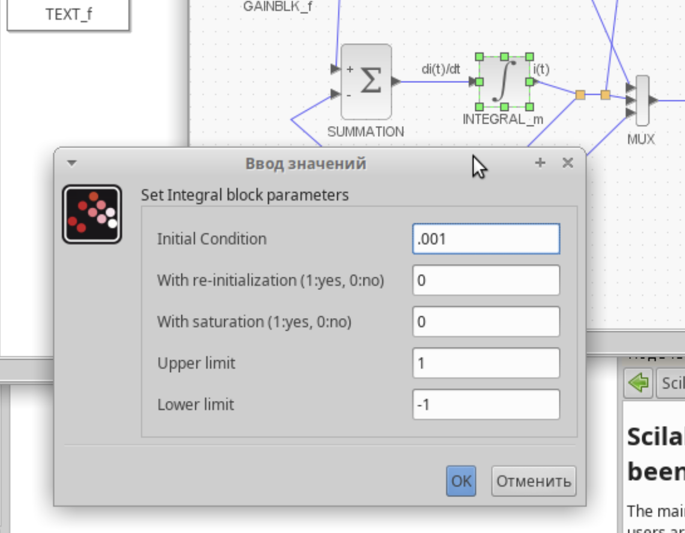
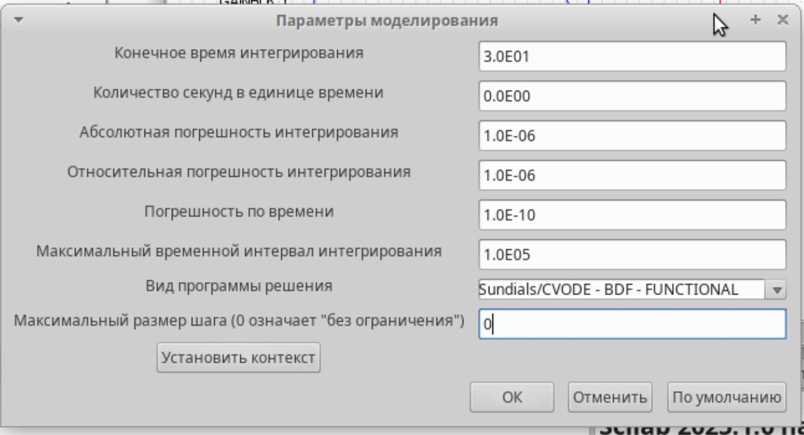
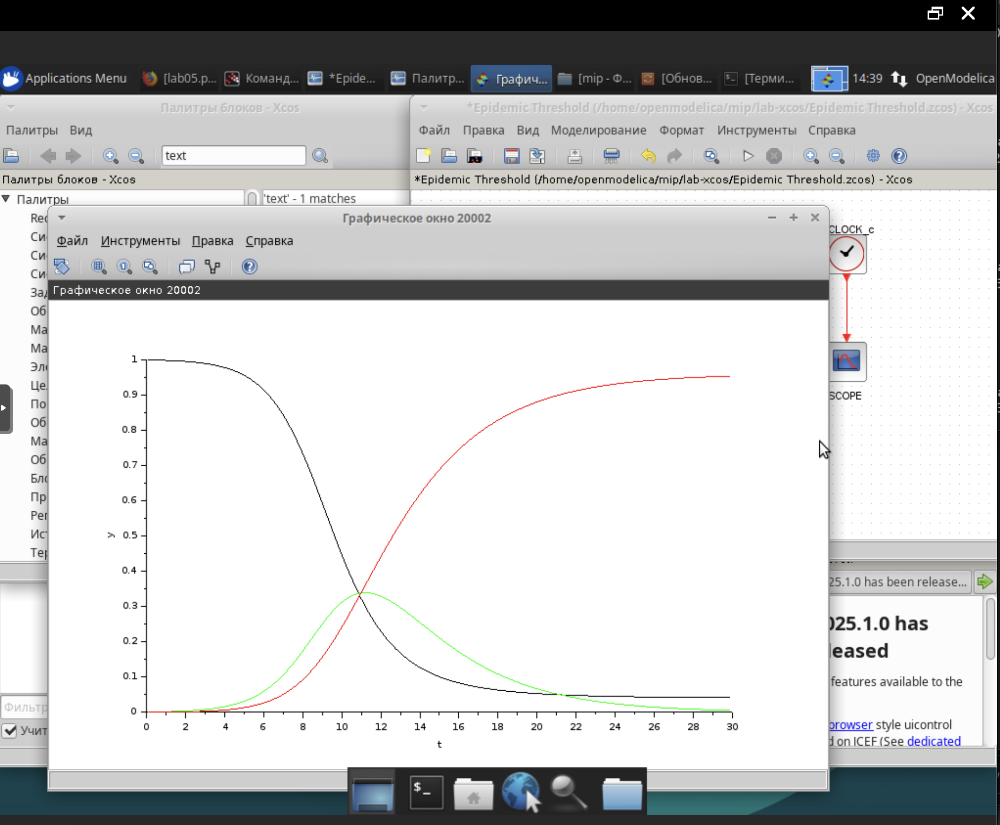
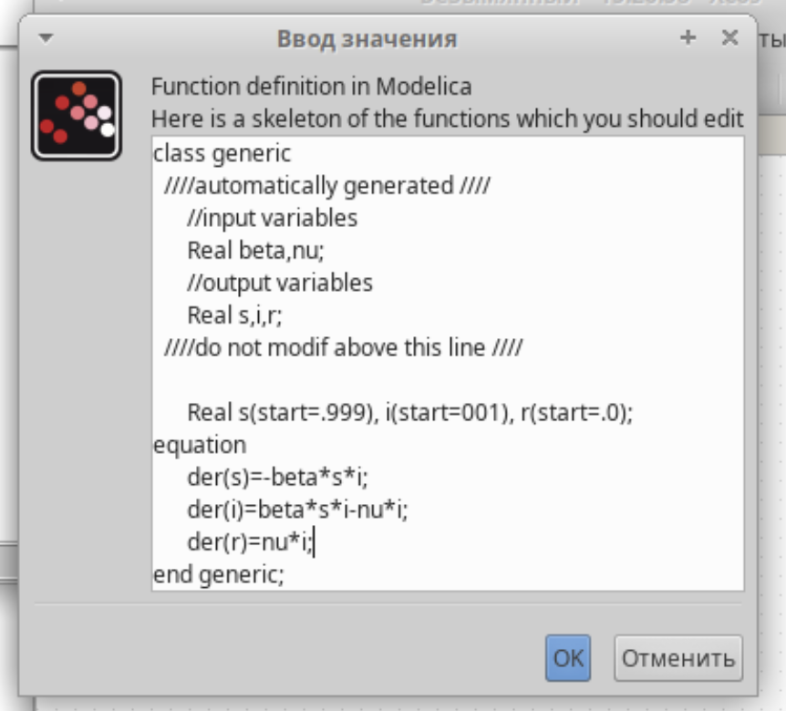
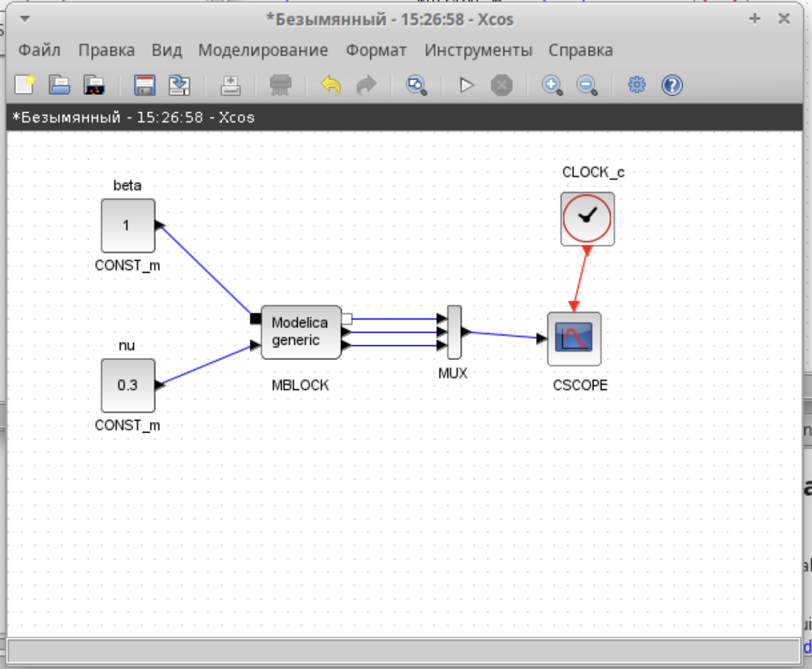
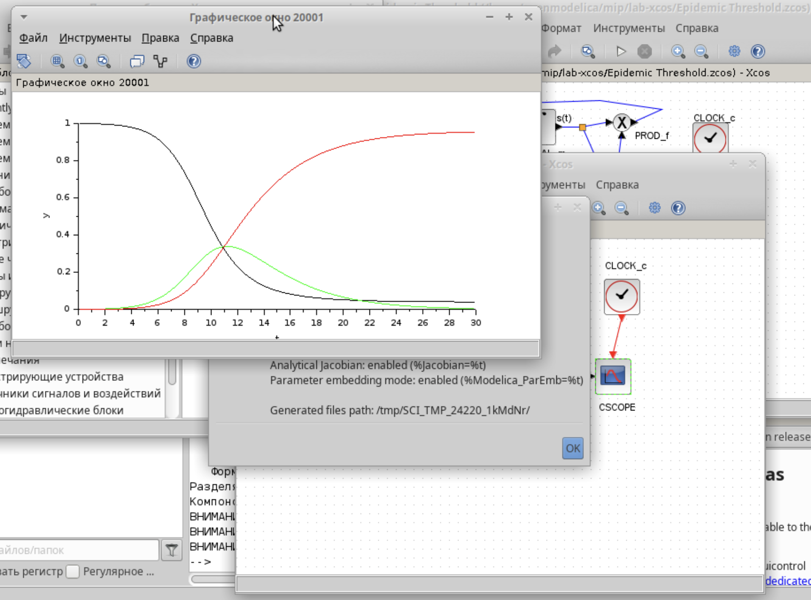
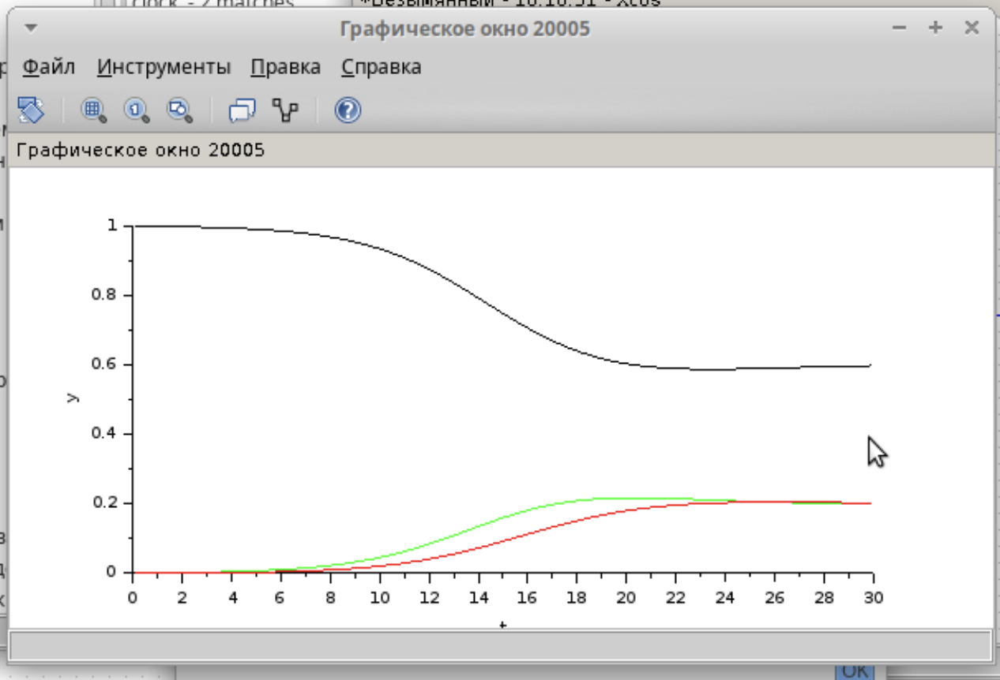

---
# Preamble

## Author
author:
  name: Шубнякова Дарья НКНбд-01-22
  email: 1132226452@pfur.ru
  affiliation:
    - name: Российский университет дружбы народов
      country: Российская Федерация
      postal-code: 117198
      city: Москва
      address: ул. Миклухо-Маклая, д. 6
## Title
title: Лабораторная работа №5
subtitle: Модель эпидемии (SIR)
license: CC BY
## Generic options
lang: ru-RU
crossref:
  fig-title: "Рисунок"
  tbl-title: "Таблица"
  lst-title: "Листинг"
## Formats
format:
### Pdf output format
  beamer:
    toc: true
    toc-title: Содержание
    number-sections: true
    colorlinks: false
    toc-depth: 2
    slide-level: 2
    aspectratio: 169
    section-titles: true
    theme: metropolis
    theme-options:
      - progressbar=frametitle
      - sectionpage=progressbar
      - numbering=fraction
    pdf-engine: xelatex
    include-in-header:
      text: |
        \usepackage{fontspec}
        \setmainfont{Times New Roman}
        \setsansfont{Arial}
        \setmonofont{Courier New}
        \usepackage{polyglossia}
        \setdefaultlanguage{russian}
        \setotherlanguage{english}
        \usepackage{caption}
        \captionsetup[figure]{name=Рисунок}

### Html output
  revealjs:
    transition: slide
    margin: 0.2
    smaller: false
    output-ext: html
    theme: beige
    logo: _resources/image/logo_rudn.png
---

# Вводная часть

## Цели и задачи

Ознакомиться с моделью SIR и ее реализациями в xcos и с помощью языка Modelica.

Требуется:
– реализовать модель SIR с учётом процесса рождения / гибели особей в xcos (в том числе и с использованием блока Modelica);
– построить графики эпидемического порога при различных значениях параметров модели (в частности изменяя параметр μ);
– сделать анализ полученных графиков в зависимости от выбранных значений параметров модели.

# Основная часть

## Выполнение лабораторной работы

Предполагается, что особи популяции размера N могут находиться в трёх различных состояниях:
– S (susceptible, уязвимые) — здоровые особи, которые находятся в группе риска и могут подхватить инфекцию;
– I (infective, заражённые, распространяющие заболевание) — заразившиеся пере- носчики болезни;
– R (recovered/removed, вылечившиеся) — те, кто выздоровел и перестал распро- странять болезнь (в эту категорию относят, например, приобретших иммунитет или умерших).

Устанавливаем контекст среды выполнения.

{width=70%}

## Строим модель в xcos с помощью предложенных блоков и ориентируясь на модель в лабораторной работе.

{width=70%}

## В параметрах вергнего блока устанавливаем верхний предел интегрирования s(0)=0.999.

{width=70%}

## В среднем блоке устанавливаем параметр нижнего предела интегрирования i(0)=0.001.

{width=70%}

## В параметрах моделирования задаем конечное время интегрирования, иначе наш график будет строится бесконечно.

{width=70%}

## Получаем модель, сравниваем ее с рисунком в лабораторной работе, все аналогично. Зеленая линия определяет i(t) — динамику численности заражённых особей. Красная линия отвечает за r(t) — динамику численности выздоровевших особей, черная -- за s(t) (динамика численности уязвимых к болезни особей).

{width=70%}

## Прописываем код для блока Modelica.

{width=70%}

## Задаем параметры как в лабораторной работе.

{width=70%}

## Так выглядит модель на блоковой схеме.

{width=70%}

## Получаем аналогичный результат.

{width=70%}

## Задаем контекст среды выполнения для самостоятельной работы и строим блоковую схему по предложенным нам уравнениям, в которых учитываются демографические процессы, в частности, что смертность в популяции полностью уравновешивает рождаемость, а все рожденные индивидуу- мы появляются на свет абсолютно здоровыми.

{width=70%}

## Затем делаем то же самое с помощью блока OpenModelica.

{width=70%}

## Теперь задаем различные μ, где μ — константа, которая равна коэффициенту смертности и рождаемости. Здечь она равна 0.1.

{width=70%}

## Здесь μ=0.3.

{width=70%}

## Здесь μ=0.5.

{width=70%}

# Результаты

Мы ознакомились с тем, как строить блоковые схемы в xcos и реализовывать модели на языке Modelica. Получили такие выводы на графике: чем больше μ, которая равна коэффициенту смертности и рождаемости, то есть чем больше детей у нас рождается и чем меньше людей умирает, тем меньше пик динамика численности зараженных, динамика численности выздовевших так же имеет меньший максимум, а количество особей, уязвых к болези, наоборот, не достигает такого большого минимума, т.е. заражается меньше людей.

