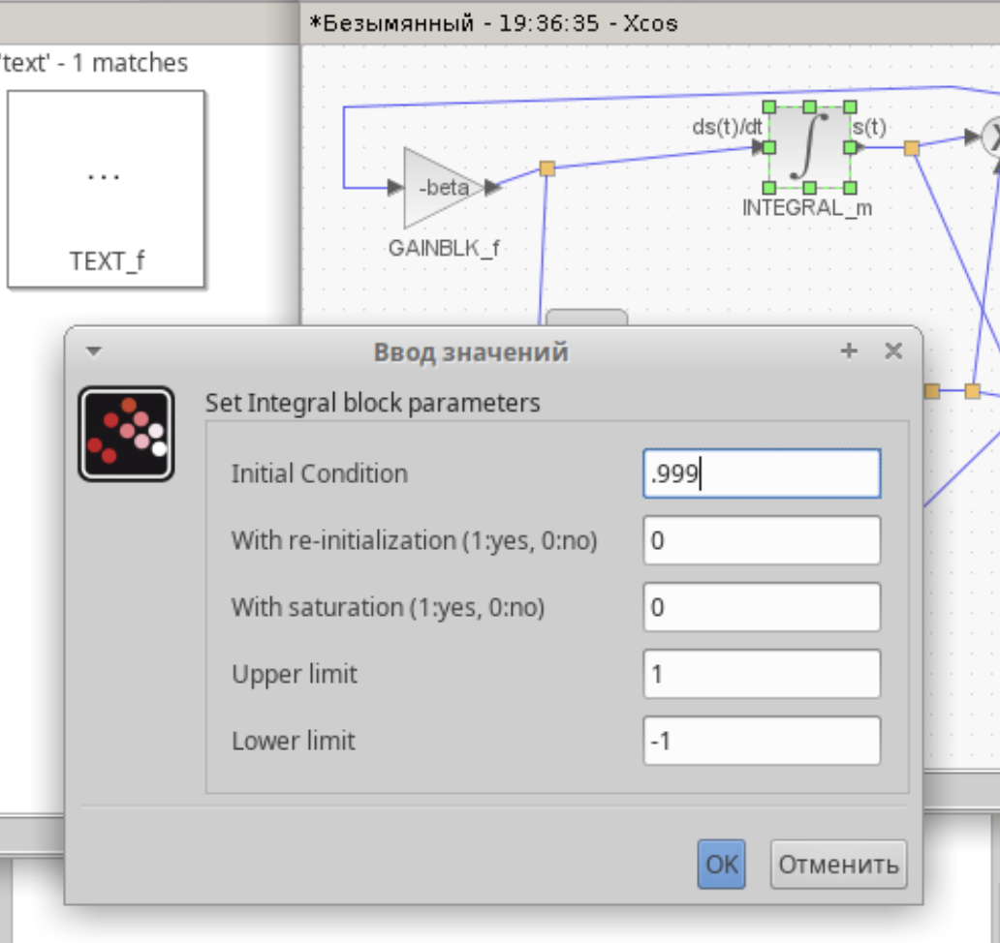
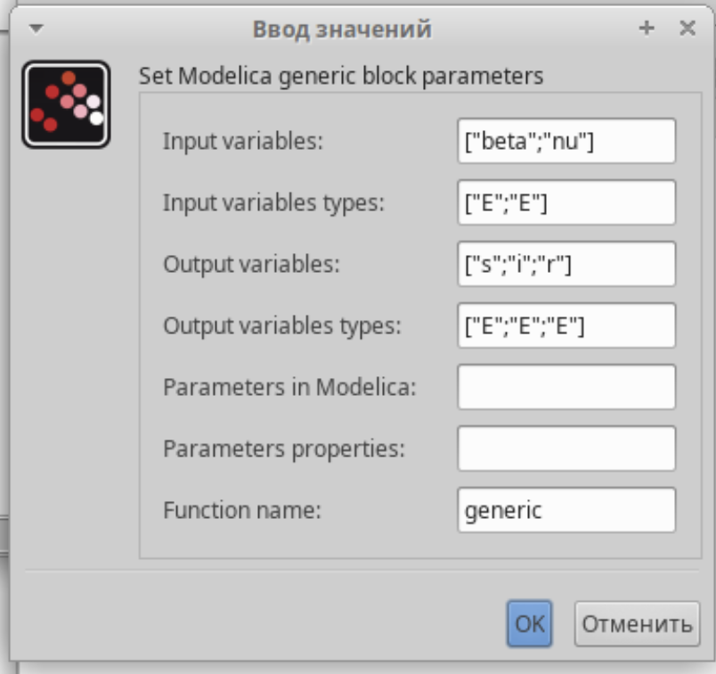
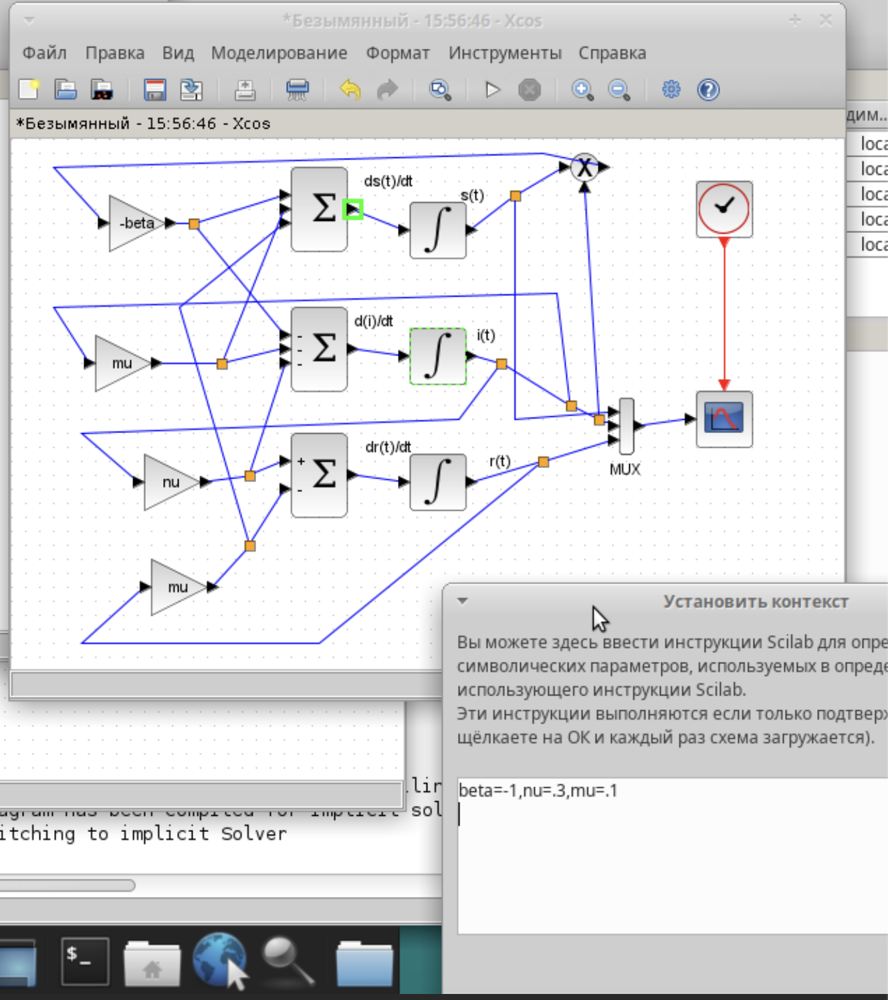
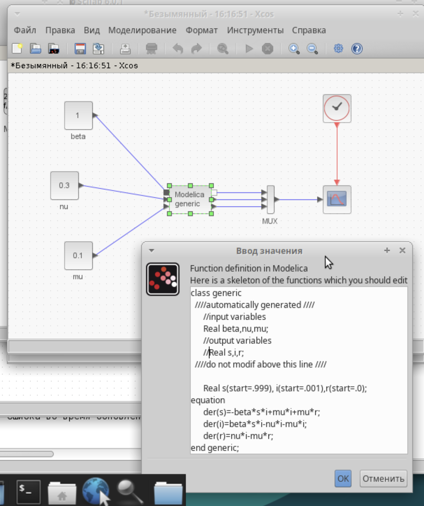
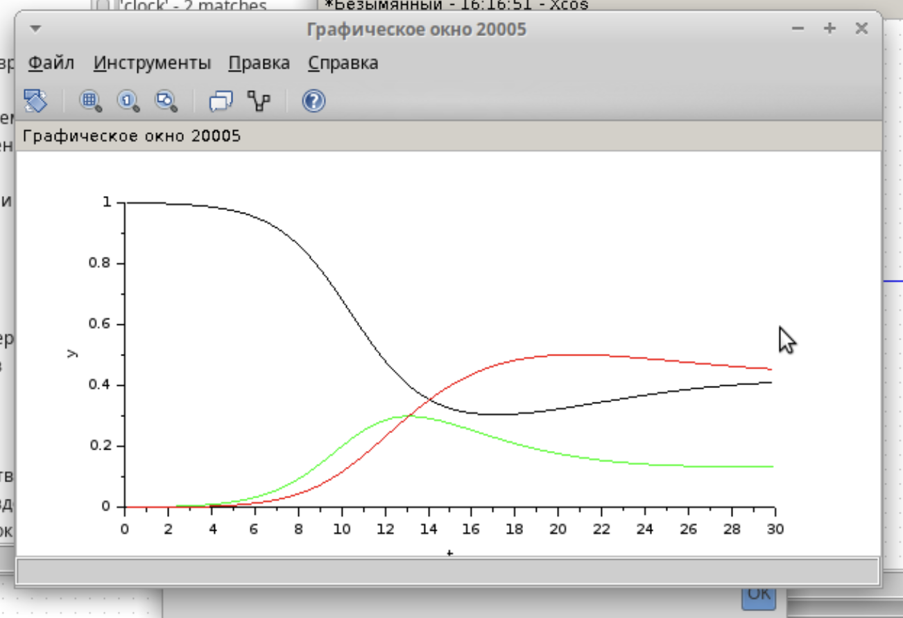
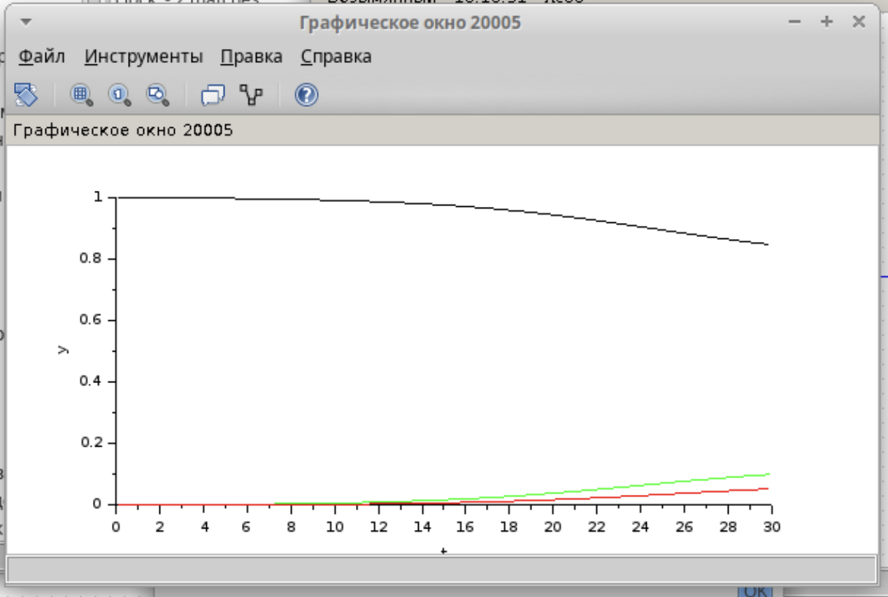

---
# Preamble

## Author
author:
  - name: Шубнякова Дарья НКНбд-01-22
    email: 1132226452@pfur.ru
    affiliation:
      - name: Российский университет дружбы народов
        country: Российская Федерация
        postal-code: 117198
        city: Москва
        address: ул. Миклухо-Маклая, д. 6

## Title
title: "Лабораторная работа №5"
subtitle: "Модель эпидемии (SIR)"
license: "CC BY"

## Generic options
lang: ru-RU
number-sections: true
toc: true
toc-title: "Содержание"
toc-depth: 2

## Formats
format:
  ### Pdf output format
  pdf:
    toc: true
    number-sections: true
    colorlinks: false
    toc-depth: 2
    documentclass: article
    papersize: a4
    fontsize: 12pt
    linestretch: 1.5
    babel-lang: russian
    babel-otherlangs: english
    indent: true
    header-includes: |
      \usepackage{indentfirst}
      \usepackage{float}
      \floatplacement{figure}{H}
      \usepackage{fontspec}
      \setmainfont{Times New Roman}
      \usepackage{titling}
      \renewcommand{\maketitlehooka}{\null\vfill}
      \renewcommand{\maketitlehookd}{\vfill\null\newpage}

  ### Docx output format
  docx:
    toc: true
    number-sections: true
    toc-depth: 2
---

\newpage

# Цель работы

Ознакомиться с моделью SIR и ее реализациями в xcos и с помощью языка Modelica.

# Задание

Требуется:
– реализовать модель SIR с учётом процесса рождения / гибели особей в xcos (в том числе и с использованием блока Modelica);
– построить графики эпидемического порога при различных значениях параметров модели (в частности изменяя параметр μ);
– сделать анализ полученных графиков в зависимости от выбранных значений параметров модели.

# Теоретическое введение

Модель SIR предложена в 1927 г. (W. O. Kermack, A. G. McKendrick). С описанием модели можно ознакомиться, например в [1].
Предполагается, что особи популяции размера N могут находиться в трёх различных состояниях:
– S (susceptible, уязвимые) — здоровые особи, которые находятся в группе риска и могут подхватить инфекцию;
– I (infective, заражённые, распространяющие заболевание) — заразившиеся пере- носчики болезни;
– R (recovered/removed, вылечившиеся) — те, кто выздоровел и перестал распро- странять болезнь (в эту категорию относят, например, приобретших иммунитет или умерших).
Внутри каждой из выделенных групп особи считаются неразличимыми по свойствам.

# Выполнение лабораторной работы

Устанавливаем контекст среды выполнения([рис. @fig-001]).

{#fig-001 width=70%}

Строим модель в xcos с помощью предложенных блоков и ориентируясь на модель в лабораторной работе([рис. @fig-002]).

{#fig-002 width=70%}

В параметрах вергнего блока устанавливаем верхний предел интегрирования s(0)=0.999([рис. @fig-003]).

{#fig-003 width=70%}

В среднем блоке устанавливаем параметр нижнего предела интегрирования i(0)=0.001([рис. @fig-004]).

{#fig-004 width=70%}

В параметрах моделирования задаем конечное время интегрирования, иначе наш график будет строится бесконечно([рис. @fig-005]).

{#fig-005 width=70%}

Получаем модель, сравниваем ее с рисунком в лабораторной работе, все аналогично. Зеленая линия определяет i(t) — динамику численности заражённых особей. Красная линия отвечает за r(t) — динамику численности выздоровевших особей, черная -- за s(t) (динамика численности уязвимых к болезни особей)([рис. @fig-006]).

{#fig-006 width=70%}

Прописываем код для блока Modelica([рис. @fig-007]).

{#fig-007 width=70%}

Задаем параметры как в лабораторной работе([рис. @fig-008]).

{#fig-008 width=70%}

Так выглядит модель на блоковой схеме([рис. @fig-009]).

{#fig-009 width=70%}

Получаем аналогичный результат([рис. @fig-010]).

{#fig-010 width=70%}

Задаем контекст среды выполнения для самостоятельной работы и строим блоковую схему по предложенным нам уравнениям, в которых учитываются демографические процессы, в частности, что смертность в популяции полностью уравновешивает рождаемость, а все рожденные индивидуу- мы появляются на свет абсолютно здоровыми([рис. @fig-011]).

{#fig-011 width=70%}

Затем делаем то же самое с помощью блока OpenModelica([рис. @fig-012]).

{#fig-012 width=70%}

Теперь задаем различные μ, где μ — константа, которая равна коэффициенту смертности и рождаемости. Здечь она равна 0.1([рис. @fig-013]).

{#fig-013 width=70%}

Здесь μ=0.3([рис. @fig-014]).

{#fig-014 width=70%}

Здесь μ=0.5([рис. @fig-014]).

{#fig-014 width=70%}

# Выводы

Мы ознакомились с тем, как строить блоковые схемы в xcos и реализовывать модели на языке Modelica. Получили такие выводы на графике: чем больше μ, которая равна коэффициенту смертности и рождаемости, то есть чем больше детей у нас рождается и чем меньше людей умирает, тем меньше пик динамика численности зараженных, динамика численности выздовевших так же имеет меньший максимум, а количество особей, уязвых к болези, наоборот, не достигает такого большого минимума, т.е. заражается меньше людей.
