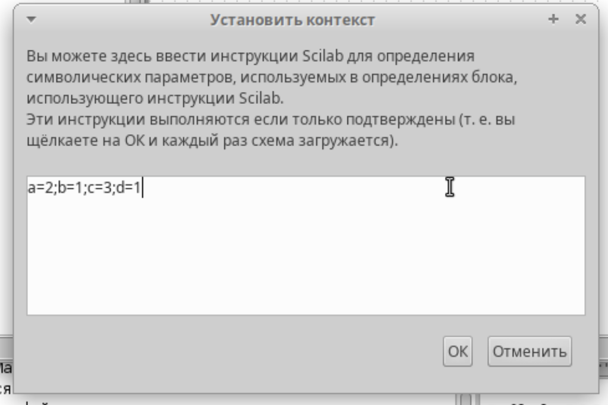
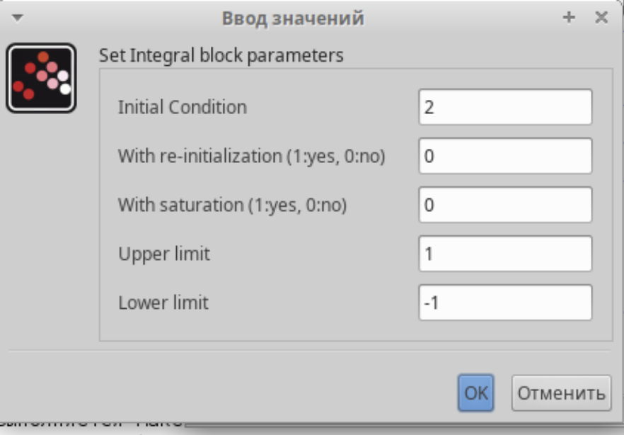
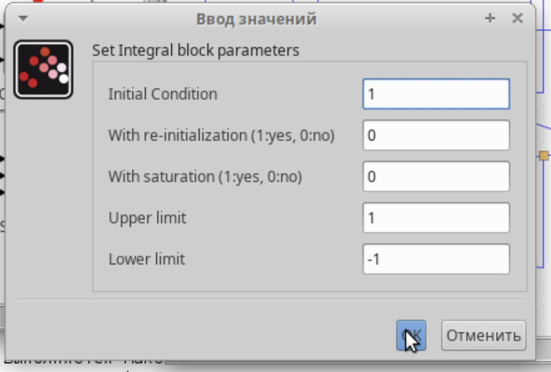
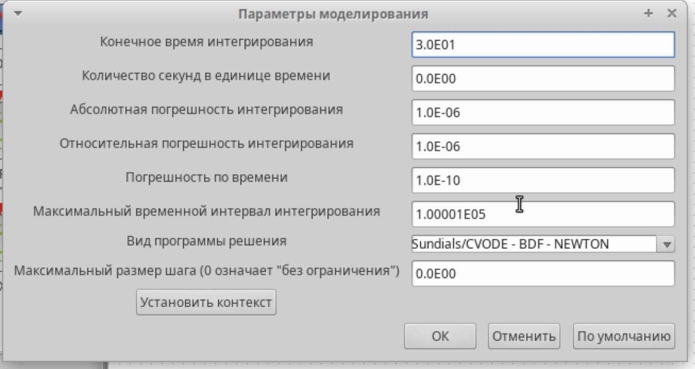
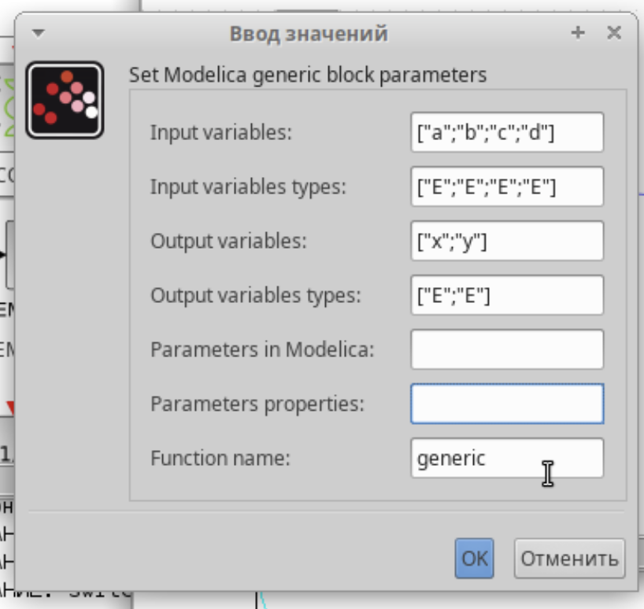
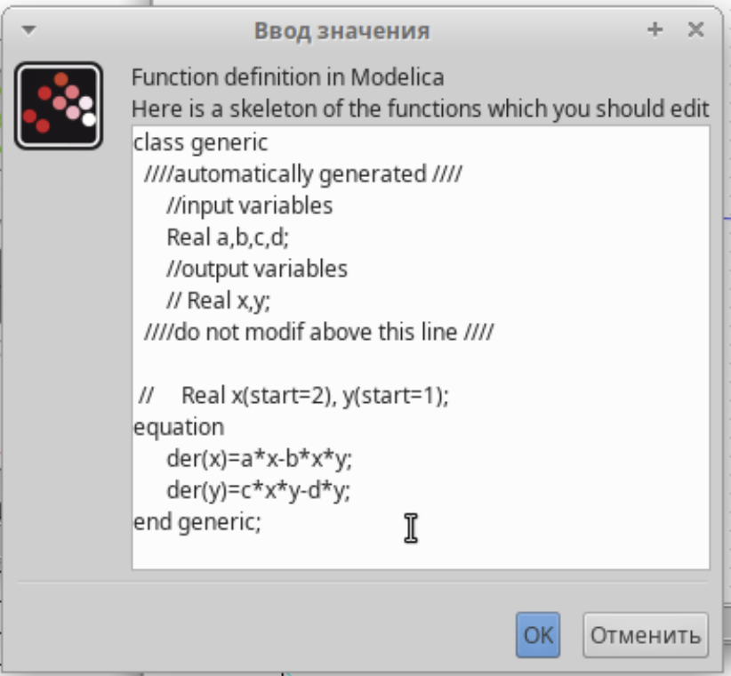
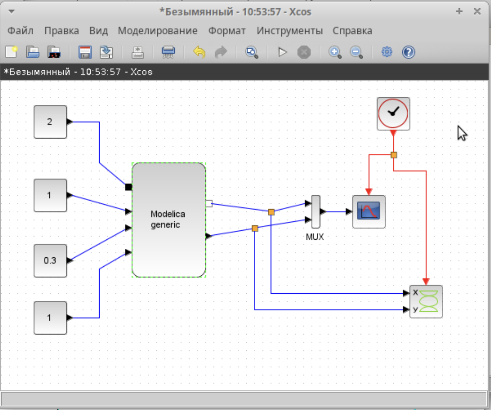
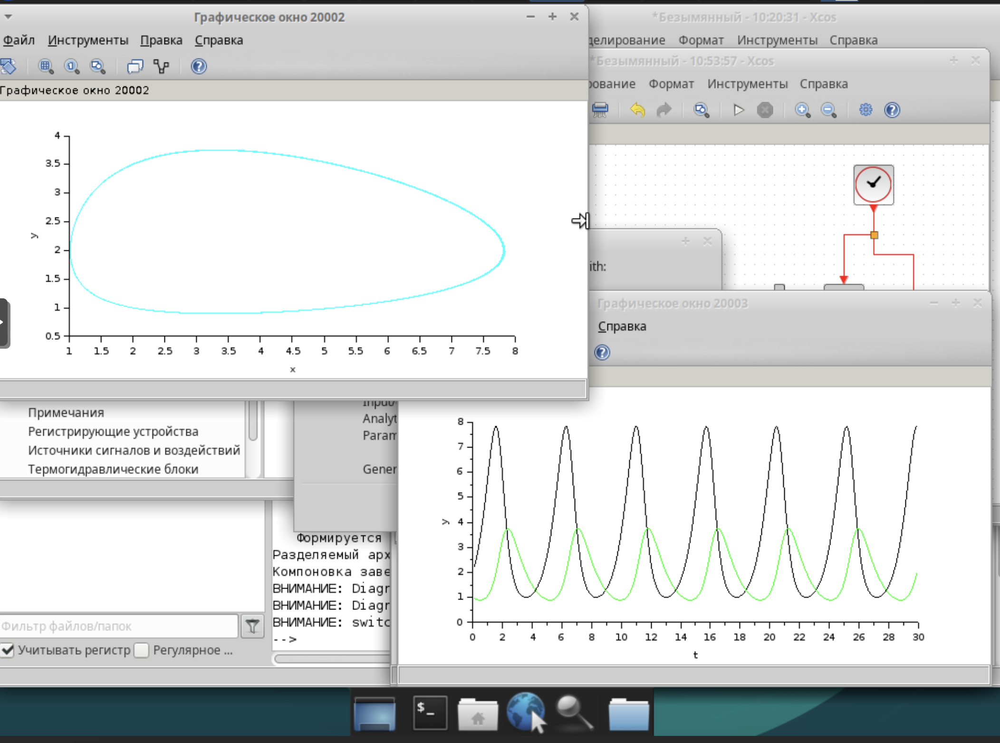
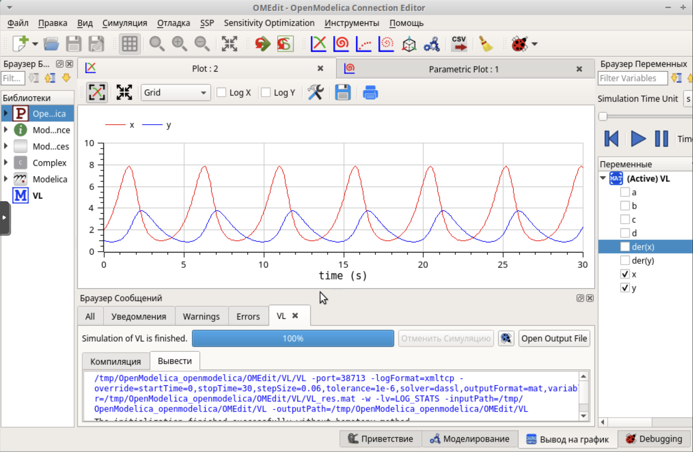
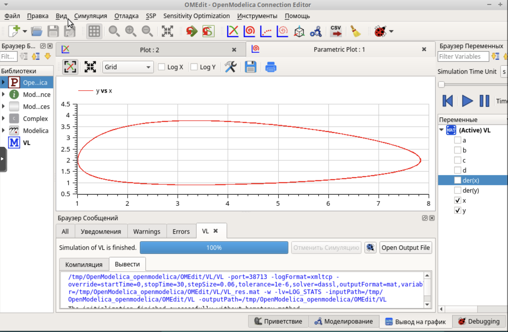

---
# Preamble

## Author
author:
  name: Шубнякова Дарья НКНбд-01-22
  email: 1132226452@pfur.ru
  affiliation:
    - name: Российский университет дружбы народов
      country: Российская Федерация
      postal-code: 117198
      city: Москва
      address: ул. Миклухо-Маклая, д. 6
## Title
title: Лабораторная работа №6
subtitle: Модель «хищник–жертва»
license: CC BY
## Generic options
lang: ru-RU
crossref:
  fig-title: "Рисунок"
  tbl-title: "Таблица"
  lst-title: "Листинг"
## Formats
format:
### Pdf output format
  beamer:
    toc: true
    toc-title: Содержание
    number-sections: true
    colorlinks: false
    toc-depth: 2
    slide-level: 2
    aspectratio: 169
    section-titles: true
    theme: metropolis
    theme-options:
      - progressbar=frametitle
      - sectionpage=progressbar
      - numbering=fraction
    pdf-engine: xelatex
    include-in-header:
      text: |
        \usepackage{fontspec}
        \setmainfont{Times New Roman}
        \setsansfont{Arial}
        \setmonofont{Courier New}
        \usepackage{polyglossia}
        \setdefaultlanguage{russian}
        \setotherlanguage{english}
        \usepackage{caption}
        \captionsetup[figure]{name=Рисунок}

### Html output
  revealjs:
    transition: slide
    margin: 0.2
    smaller: false
    output-ext: html
    theme: beige
    logo: _resources/image/logo_rudn.png
---

# Вводная часть

## Цели и задачи

Ознакомиться с моделью "хищник-жертва" и ее реализациями в xcos.

Реализовать модель «хищник – жертва» в OpenModelica. Построить графики изменения численности популяций и фазовый портрет.

# Основная часть

## Выполнение лабораторной работы

Устанавливаем контекст среды выполнения. Коэффицент рождаемости жертв равен двум, коэффицент убыли жертв 1, коэффицент рождения хищников 0.3, коэффицент убыли хищников равен 1.

{width=70%}

## Повторяем модель из задания, знакомимся с новым блоком CSCOPXY, который выведет нам фазовый портрет модели.

{width=70%}

## Задаем границы интегрирования.

{width=70%}

## Задаем границы интегрирования.

{width=70%}

## А после настраиваем время, равное 30 секундам.

{width=70%}

## Получаем два графика, они соответствуют данным в работе. На нашем графике зеленая линия -- это динамика численности хищников, черная -- динамика численности жертв. Фазовый портрет — графическое изображение системы на фазовой плоскости (или в многомерном пространстве), по координатным осям которого отложены зна- чения величин переменных системы.

## {width=70%}

## Задаем нужные параметры.

{width=70%}

## Прописываем код для блока Modelica.

{width=70%}

## Так выглядит модель на блоковой схеме.

{width=70%}

## Получаем аналогичный результат.

{width=70%}

## Выполняем упражнение. Прописываем код в OpenModelica.

{width=70%}

## Получаем такой же график, где красная линия -- это динамика хищников, синяя линия -- динамика жертв.

{width=70%}

## И так же реализуем фазовый портрет модели.

{width=70%}

# Результаты

Мы ознакомились с моделью "хищник-жертва", реализовали ее в xcos наглядно, затем с помощью блока Modelica. А также релизовали ее с помощью кода в OpenModelica.
