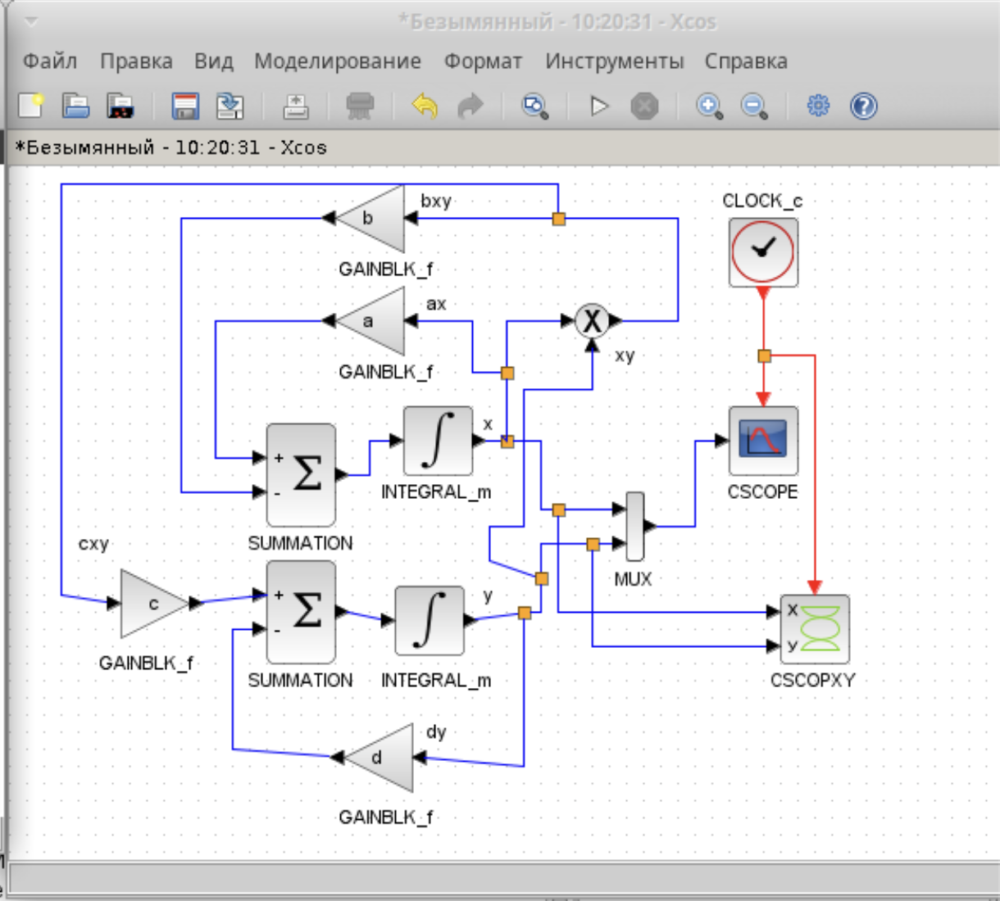
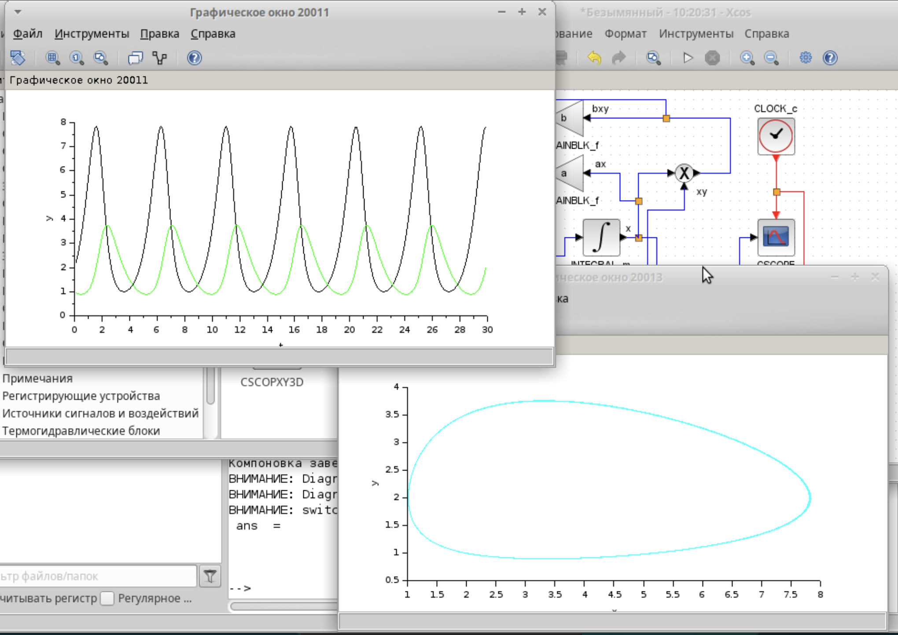
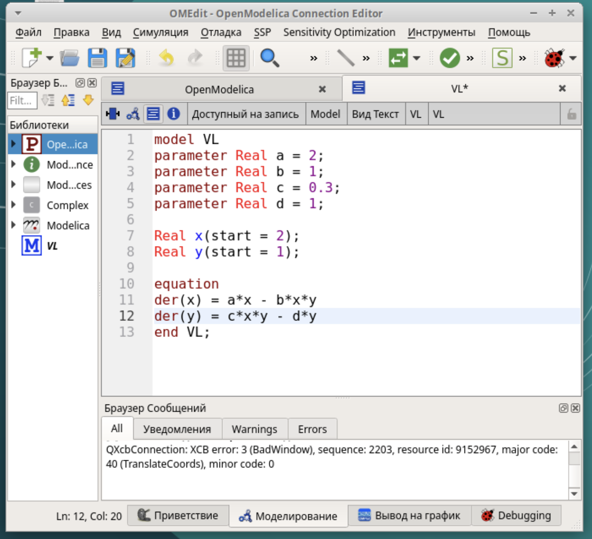

---
# Preamble

## Author
author:
  - name: Шубнякова Дарья НКНбд-01-22
    email: 1132226452@pfur.ru
    affiliation:
      - name: Российский университет дружбы народов
        country: Российская Федерация
        postal-code: 117198
        city: Москва
        address: ул. Миклухо-Маклая, д. 6

## Title
title: "Лабораторная работа №6"
subtitle: "Модель «хищник–жертва»"
license: "CC BY"

## Generic options
lang: ru-RU
number-sections: true
toc: true
toc-title: "Содержание"
toc-depth: 2

## Formats
format:
  ### Pdf output format
  pdf:
    toc: true
    number-sections: true
    colorlinks: false
    toc-depth: 2
    documentclass: article
    papersize: a4
    fontsize: 12pt
    linestretch: 1.5
    babel-lang: russian
    babel-otherlangs: english
    indent: true
    header-includes: |
      \usepackage{indentfirst}
      \usepackage{float}
      \floatplacement{figure}{H}
      \usepackage{fontspec}
      \setmainfont{Times New Roman}
      \usepackage{titling}
      \renewcommand{\maketitlehooka}{\null\vfill}
      \renewcommand{\maketitlehookd}{\vfill\null\newpage}

  ### Docx output format
  docx:
    toc: true
    number-sections: true
    toc-depth: 2
---

\newpage

# Цель работы

Ознакомиться с моделью "хищник-жертва" и ее реализациями в xcos.

# Задание

Реализовать модель «хищник – жертва» в OpenModelica. Построить графики изменения численности популяций и фазовый портрет.

# Теоретическое введение

Модель «хищник–жертва» (модель Лотки — Вольтерры) представляет собой модель межвидовой конкуренции.
x — количество жертв; y — количество хищников; a, b, c, d — коэффициенты, отражающие взаимодействия между видами: a — коэффициент рождаемости жертв; b — коэффициент убыли жертв; c — коэффициент рождения хищников; d — коэффициент убыли хищников.

# Выполнение лабораторной работы

Устанавливаем контекст среды выполнения. Коэффицент рождаемости жертв равен двум, коэффицент убыли жертв 1, коэффицент рождения хищников 0.3, коэффицент убыли хищников равен 1([рис. @fig-001]).

{#fig-001 width=70%}

Повторяем модель из задания, знакомимся с новым блоком CSCOPXY, который выведет нам фазовый портрет модели([рис. @fig-002]).

{#fig-002 width=70%}

Задаем границы интегрирования([рис. @fig-003]).

{#fig-003 width=70%}

Задаем границы интегрирования([рис. @fig-004]).

{#fig-004 width=70%}

А после настраиваем время, равное 30 секундам([рис. @fig-005]).

{#fig-005 width=70%}

Получаем два графика, они соответствуют данным в работе. На нашем графике зеленая линия -- это динамика численности хищников, черная -- динамика численности жертв. Фазовый портрет — графическое изображение системы на фазовой плоскости (или в многомерном пространстве), по координатным осям которого отложены зна- чения величин переменных системы.([рис. @fig-006]).

{#fig-006 width=70%}

Задаем нужные параметры([рис. @fig-007]).

{#fig-007 width=70%}

Прописываем код для блока Modelica([рис. @fig-008]).

{#fig-008 width=70%}

Так выглядит модель на блоковой схеме([рис. @fig-009]).

{#fig-009 width=70%}

Получаем аналогичный результат([рис. @fig-010]).

{#fig-010 width=70%}

Выполняем упражнение. Прописываем код в OpenModelica([рис. @fig-011]).

{#fig-011 width=70%}

Получаем такой же график, где красная линия -- это динамика хищников, синяя линия -- динамика жертв([рис. @fig-012]).

{#fig-012 width=70%}

И так же реализуем фазовый портрет модели([рис. @fig-013]).

{#fig-013 width=70%}

# Выводы

Мы ознакомились с моделью "хищник-жертва", реализовали ее в xcos наглядно, затем с помощью блока Modelica. А также релизовали ее с помощью кода в OpenModelica.
