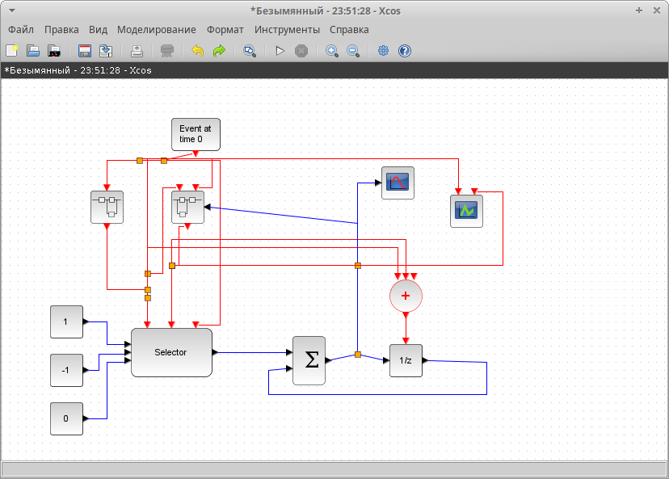
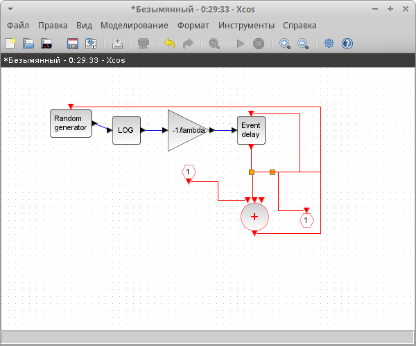
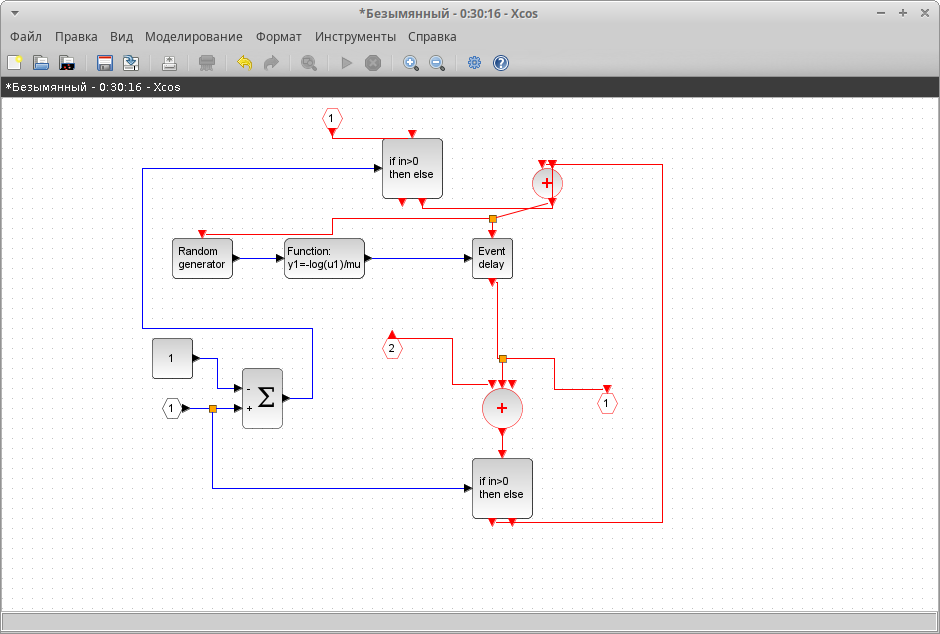

---
# Preamble

## Author
author:
  name: Шубнякова Дарья НКНбд-01-22
  email: 1132226452@pfur.ru
  affiliation:
    - name: Российский университет дружбы народов
      country: Российская Федерация
      postal-code: 117198
      city: Москва
      address: ул. Миклухо-Маклая, д. 6
## Title
title: Лабораторная работа №7
subtitle: Модель M|M|1|∞
license: CC BY
## Generic options
lang: ru-RU
crossref:
  fig-title: "Рисунок"
  tbl-title: "Таблица"
  lst-title: "Листинг"
## Formats
format:
### Pdf output format
  beamer:
    toc: true
    toc-title: Содержание
    number-sections: true
    colorlinks: false
    toc-depth: 2
    slide-level: 2
    aspectratio: 169
    section-titles: true
    theme: metropolis
    theme-options:
      - progressbar=frametitle
      - sectionpage=progressbar
      - numbering=fraction
    pdf-engine: xelatex
    include-in-header:
      text: |
        \usepackage{fontspec}
        \setmainfont{Times New Roman}
        \setsansfont{Arial}
        \setmonofont{Courier New}
        \usepackage{polyglossia}
        \setdefaultlanguage{russian}
        \setotherlanguage{english}
        \usepackage{caption}
        \captionsetup[figure]{name=Рисунок}

### Html output
  revealjs:
    transition: slide
    margin: 0.2
    smaller: false
    output-ext: html
    theme: beige
    logo: _resources/image/logo_rudn.png
---

# Вводная часть

## Цели и задачи

Рассмотреть пример моделирования в xcos системы массового обслуживания типа M |M |1|∞.

Реализовать модель в xcos.

# Основная часть

## Выполнение лабораторной работы

Задаем параметры среды.

{width=70%}

## Строим нашу модель. Далее детальнее рассмотрим все суперблоки.

{width=70%}

## Суперблок, моделирующий поступление заявок.

{width=70%}

## Суперблок, моделирующий обработку заявок.

{width=70%}

## Динамика размера очереди.

{width=70%}

## Поступление заявок выделен черным, а обработки -- зеленым.

## {width=70%}

# Результаты

Мы ознакомились с реализацией модели типа M |M |1|∞ в xcos, увидели график поступления и обработки заявок, а так же график динамики размера очереди.
