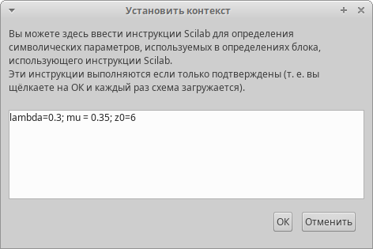
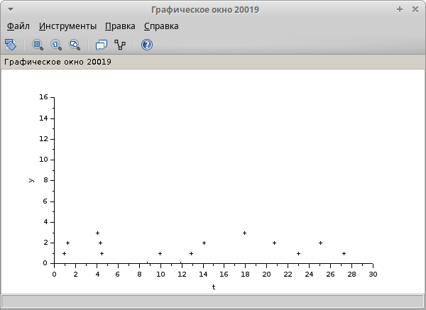
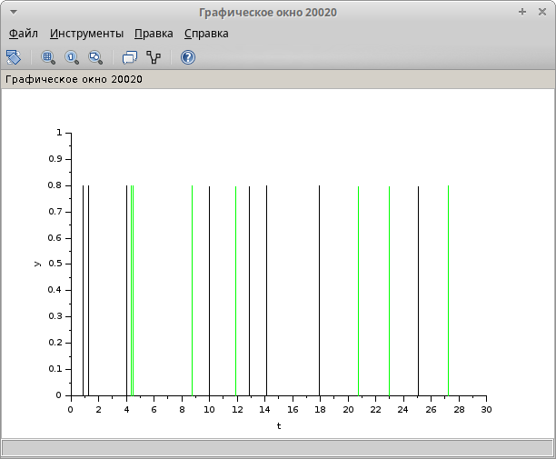

---
# Preamble

## Author
author:
  - name: Шубнякова Дарья НКНбд-01-22
    email: 1132226452@pfur.ru
    affiliation:
      - name: Российский университет дружбы народов
        country: Российская Федерация
        postal-code: 117198
        city: Москва
        address: ул. Миклухо-Маклая, д. 6

## Title
title: "Лабораторная работа №7"
subtitle: "Модель M|M|1|∞"
license: "CC BY"

## Generic options
lang: ru-RU
number-sections: true
toc: true
toc-title: "Содержание"
toc-depth: 2

## Formats
format:
  ### Pdf output format
  pdf:
    toc: true
    number-sections: true
    colorlinks: false
    toc-depth: 2
    documentclass: article
    papersize: a4
    fontsize: 12pt
    linestretch: 1.5
    babel-lang: russian
    babel-otherlangs: english
    indent: true
    header-includes: |
      \usepackage{indentfirst}
      \usepackage{float}
      \floatplacement{figure}{H}
      \usepackage{fontspec}
      \setmainfont{Times New Roman}
      \usepackage{titling}
      \renewcommand{\maketitlehooka}{\null\vfill}
      \renewcommand{\maketitlehookd}{\vfill\null\newpage}

  ### Docx output format
  docx:
    toc: true
    number-sections: true
    toc-depth: 2
---

\newpage

# Цель работы

Рассмотреть пример моделирования в xcos системы массового обслуживания типа M |M |1|∞.

# Задание

Реализовать модель в xcos.

# Теоретическое введение

Зафиксируем начальные данные: λ = 0, 3, μ = 0, 35, z0 = 6.

# Выполнение лабораторной работы

Задаем параметры среды([рис. @fig-001]).

{#fig-001 width=70%}

Строим нашу модель. далее детальнее рассмотрим все суперблоки([рис. @fig-002]).

{#fig-002 width=70%}

Суперблок, моделирующий поступление заявок([рис. @fig-003]).

{#fig-003 width=70%}

Суперблок, моделирующий обработку заявок([рис. @fig-004]).

{#fig-004 width=70%}

Динамика размера очереди([рис. @fig-005]).

{#fig-005 width=70%}

Поступление заявок выделен черным, а обработки -- зеленым([рис. @fig-006]).

{#fig-006 width=70%}

# Выводы

Мы ознакомились с реализацией модели типа M |M |1|∞ в xcos, увидели график поступления и обработки заявок, а так же график динамики размера очереди
