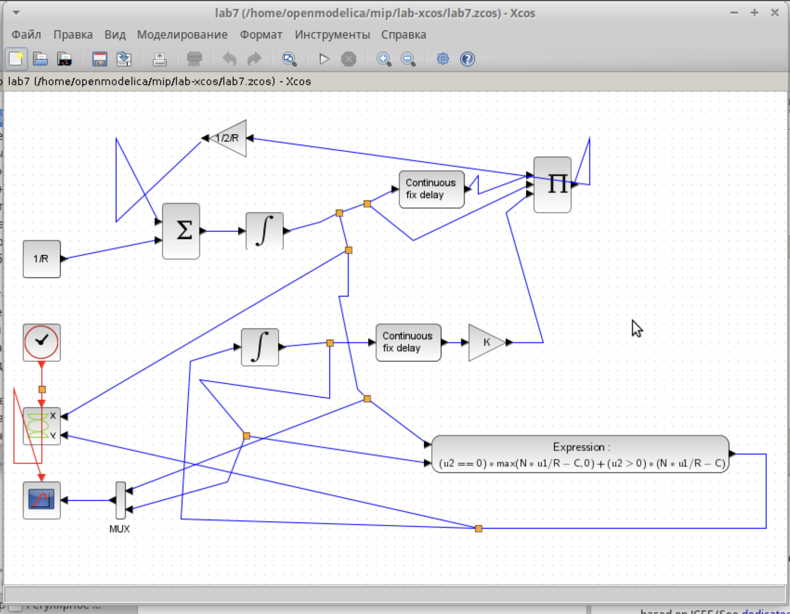
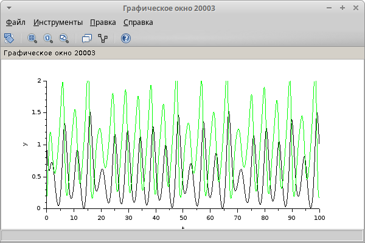
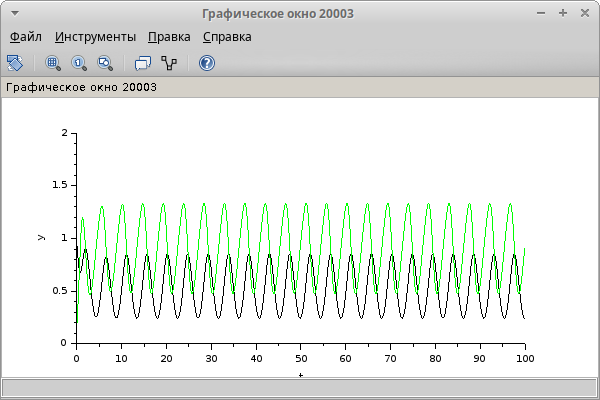
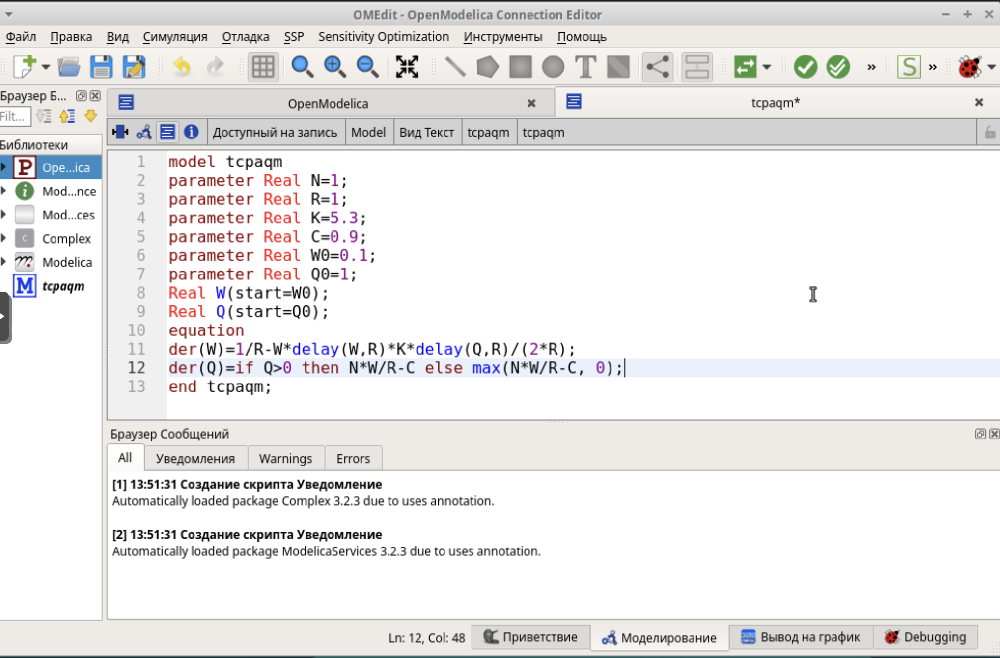
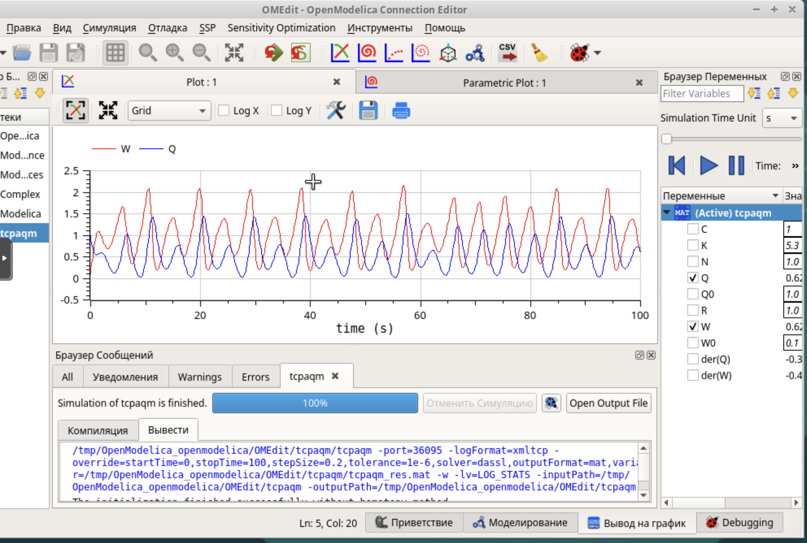

---
# Preamble

## Author
author:
  name: Шубнякова Дарья НКНбд-01-22
  email: 1132226452@pfur.ru
  affiliation:
    - name: Российский университет дружбы народов
      country: Российская Федерация
      postal-code: 117198
      city: Москва
      address: ул. Миклухо-Маклая, д. 6
## Title
title: Лабораторная работа №8
subtitle: Модель TCP/AQM
license: CC BY
## Generic options
lang: ru-RU
crossref:
  fig-title: "Рисунок"
  tbl-title: "Таблица"
  lst-title: "Листинг"
## Formats
format:
### Pdf output format
  beamer:
    toc: true
    toc-title: Содержание
    number-sections: true
    colorlinks: false
    toc-depth: 2
    slide-level: 2
    aspectratio: 169
    section-titles: true
    theme: metropolis
    theme-options:
      - progressbar=frametitle
      - sectionpage=progressbar
      - numbering=fraction
    pdf-engine: xelatex
    include-in-header:
      text: |
        \usepackage{fontspec}
        \setmainfont{Times New Roman}
        \setsansfont{Arial}
        \setmonofont{Courier New}
        \usepackage{polyglossia}
        \setdefaultlanguage{russian}
        \setotherlanguage{english}
        \usepackage{caption}
        \captionsetup[figure]{name=Рисунок}

### Html output
  revealjs:
    transition: slide
    margin: 0.2
    smaller: false
    output-ext: html
    theme: beige
    logo: _resources/image/logo_rudn.png
---

# Вводная часть

## Цели и задачи

Рассмотреть упрощённую модель поведения TCP-подобного трафика с регулируемой некоторым AQM алгоритмом динамической интенсивностью потока.

Реализовать модель TCP/AQM в xcos и OpenModelica.

# Основная часть

## Выполнение лабораторной работы

Устанавливаем контекст среды  с начальными значениями пара- метровN = 1,R = 1,K = 5,3,C = 1,W(0) = 0,1,Q(0) = 1.

{width=70%}

## Повторяем модель из задания.

{width=70%}

## Получаем график, где зеленая линия -- динамика изменения размера TCP окна W (t), черная -- динамика размера очереди Q(t).

{width=70%}

## Получаем фазовый портрет (W, Q).

{width=70%}

## Меняем значение параметра С -- скорость обработки пакетов в очереди (пакетов в секунду) с 1 на 0.9 и получаем такой график.

{width=70%}

## И фазовый портрет модели при С=0.9.

## {width=70%}

## Прописываем код для программы в OpenModelica. Для реализации задержки используем оператор delay().

{width=70%}

## Построим график динамики изменения размера TCP окна W(t) и размера очереди Q(t).

{width=70%}

## И фазовый портрет (W, Q).

{width=70%}

## До этого мы рассматривали график для С = 0.9, теперь смотрим для С = 1.

{width=70%}

## И фазовый портрет при С = 1.

{width=70%}

# Результаты

Мы ознакомились с моделью TCP/AQM, реализовали ее в xcos наглядно,а также релизовали ее с помощью кода в OpenModelica. Фазовый портрет (W, Q), который показывает наличие автоколебаний параметров системы — фазовая траектория осциллирует вокруг своей стационарной точки. При C = 0, 9 автоколебания более выраженные.
