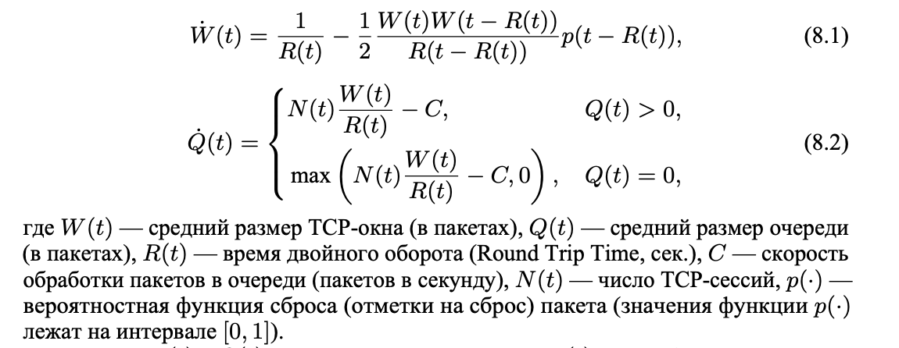
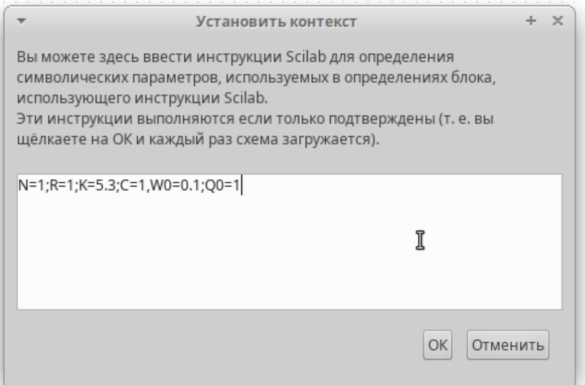
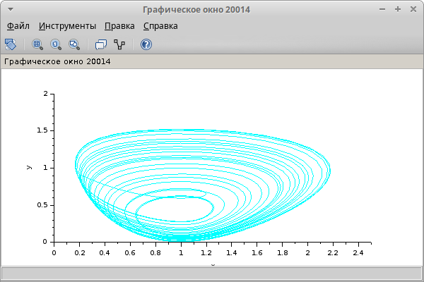
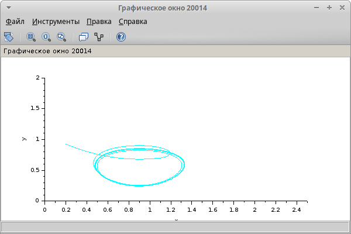
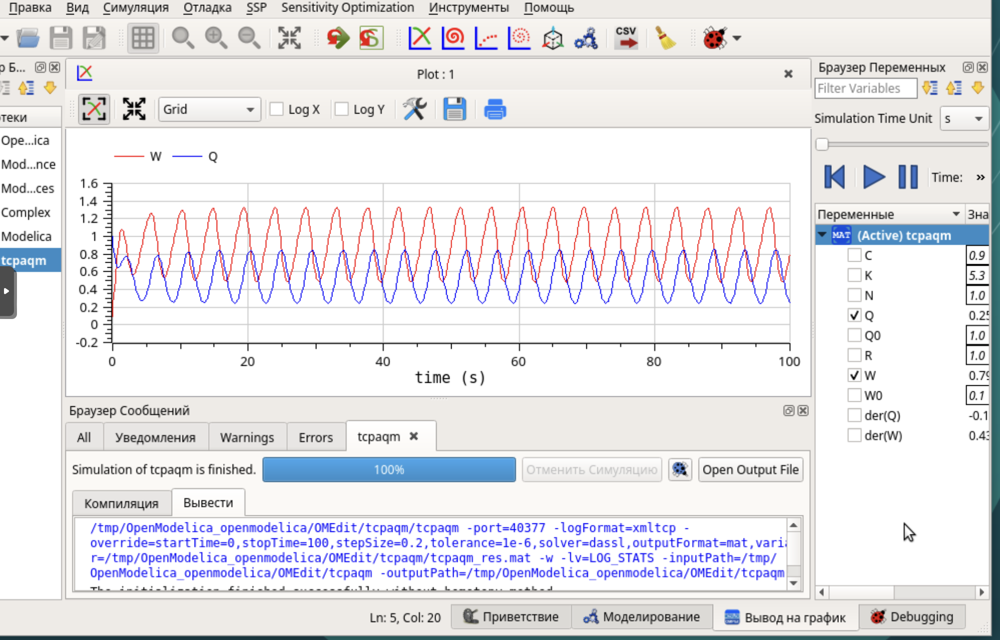
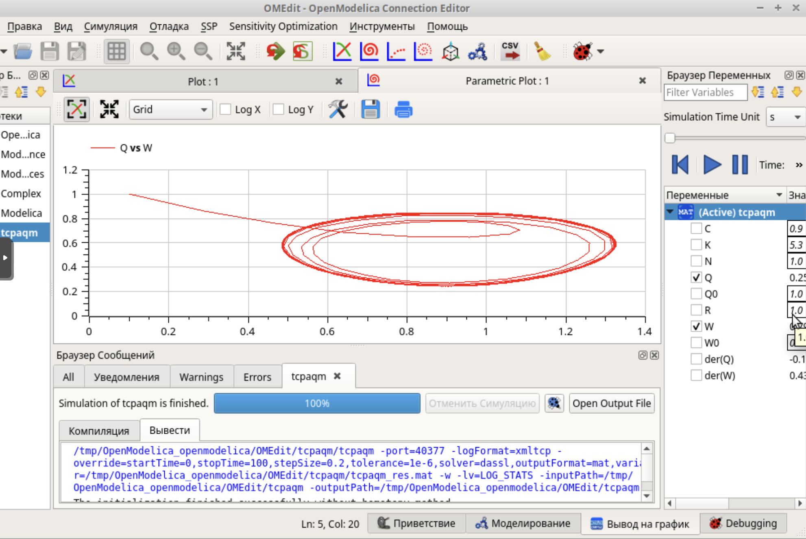
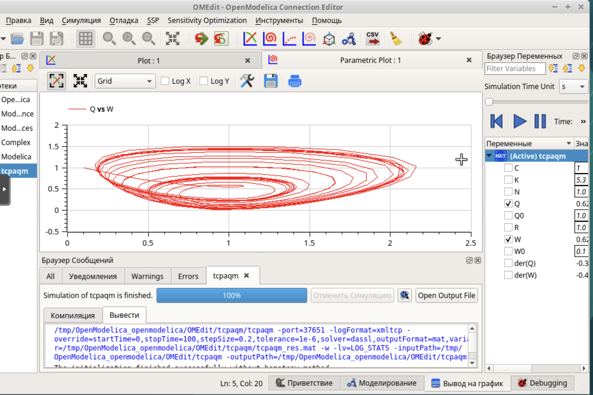

---
# Preamble

## Author
author:
  - name: Шубнякова Дарья НКНбд-01-22
    email: 1132226452@pfur.ru
    affiliation:
      - name: Российский университет дружбы народов
        country: Российская Федерация
        postal-code: 117198
        city: Москва
        address: ул. Миклухо-Маклая, д. 6

## Title
title: "Лабораторная работа №8"
subtitle: "Модель TCP/AQM"
license: "CC BY"

## Generic options
lang: ru-RU
number-sections: true
toc: true
toc-title: "Содержание"
toc-depth: 2

## Formats
format:
  ### Pdf output format
  pdf:
    toc: true
    number-sections: true
    colorlinks: false
    toc-depth: 2
    documentclass: article
    papersize: a4
    fontsize: 12pt
    linestretch: 1.5
    babel-lang: russian
    babel-otherlangs: english
    indent: true
    header-includes: |
      \usepackage{indentfirst}
      \usepackage{float}
      \floatplacement{figure}{H}
      \usepackage{fontspec}
      \setmainfont{Times New Roman}
      \usepackage{titling}
      \renewcommand{\maketitlehooka}{\null\vfill}
      \renewcommand{\maketitlehookd}{\vfill\null\newpage}

  ### Docx output format
  docx:
    toc: true
    number-sections: true
    toc-depth: 2
---

\newpage

# Цель работы

Рассмотреть упрощённую модель поведения TCP-подобного трафика с регулируемой некоторым AQM алгоритмом динамической интенсивностью потока.

# Задание

Реализовать модель TCP/AQM в xcos и OpenModelica.

# Теоретическое введение

{width=70%}

# Выполнение лабораторной работы

Устанавливаем контекст среды  с начальными значениями пара- метровN = 1,R = 1,K = 5,3,C = 1,W(0) = 0,1,Q(0) = 1([рис. @fig-001]).

{#fig-001 width=70%}

Повторяем модель из задания([рис. @fig-002]).

{#fig-002 width=70%}

Получаем график, где зеленая линия -- динамика изменения размера TCP окна W (t), черная -- динамика размера очереди Q(t)([рис. @fig-003]).

{#fig-003 width=70%}

Получаем фазовый портрет (W, Q)([рис. @fig-004]).

{#fig-004 width=70%}

Меняем значение параметра С -- скорость обработки пакетов в очереди (пакетов в секунду) с 1 на 0.9 и получаем такой график([рис. @fig-005]).

{#fig-005 width=70%}

И фазовый портрет модели при С=0.9([рис. @fig-006]).

{#fig-006 width=70%}

Прописываем код для программы в OpenModelica. Для реализации задержки используем оператор delay()([рис. @fig-007]).

{#fig-007 width=70%}

Построим график динамики изменения размера TCP окна W(t) и размера очереди Q(t)([рис. @fig-008]).

{#fig-008 width=70%}

И фазовый портрет (W, Q)([рис. @fig-009]).

{#fig-009 width=70%}

До этого мы рассматривали график для С = 0.9, теперь смотрим для С = 1([рис. @fig-010]).

{#fig-010 width=70%}

И фазовый портрет при С = 1([рис. @fig-011]).

{#fig-011 width=70%}

# Выводы

Мы ознакомились с моделью TCP/AQM, реализовали ее в xcos наглядно,а также релизовали ее с помощью кода в OpenModelica.
