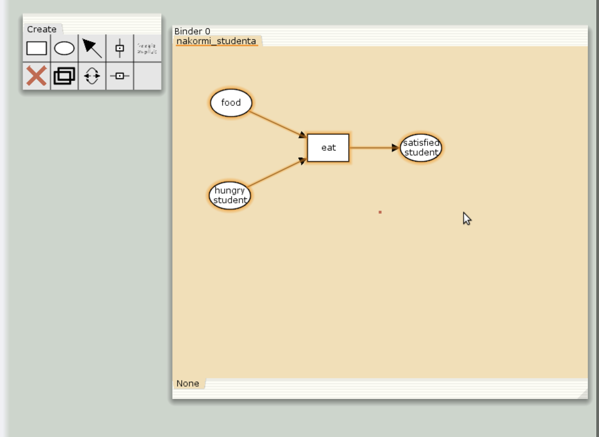
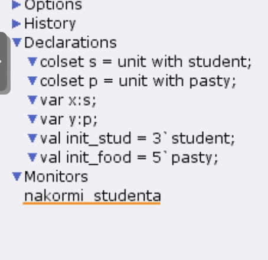
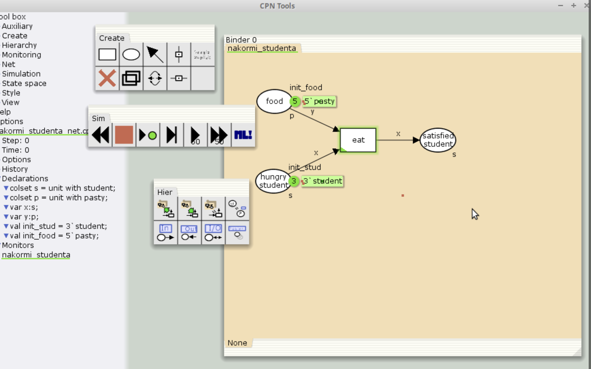
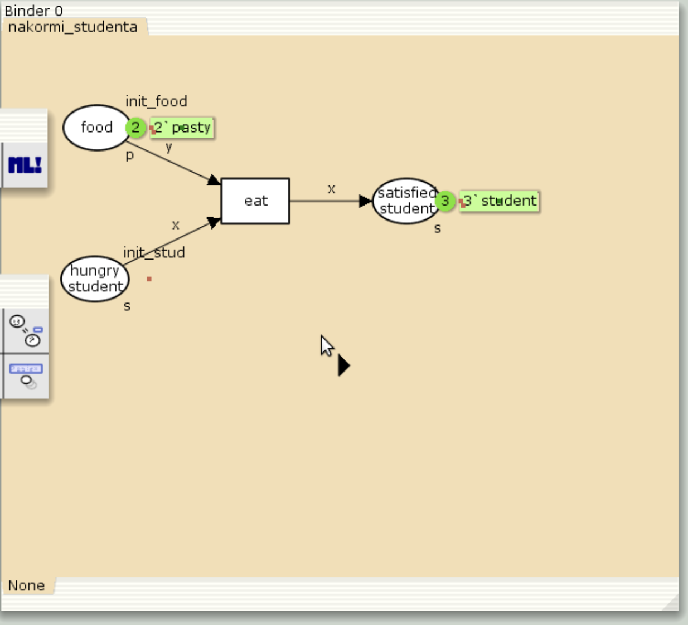
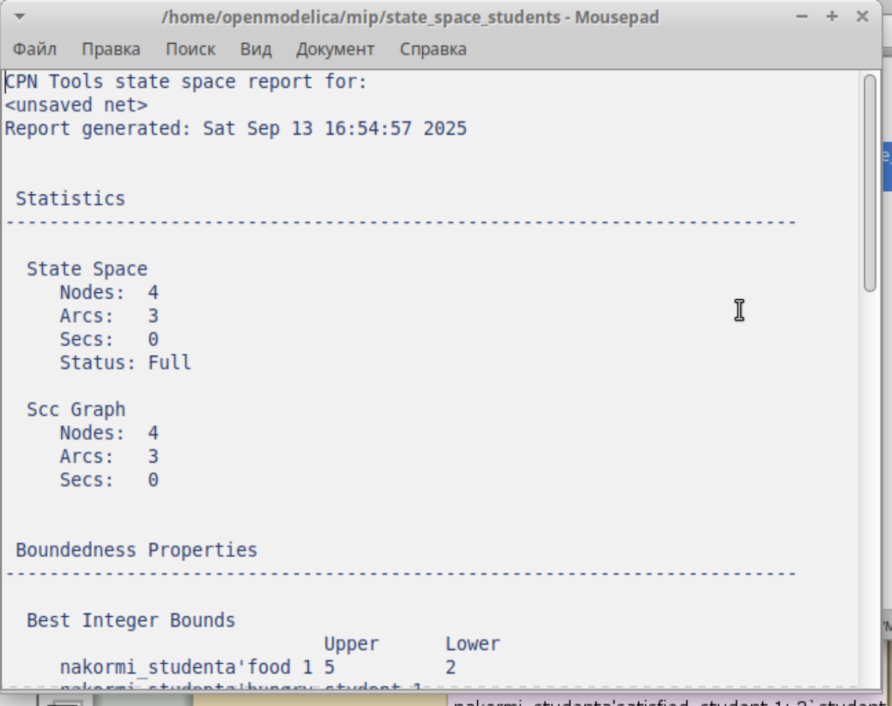

---
# Preamble

## Author
author:
  - name: Шубнякова Дарья НКНбд-01-22
    email: 1132226452@pfur.ru
    affiliation:
      - name: Российский университет дружбы народов
        country: Российская Федерация
        postal-code: 117198
        city: Москва
        address: ул. Миклухо-Маклая, д. 6

## Title
title: "Лабораторная работа №9"
subtitle: "Модель «Накорми студентов»"
license: "CC BY"

## Generic options
lang: ru-RU
number-sections: true
toc: true
toc-title: "Содержание"
toc-depth: 2

## Formats
format:
  ### Pdf output format
  pdf:
    toc: true
    number-sections: true
    colorlinks: false
    toc-depth: 2
    documentclass: article
    papersize: a4
    fontsize: 12pt
    linestretch: 1.5
    babel-lang: russian
    babel-otherlangs: english
    indent: true
    header-includes: |
      \usepackage{indentfirst}
      \usepackage{float}
      \floatplacement{figure}{H}
      \usepackage{fontspec}
      \setmainfont{Times New Roman}
      \usepackage{titling}
      \renewcommand{\maketitlehooka}{\null\vfill}
      \renewcommand{\maketitlehookd}{\vfill\null\newpage}

  ### Docx output format
  docx:
    toc: true
    number-sections: true
    toc-depth: 2
---

\newpage

# Цель работы

Ознакомиться с моделью "Накорми студентов" и работой в CPNTools. Построить предложенную модель.

# Задание

Вычислить пространство состояний. Сформировать отчёт о пространстве состояний и проанализируйте его. Построить граф пространства состояний.

# Теоретическое введение


CPN Tools — это программный инструментарий для редактирования, симуляции и анализа раскрашенных сетей Петри (Coloured Petri Nets, CPN). Он позволяет моделировать, описывать и исследовать параллельные распределенные вычислительные системы, включая временные и иерархические сети Петри, используя комбинацию графического редактора и языка программирования CPN ML.

# Выполнение лабораторной работы

Составляем модель. Имеем:
– два типа фишек: «пироги» и «студенты»;
– три позиции: «голодный студент», «пирожки», «сытый студент»; – один переход: «съесть пирожок»([рис. @fig-001]).

{#fig-001 width=70%}

В меню задаём новые декларации модели: типы фишек, начальные значения позиций, выражения для дуг([рис. @fig-002]).

{#fig-002 width=70%}


После этого задаем тип s фишкам, относящимся к студентам, тип p — фишкам, относящимся к пирогам, задаём значения переменных x и y для дуг и начальные значения мультимножеств init_stud и init_food ([рис. @fig-003]).

{#fig-003 width=70%}

В результате получаем работающую модель. После запуска фишки типа «пирожки» из позиции «еда» и фишки типа «студен- ты» из позиции «голодный студент», пройдя через переход «кушать», попадают в позицию «сытый студент» и преобразуются в тип «студенты»([рис. @fig-004]).

{#fig-004 width=70%}

Выполняем упражнение. Строим граф пространства состояний([рис. @fig-005]).

{#fig-005 width=70%}

А так же получаем отчет о пространстве состояний([рис. @fig-006]).

{#fig-006 width=70%}

# Выводы

Мы ознакомились с моделью "Накорми студента". Ознакомились с базовыми аспектами работы в CPNTools.

Получили отчет по работе модели.

```
CPN Tools state space report for:
<unsaved net>
Report generated: Sat Sep 13 16:54:57 2025


 Statistics
------------------------------------------------------------------------

  State Space
     Nodes:  4
     Arcs:   3
     Secs:   0
     Status: Full

  Scc Graph
     Nodes:  4
     Arcs:   3
     Secs:   0


 Boundedness Properties
------------------------------------------------------------------------

  Best Integer Bounds
                             Upper      Lower
     nakormi_studenta'food 1 5          2
     nakormi_studenta'hungry_student 1
                             3          0
     nakormi_studenta'satisfied_student 1
                             3          0

  Best Upper Multi-set Bounds
     nakormi_studenta'food 1
                         5`pasty
     nakormi_studenta'hungry_student 1
                         3`student
     nakormi_studenta'satisfied_student 1
                         3`student

  Best Lower Multi-set Bounds
     nakormi_studenta'food 1
                         2`pasty
     nakormi_studenta'hungry_student 1
                         empty
     nakormi_studenta'satisfied_student 1
                         empty


 Home Properties
------------------------------------------------------------------------

  Home Markings
     [4]


 Liveness Properties
------------------------------------------------------------------------

  Dead Markings
     [4]

  Dead Transition Instances
     None

  Live Transition Instances
     None


 Fairness Properties
------------------------------------------------------------------------
     No infinite occurrence sequences.
```

