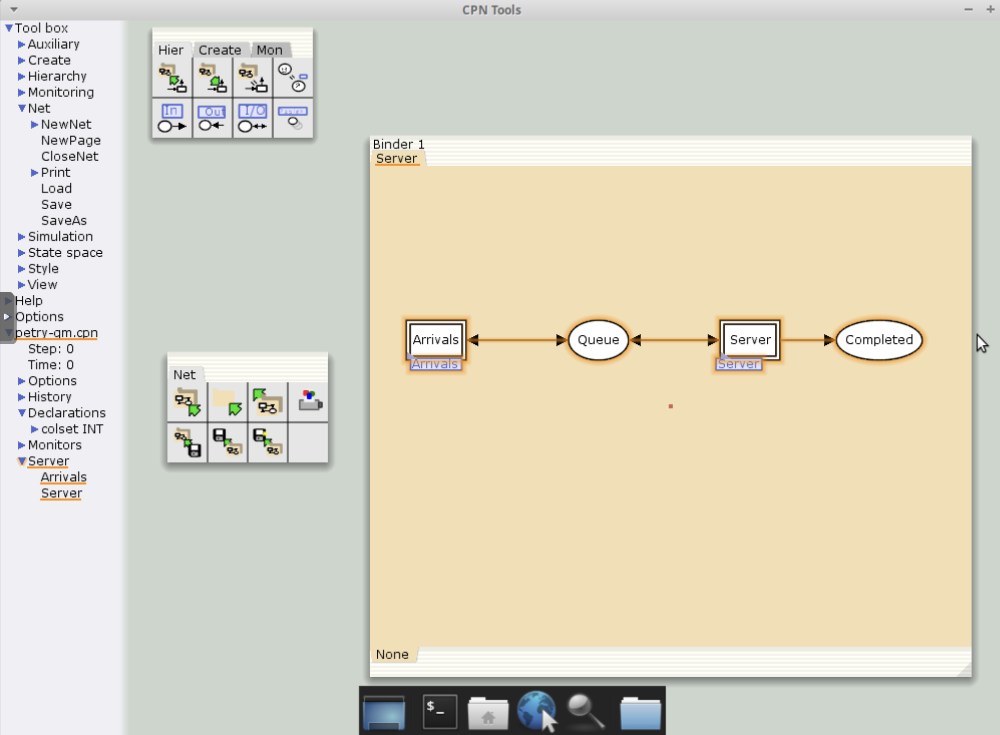
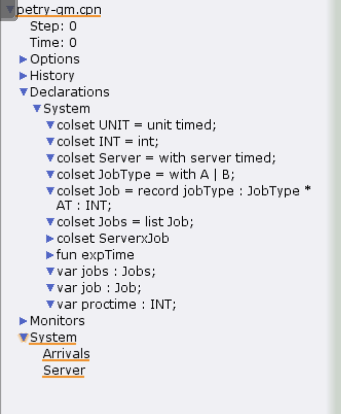
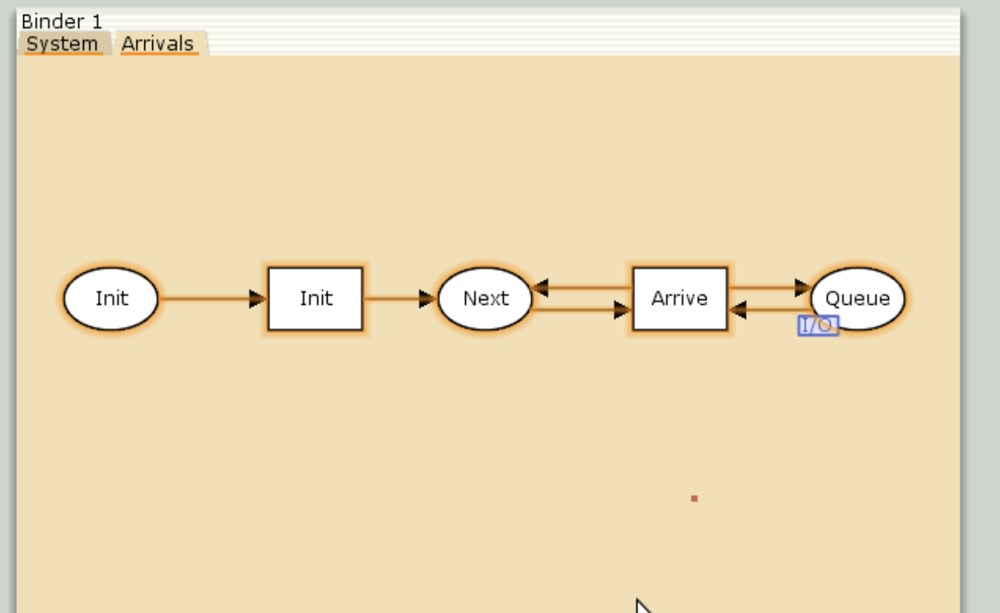
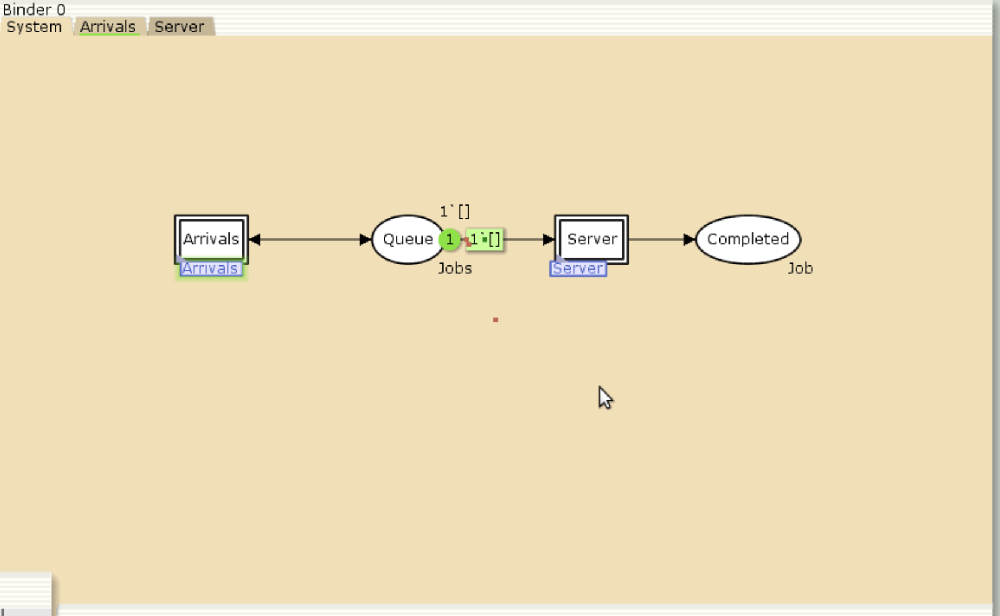
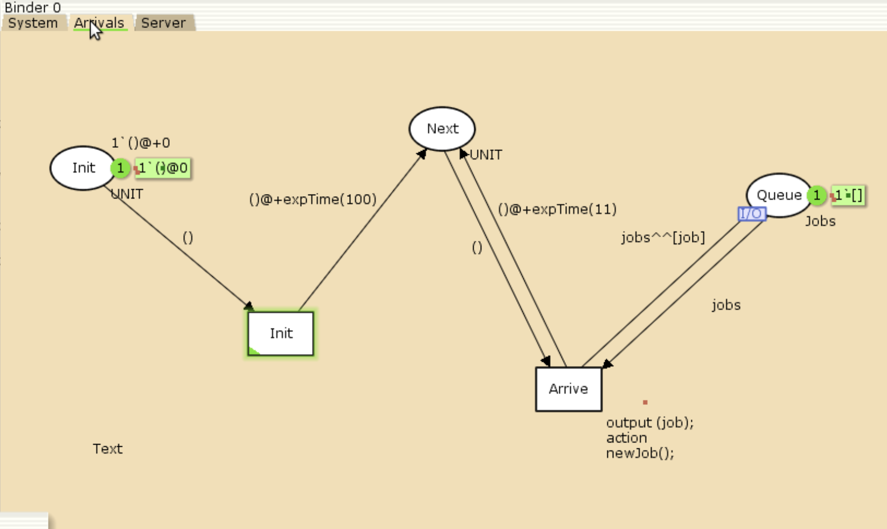
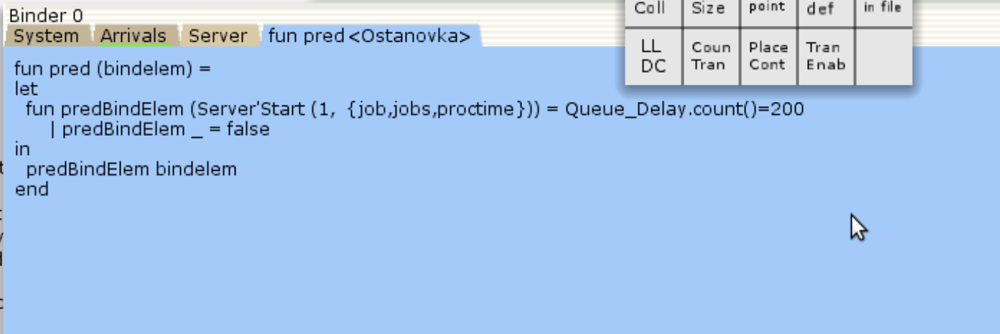
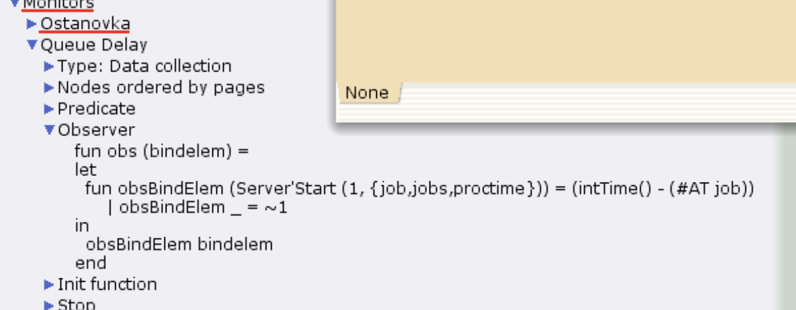

---
# Preamble

## Author
author:
  name: Шубнякова Дарья НКНбд-01-22
  email: 1132226452@pfur.ru
  affiliation:
    - name: Российский университет дружбы народов
      country: Российская Федерация
      postal-code: 117198
      city: Москва
      address: ул. Миклухо-Маклая, д. 6
## Title
title: Лабораторная работа №11
subtitle: Модель системы массового обслуживания M|M|1
license: CC BY
## Generic options
lang: ru-RU
crossref:
  fig-title: "Рисунок"
  tbl-title: "Таблица"
  lst-title: "Листинг"
## Formats
format:
### Pdf output format
  beamer:
    toc: true
    toc-title: Содержание
    number-sections: true
    colorlinks: false
    toc-depth: 2
    slide-level: 2
    aspectratio: 169
    section-titles: true
    theme: metropolis
    theme-options:
      - progressbar=frametitle
      - sectionpage=progressbar
      - numbering=fraction
    pdf-engine: xelatex
    include-in-header:
      text: |
        \usepackage{fontspec}
        \setmainfont{Times New Roman}
        \setsansfont{Arial}
        \setmonofont{Courier New}
        \usepackage{polyglossia}
        \setdefaultlanguage{russian}
        \setotherlanguage{english}
        \usepackage{caption}
        \captionsetup[figure]{name=Рисунок}

### Html output
  revealjs:
    transition: slide
    margin: 0.2
    smaller: false
    output-ext: html
    theme: beige
    logo: _resources/image/logo_rudn.png
---

# Вводная часть

## Цели и задачи

В систему поступает поток заявок двух типов, распределённый по пуассоновскому закону. Заявки поступают в очередь сервера на обработку. Дисциплина очереди - FIFO. Если сервер находится в режиме ожидания (нет заявок на сервере), то заявка поступает на обработку сервером. Реализовать эту модель в CPNTools. Построить нужные нам графики.

Реализовать эту модель в CPNTools. Построить нужные нам графики.

# Основная часть

## Выполнение лабораторной работы

Делаем схему System и с помощью иерархии добавляем два подблока: Arrivals и Server.

{width=70%}

## Объявляем нужные декларации.

{width=70%}

## Строим блок Arrivals.

{width=70%}

## Строим блок System.

{width=70%}

## Видим, что очередь подключилась

{width=70%}

## Задаем необходимые параметры элементов в System

{width=70%}

## Задаем нужные параметры элементов в Arrivals.

{width=70%}

## Задаем нужные параметры в Server.

{width=70%}

## Переписываем ф-ию Predicate в мониторе Ostanovka.

{width=70%}

## Переписываем ф-ию Observer в мониторе Queue Delay.

{width=70%}

## Видим, что наша очередь заработала.

{width=70%}

## Переписываем ф-ию Observer в мониторе Queue Delay Real.

{width=70%}

## Получаем значения в Queue Delay.

{width=70%}

## Рисуем график по этим данным с помощью GNUPlot. График изменения задержки в очереди.

{width=70%}

## Получаем значения в Queue Delay Real.

{width=70%}

## Рисуем второй график по этим данным. Периоды времени, когда значения задержки в очереди превышали заданное значение.

{width=70%}

# Результаты

Мы ознакомились с реализацием модели системы массового обслуживания M|M|1 в CPNTools и рассмотрели графики, построенные в GNUPlot.
