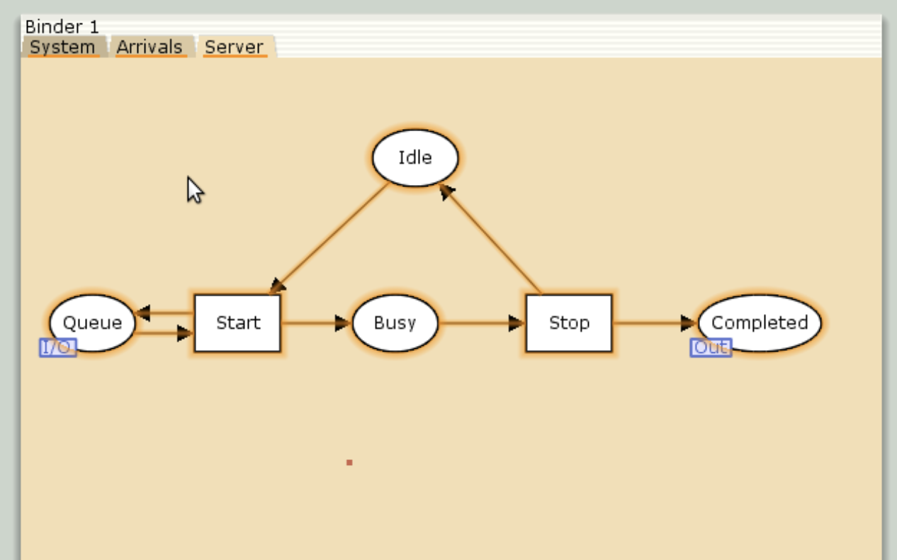
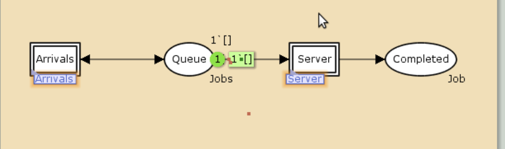
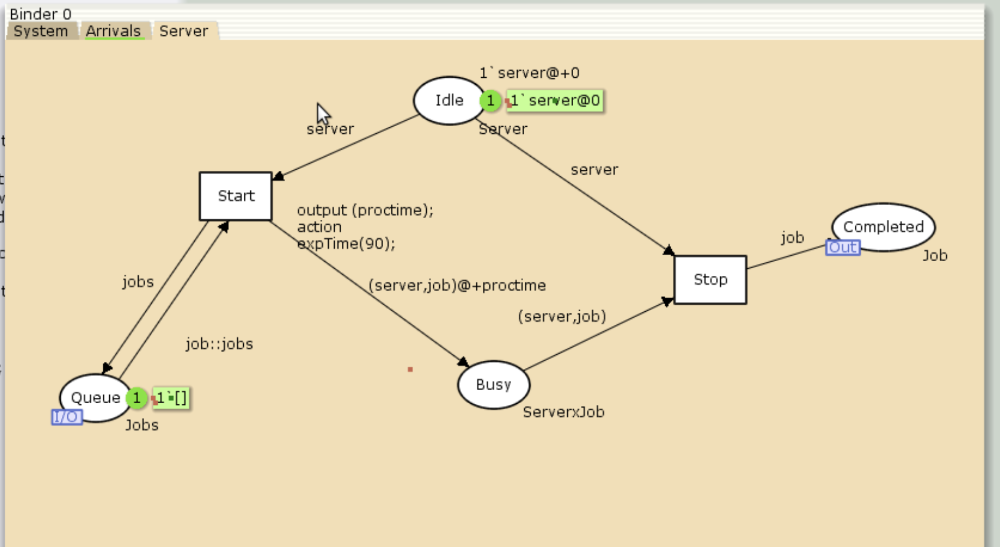
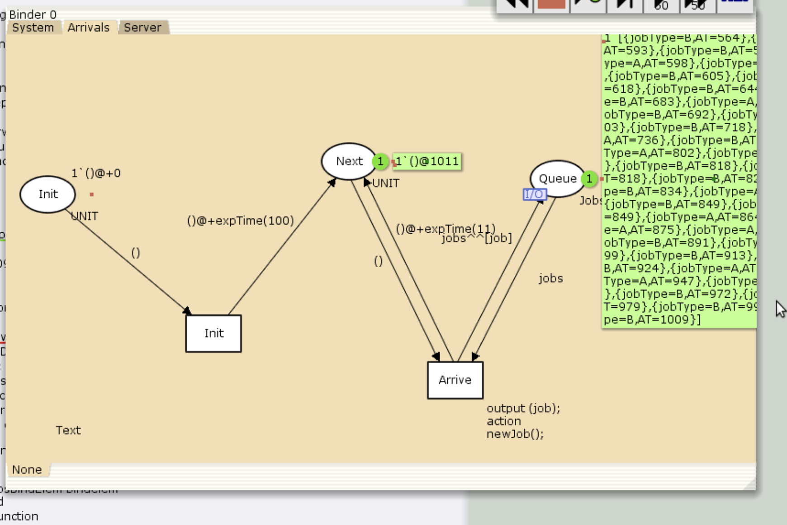
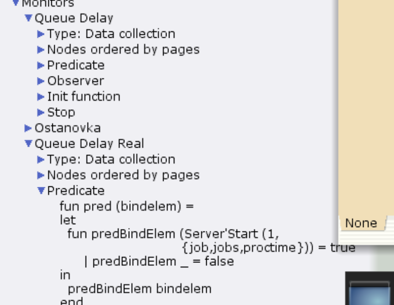
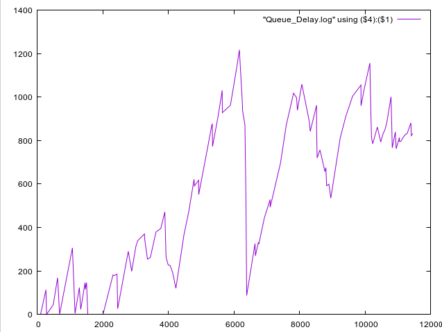
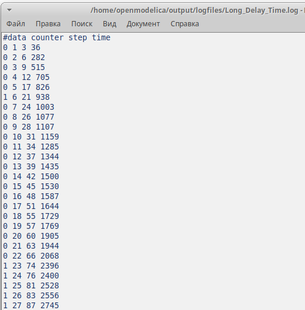

---
# Preamble

## Author
author:
  - name: Шубнякова Дарья НКНбд-01-22
    email: 1132226452@pfur.ru
    affiliation:
      - name: Российский университет дружбы народов
        country: Российская Федерация
        postal-code: 117198
        city: Москва
        address: ул. Миклухо-Маклая, д. 6

## Title
title: "Лабораторная работа №11"
subtitle: "Модель системы массового обслуживания M|M|1"
license: "CC BY"

## Generic options
lang: ru-RU
number-sections: true
toc: true
toc-title: "Содержание"
toc-depth: 2

## Formats
format:
  ### Pdf output format
  pdf:
    toc: true
    number-sections: true
    colorlinks: false
    toc-depth: 2
    documentclass: article
    papersize: a4
    fontsize: 12pt
    linestretch: 1.5
    babel-lang: russian
    babel-otherlangs: english
    indent: true
    header-includes: |
      \usepackage{indentfirst}
      \usepackage{float}
      \floatplacement{figure}{H}
      \usepackage{fontspec}
      \setmainfont{Times New Roman}
      \usepackage{titling}
      \renewcommand{\maketitlehooka}{\null\vfill}
      \renewcommand{\maketitlehookd}{\vfill\null\newpage}

  ### Docx output format
  docx:
    toc: true
    number-sections: true
    toc-depth: 2
---

\newpage

# Цель работы

В систему поступает поток заявок двух типов, распределённый по пуассоновскому закону. Заявки поступают в очередь сервера на обработку. Дисциплина очереди - FIFO. Если сервер находится в режиме ожидания (нет заявок на сервере), то заявка поступает на обработку сервером. Реализовать эту модель в CPNTools. Построить нужные нам графики.

# Задание

Реализовать эту модель в CPNTools. Построить нужные нам графики.

# Теоретическое введение

В работе рассматривается много важных аспектов ткаих, как работа с иерархией, создание файлов с работой модели и построение графиков по ним в GNUPlot.

# Выполнение лабораторной работы

Делаем схему System и с помощью иерархии добавляем два подблока: Arrivals и Server([рис. @fig-001]).

{#fig-001 width=70%}

Объявляем нужные декларации([рис. @fig-002]).

{#fig-002 width=70%}

Строим блок Arrivals([рис. @fig-003]).

{#fig-003 width=70%}

Строим блок System([рис. @fig-004]).

{#fig-004 width=70%}

Видим, что очередь подключилась([рис. @fig-005]).

{#fig-005 width=70%}

Задаем необходимые параметры элементов в System([рис. @fig-006]).

{#fig-006 width=70%}

Задаем нужные параметры элементов в Arrivals([рис. @fig-007]).

{#fig-007 width=70%}

Задаем нужные параметры в Server([рис. @fig-008]).

{#fig-008 width=70%}

Переписываем ф-ию остановки в мониторе Ostanovka([рис. @fig-009]).

{#fig-009 width=70%}

Переписываем ф-ию Observer в мониторе Queue Delay([рис. @fig-010]).

{#fig-010 width=70%}

Видим, что наша очередь заработала([рис. @fig-011]).

{#fig-011 width=70%}

Переписываем ф-ию Observer в мониторе Queue Delay Real([рис. @fig-012]).

{#fig-012 width=70%}

Получаем значения в Queue Delay([рис. @fig-013]).

{#fig-013 width=70%}

Рисуем график по этим данным с помощью GNUPlot. График изменения задержки в очереди([рис. @fig-014]).

{#fig-014 width=70%}

Получаем значения в Queue Delay Real([рис. @fig-015]).

{#fig-015 width=70%}

Рисуем второй график по этим данным. Периоды времени, когда значения задержки в очереди превышали заданное значение([рис. @fig-016]).

{#fig-016 width=70%}

# Выводы

Мы ознакомились с реализацием модели системы массового обслуживания M|M|1 в CPNTools и рассмотрели графики, построенные в GNUPlot.
