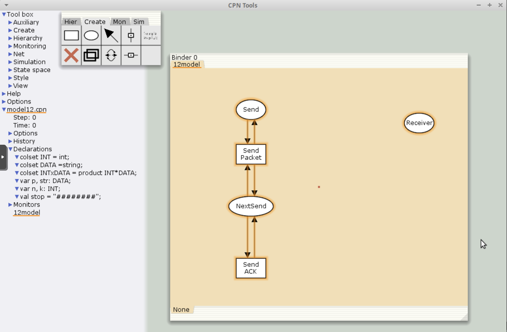
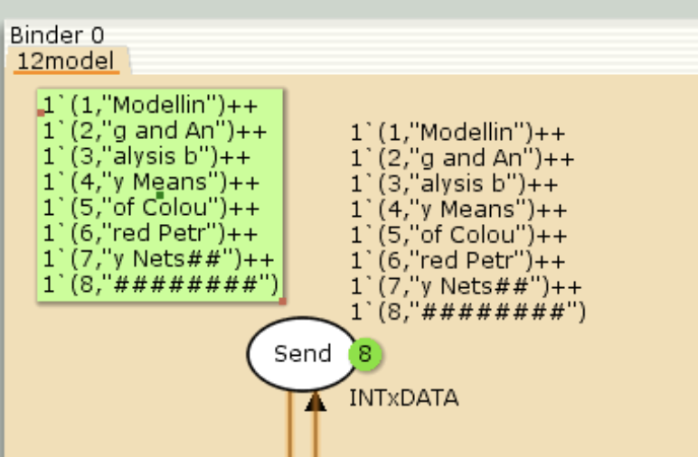
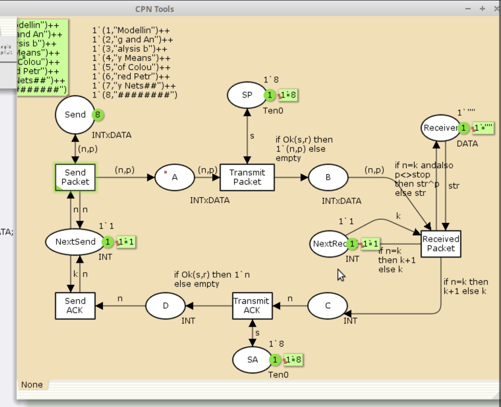
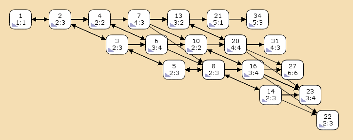

---
# Preamble

## Author
author:
  - name: Шубнякова Дарья НКНбд-01-22
    email: 1132226452@pfur.ru
    affiliation:
      - name: Российский университет дружбы народов
        country: Российская Федерация
        postal-code: 117198
        city: Москва
        address: ул. Миклухо-Маклая, д. 6

## Title
title: "Лабораторная работа №12"
subtitle: "Пример моделирования простого протокола передачи данных"
license: "CC BY"

## Generic options
lang: ru-RU
number-sections: true
toc: true
toc-title: "Содержание"
toc-depth: 2

## Formats
format:
  ### Pdf output format
  pdf:
    toc: true
    number-sections: true
    colorlinks: false
    toc-depth: 2
    documentclass: article
    papersize: a4
    fontsize: 12pt
    linestretch: 1.5
    babel-lang: russian
    babel-otherlangs: english
    indent: true
    header-includes: |
      \usepackage{indentfirst}
      \usepackage{float}
      \floatplacement{figure}{H}
      \usepackage{fontspec}
      \setmainfont{Times New Roman}
      \usepackage{titling}
      \renewcommand{\maketitlehooka}{\null\vfill}
      \renewcommand{\maketitlehookd}{\vfill\null\newpage}

  ### Docx output format
  docx:
    toc: true
    number-sections: true
    toc-depth: 2
---

\newpage

# Цель работы

Рассмотрим ненадёжную сеть передачи данных, состоящую из источника, получате- ля.
Перед отправкой очередной порции данных источник должен получить от полу- чателя подтверждение о доставке предыдущей порции данных.
Считаем, что пакет состоит из номера пакета и строковых данных. Передавать будем сообщение «Modelling and Analysis by Means of Coloured Petry Nets», разбитое по 8 символов.

# Задание

Вычислить пространство состояний. Сформировать отчёт о пространстве состояний и проанализировать его. Построить граф пространства состояний.

# Теоретическое введение

Данная задача моделирует протокол Stop-and-Wait ARQ (Automatic Repeat Request), используемый для надежной передачи данных в ненадежных каналах связи. Основной принцип: отправитель отправляет один пакет и ожидает подтверждения (ACK) от получателя перед отправкой следующего. Если подтверждение не приходит в течение заданного времени, пакет передается повторно. Это обеспечивает надежность, но снижает пропускную способность из-за простоя отправителя.

Для моделирования в CPN Tools используются:

Цветные множества (colsets) для представления номеров пакетов, данных и подтверждений.
Таймеры для обработки таймаутов повторной передачи.
Разделение на состояния (ожидание ACK, отправка, получение) для визуализации workflow протокола.

# Выполнение лабораторной работы

Составляем начальный граф([рис. @fig-001]).

{#fig-001 width=70%}

Задаем состояние Send имеет тип INTxDATA и следующую начальную маркировку (в соответствии с передаваемой фразой)([рис. @fig-002]).

{#fig-002 width=70%}

Расширяем наш граф, задавая промежуточные состояния([рис. @fig-003]).

{#fig-003 width=70%}

Декларируем все необходимое в меню слева([рис. @fig-004]).

{#fig-004 width=70%}

Окончательно оформляем полную модель системы([рис. @fig-005]).

{#fig-005 width=70%}

Запускаем модель, все работает коректно, что видно на скриншоте([рис. @fig-006]).

{#fig-006 width=70%}

Выполняем упражнение. Строим граф пространства состояний. В конце отчета можно так же ознакомиться с отчетом о пространстве состояний([рис. @fig-007]).

{#fig-007 width=70%}

# Выводы

Мы ознакомились с примером моделирования простого протокола передачи данных в CPNTools.

Получили отчет по работе модели.

```
CPN Tools state space report for:
<unsaved net>
Report generated: Sat Sep 13 16:54:57 2025

 Statistics
------------------------------------------------------------------------

  State Space
     Nodes:  13341
     Arcs:   206461
     Secs:   300
     Status: Partial

  Scc Graph
     Nodes:  6975
     Arcs:   170859
     Secs:   14


 Boundedness Properties
------------------------------------------------------------------------

  Best Integer Bounds
                             Upper      Lower
     Main'A 1                20         0
     Main'B 1                10         0
     Main'C 1                6          0
     Main'D 1                5          0
     Main'NextRec 1          1          1
     Main'NextSend 1         1          1
     Main'Reciever 1         1          1
     Main'SA 1               1          1
     Main'SP 1               1          1
     Main'Send 1             8          8

  Best Upper Multi-set Bounds
     Main'A 1            20`(1,"Modellin")++
15`(2,"g and An")++
9`(3,"alysis b")++
4`(4,"y Means ")
     Main'B 1            10`(1,"Modellin")++
7`(2,"g and An")++
4`(3,"alysis b")++
2`(4,"y Means ")
     Main'C 1            6`2++
5`3++
3`4++
1`5
     Main'D 1            5`2++
3`3++
2`4++
1`5
     Main'NextRec 1      1`1++
1`2++
1`3++
1`4++
1`5
     Main'NextSend 1     1`1++
1`2++
1`3++
1`4
     Main'Reciever 1     1`""++
1`"Modellin"++
1`"Modelling and An"++
1`"Modelling and Analysis b"++
1`"Modelling and Analysis by Means "
     Main'SA 1           1`8
     Main'SP 1           1`8
     Main'Send 1         1`(1,"Modellin")++
1`(2,"g and An")++
1`(3,"alysis b")++
1`(4,"y Means ")++
1`(5,"of Colou")++
1`(6,"red Petr")++
1`(7,"y Nets##")++
1`(8,"########")

  Best Lower Multi-set Bounds
     Main'A 1            empty
     Main'B 1            empty
     Main'C 1            empty
     Main'D 1            empty
     Main'NextRec 1      empty
     Main'NextSend 1     empty
     Main'Reciever 1     empty
     Main'SA 1           1`8
     Main'SP 1           1`8
     Main'Send 1         1`(1,"Modellin")++
1`(2,"g and An")++
1`(3,"alysis b")++
1`(4,"y Means ")++
1`(5,"of Colou")++
1`(6,"red Petr")++
1`(7,"y Nets##")++
1`(8,"########")


 Home Properties
------------------------------------------------------------------------

  Home Markings
     None


 Liveness Properties
------------------------------------------------------------------------

  Dead Markings
     4675 [9999,9998,9997,9996,9995,...]

  Dead Transition Instances
     None

  Live Transition Instances
     None


 Fairness Properties
------------------------------------------------------------------------
       Main'Recieved_Packet 1 No Fairness
       Main'Send_ACK 1        No Fairness
       Main'Send_Packet 1     Impartial
       Main'Transmit_ACK 1    No Fairness
       Main'Transmit_Packet 1 Impartial
```

