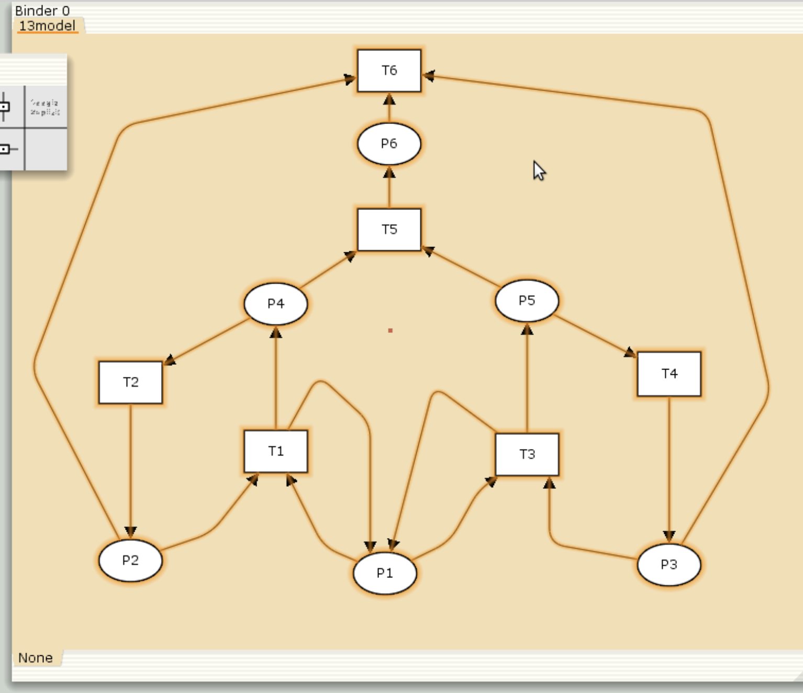
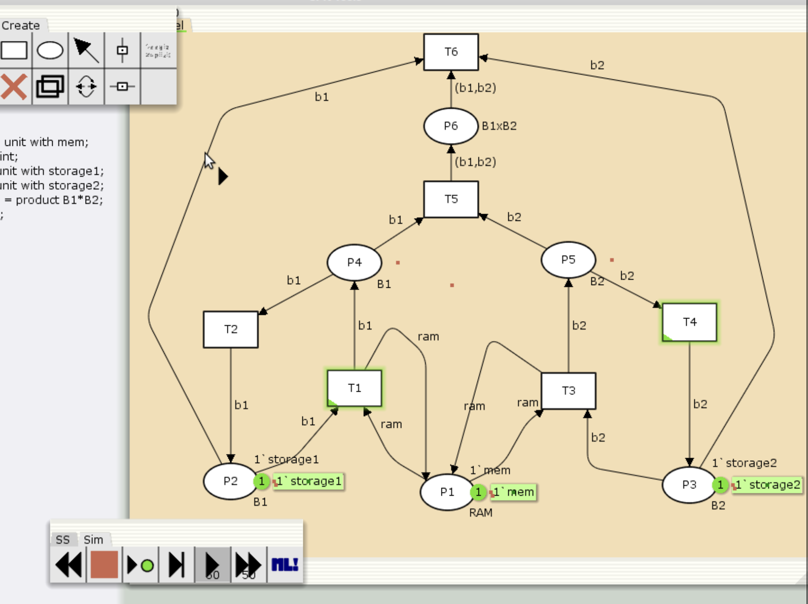

---
# Preamble

## Author
author:
  name: Шубнякова Дарья НКНбд-01-22
  email: 1132226452@pfur.ru
  affiliation:
    - name: Российский университет дружбы народов
      country: Российская Федерация
      postal-code: 117198
      city: Москва
      address: ул. Миклухо-Маклая, д. 6
## Title
title: Лабораторная работа №13
subtitle: Задание для самостоятельного выполнения
license: CC BY
## Generic options
lang: ru-RU
crossref:
  fig-title: "Рисунок"
  tbl-title: "Таблица"
  lst-title: "Листинг"
## Formats
format:
### Pdf output format
  beamer:
    toc: true
    toc-title: Содержание
    number-sections: true
    colorlinks: false
    toc-depth: 2
    slide-level: 2
    aspectratio: 169
    section-titles: true
    theme: metropolis
    theme-options:
      - progressbar=frametitle
      - sectionpage=progressbar
      - numbering=fraction
    pdf-engine: xelatex
    include-in-header:
      text: |
        \usepackage{fontspec}
        \setmainfont{Times New Roman}
        \setsansfont{Arial}
        \setmonofont{Courier New}
        \usepackage{polyglossia}
        \setdefaultlanguage{russian}
        \setotherlanguage{english}
        \usepackage{caption}
        \captionsetup[figure]{name=Рисунок}

### Html output
  revealjs:
    transition: slide
    margin: 0.2
    smaller: false
    output-ext: html
    theme: beige
    logo: _resources/image/logo_rudn.png
---

# Вводная часть

## Цели и задачи

Реализовать модель. Заявка (команды программы, операнды) поступает в оперативную память (ОП), затем передается на прибор (центральный процессор, ЦП) для обработки. После этого заявка может равновероятно обратиться к оперативной памяти или к одному из двух внешних запоминающих устройств (B1 и B2). Прежде чем записать информацию на внешний накопитель, необходимо вторично обратиться к центральному процессору, определяющему состояние накопителя и выдающему необходимую управляющую информацию. Накопители (B1 и B2) могут работать в 3-х режимах:
1) B1 — занят, B2 — свободен; 2) B2 — свободен, B1 — занят; 3) B1 — занят, B2 — занят.
Промоделировать сеть Петри в CPNTools. Определить, является ли сеть безопасной, ограниченной, сохраняющей, имеются ли тупики. Вычислить пространство состояний. Сформировать отчёт о пространстве состояний и проанализировать его. Построить граф пространства состояний.

# Основная часть

## Выполнение лабораторной работы

Создаем представленный в работе граф.

{width=70%}

## Видим, что модель работает и симуляция запускается.

{width=70%}

## Декларируем все необходимое.

{width=70%}

## Получаем отчет по состоянию системы, который представлен в выводах этого отчета и визуализурием состояние среды на графике.

{width=70%}

# Результаты

Мы выполнили самостоятельную работу. Boundedness Properties -> Best Integer Bounds (покажет, ограничена ли сеть и какое макс. количество фишек в каждой позиции). Если все верхние границы равны 1 — сеть безопасна. Поскольку в нашем отчете о состоянии системы видно, что везде стоят единички -- значит наша система безопасна.

Тупики так же отсутствуют.
 
   Dead Markings
     None

 
 Boundedness Properties
------------------------------------------------------------------------

  Best Integer Bounds
                             Upper      Lower
     petri'P1 1              1          1
     petri'P2 1              1          0
     petri'P3 1              1          0
     petri'P4 1              1          0
     petri'P5 1              1          0
     petri'P6 1              1          0

