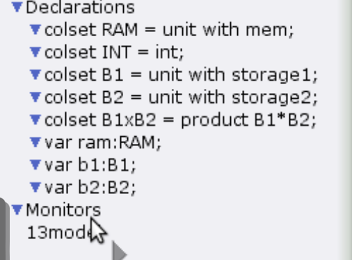

---
# Preamble

## Author
author:
  - name: Шубнякова Дарья НКНбд-01-22
    email: 1132226452@pfur.ru
    affiliation:
      - name: Российский университет дружбы народов
        country: Российская Федерация
        postal-code: 117198
        city: Москва
        address: ул. Миклухо-Маклая, д. 6

## Title
title: "Лабораторная работа №13"
subtitle: "Задание для самостоятельного выполнения"
license: "CC BY"

## Generic options
lang: ru-RU
number-sections: true
toc: true
toc-title: "Содержание"
toc-depth: 2

## Formats
format:
  ### Pdf output format
  pdf:
    toc: true
    number-sections: true
    colorlinks: false
    toc-depth: 2
    documentclass: article
    papersize: a4
    fontsize: 12pt
    linestretch: 1.5
    babel-lang: russian
    babel-otherlangs: english
    indent: true
    header-includes: |
      \usepackage{indentfirst}
      \usepackage{float}
      \floatplacement{figure}{H}
      \usepackage{fontspec}
      \setmainfont{Times New Roman}
      \usepackage{titling}
      \renewcommand{\maketitlehooka}{\null\vfill}
      \renewcommand{\maketitlehookd}{\vfill\null\newpage}

  ### Docx output format
  docx:
    toc: true
    number-sections: true
    toc-depth: 2
---

\newpage

# Цель работы

Реализовать модель. Заявка (команды программы, операнды) поступает в оперативную память (ОП), затем передается на прибор (центральный процессор, ЦП) для обработки. После этого заявка может равновероятно обратиться к оперативной памяти или к одному из двух внешних запоминающих устройств (B1 и B2). Прежде чем записать информацию на внешний накопитель, необходимо вторично обратиться к центральному процессору, определяющему состояние накопителя и выдающему необходимую управляющую информацию. Накопители (B1 и B2) могут работать в 3-х режимах:
1) B1 — занят, B2 — свободен; 2) B2 — свободен, B1 — занят; 3) B1 — занят, B2 — занят.

# Задание

Промоделировать сеть Петри в CPNTools. Определить, является ли сеть безопасной, ограниченной, сохраняющей, имеются ли тупики. Вычислить пространство состояний. Сформировать отчёт о пространстве состояний и проанализировать его. Построить граф пространства состояний.

# Теоретическое введение

Сеть Петри моделируемой системы представлена на рис. 13.2. Множество позиций:
P1 — состояние оперативной памяти (свободна / занята);
P2 — состояние внешнего запоминающего устройства B1 (свободно / занято); P3 — состояние внешнего запоминающего устройства B2 (свободно / занято); P4 — работа на ОП и B1 закончена;
P5 — работа на ОП и B2 закончена;
P6 — работа на ОП, B1 и B2 закончена;
Множество переходов:
T1 — ЦП работает только с RAM и B1;
T2 — обрабатываются данные из RAM и с B1 переходят на устройство вывода; T3 — CPU работает только с RAM и B2;
T4 — обрабатываются данные из RAM и с B2 переходят на устройство вывода; T5 — CPU работает только с RAM и с B1, B2;
T6 — обрабатываются данные из RAM, B1, B2 и переходят на устройство вывода.
Функционирование сети Петри можно расматривать как срабатывание переходов, в ходе которого происходит перемещение маркеров по позициям:
– работа CPU с RAM и B1 отображается запуском перехода T1 (удаление маркеров из P1, P2 и появление в P1, P4), что влечет за собой срабатывание перехода T2, т.е. передачу данных с RAM и B1 на устройство вывода;
– работа CPU с RAM и B2 отображается запуском перехода T3 (удаление маркеров из P1 и P3 и появление в P1 и P5), что влечет за собой срабатывание перехода T4, т.е. передачу данных с RAM и B2 на устройство вывода;
– работа CPU с RAM, B1 и B2 отображается запуском перехода T5 (удаление маркеров из P4 и P5 и появление в P6), далее срабатывание перехода T6, и данные из RAM, B1 и B2 передаются на устройство вывода;
– состояние устройств восстанавливается при срабатывании: RAM — переходов T1 или T2; B1 — переходов T2 или T6; B2 — переходов T4 или T6.

# Выполнение лабораторной работы

Создаем представленный в работе граф([рис. @fig-001]).

{#fig-001 width=70%}

Видим, что модель работает и симуляция запускается([рис. @fig-002]).

{#fig-002 width=70%}

Декларируем все необходимое([рис. @fig-003]).

{#fig-003 width=70%}

Получаем отчет по состоянию системы, который представлен в выводах этого отчета и визуализурием состояние среды на графике([рис. @fig-004]).

{#fig-004 width=70%}

# Выводы

Мы выполнили самостоятельную работу. Boundedness Properties -> Best Integer Bounds (покажет, ограничена ли сеть и какое макс. количество фишек в каждой позиции). Если все верхние границы равны 1 — сеть безопасна. Поскольку в нашем отчете о состоянии системы видно, что везде стоят единички -- значит наша система безопасна.

Тупики так же отсутствуют.
 
   Dead Markings
     None

Получили отчет по работе модели.

```
CPN Tools state space report for:
<unsaved net>
Report generated: Sat Sep 13 16:54:57 2025

 Statistics
------------------------------------------------------------------------

  State Space
     Nodes:  5
     Arcs:   10
     Secs:   0
     Status: Full

  Scc Graph
     Nodes:  1
     Arcs:   0
     Secs:   0


 Boundedness Properties
------------------------------------------------------------------------

  Best Integer Bounds
                             Upper      Lower
     petri'P1 1              1          1
     petri'P2 1              1          0
     petri'P3 1              1          0
     petri'P4 1              1          0
     petri'P5 1              1          0
     petri'P6 1              1          0

  Best Upper Multi-set Bounds
     petri'P1 1          1`memory
     petri'P2 1          1`storage1
     petri'P3 1          1`storage2
     petri'P4 1          1`storage1
     petri'P5 1          1`storage2
     petri'P6 1          1`(storage1,storage2)

  Best Lower Multi-set Bounds
     petri'P1 1          1`memory
     petri'P2 1          empty
     petri'P3 1          empty
     petri'P4 1          empty
     petri'P5 1          empty
     petri'P6 1          empty


 Home Properties
------------------------------------------------------------------------

  Home Markings
     All


 Liveness Properties
------------------------------------------------------------------------

  Dead Markings
     None

  Dead Transition Instances
     None

  Live Transition Instances
     All


 Fairness Properties
------------------------------------------------------------------------
       petri'T1 1             No Fairness
       petri'T2 1             No Fairness
       petri'T3 1             No Fairness
       petri'T4 1             No Fairness
       petri'T5 1             Just
       petri'T6 1             Fair
```

