---
# Preamble

## Author
author:
  - name: Шубнякова Дарья НКНбд-01-22
    email: 1132226452@pfur.ru
    affiliation:
      - name: Российский университет дружбы народов
        country: Российская Федерация
        postal-code: 117198
        city: Москва
        address: ул. Миклухо-Маклая, д. 6

## Title
title: "Лабораторная работа №14"
subtitle: "Модели обработки заказов"
license: "CC BY"

## Generic options
lang: ru-RU
number-sections: true
toc: true
toc-title: "Содержание"
toc-depth: 2

## Formats
format:
  ### Pdf output format
  pdf:
    toc: true
    number-sections: true
    colorlinks: false
    toc-depth: 2
    documentclass: article
    papersize: a4
    fontsize: 12pt
    linestretch: 1.5
    babel-lang: russian
    babel-otherlangs: english
    indent: true
    header-includes: |
      \usepackage{indentfirst}
      \usepackage{float}
      \floatplacement{figure}{H}
      \usepackage{fontspec}
      \setmainfont{Times New Roman}
      \usepackage{titling}
      \renewcommand{\maketitlehooka}{\null\vfill}
      \renewcommand{\maketitlehookd}{\vfill\null\newpage}

  ### Docx output format
  docx:
    toc: true
    number-sections: true
    toc-depth: 2
---

\newpage

# Цель работы

1) В интернет-магазине заказы принимает один оператор. Интервалы поступления заказов распределены равномерно с интервалом 15 ± 4 мин. Время оформления заказа также распределено равномерно на интервале 10 ± 2 мин. Обработка по- ступивших заказов происходит в порядке очереди (FIFO). Требуется разработать модель обработки заказов в течение 8 часов.

2) В интернет-магазин к одному оператору поступают два типа заявок от клиентов — обычный заказ и заказ с оформление дополнительного пакета услуг. Заявки первого типа поступают каждые 15 ± 4 мин. Заявки второго типа — каждые 30 ± 8 мин. Оператор обрабатывает заявки по принципу FIFO («первым пришел — первым обслужился»). Время, затраченное на оформление обычного заказа, составляет 10 ± 2 мин, а на оформление дополнительного пакета услуг — 5 ± 2 мин. Требуется разработать модель обработки заказов в течение 8 часов, обеспечив сбор данных об очереди заявок от клиентов.

3) В интернет-магазине заказы принимают 4 оператора. Интервалы поступления зака- зов распределены равномерно с интервалом 5 ± 2 мин. Время оформления заказа каждым оператором также распределено равномерно на интервале 10 ± 2 мин. Об- работка поступивших заказов происходит в порядке очереди (FIFO). Требуется определить характеристики очереди заявок на оформление заказов при условии, что заявка может обрабатываться одним из 4-х операторов в течение восьмичасового рабочего дня.

# Задание

1) Проанализируйте полученный отчёт.
2) Измените модель: требуется учесть в ней возможные отказы клиентов от заказа
— когда при подаче заявки на заказ клиент видит в очереди более двух других заявок, он отказывается от подачи заявки, то есть отказывается от обслуживания (используйте блок TEST и стандартный числовой атрибут Qj текущей длины очереди j).
3) Проанализируйте отчёт изменённой модели.

# Теоретическое введение

В данной лабораторной работе мы знакомимся с построением модели, указанной в целях. Учимся строить гистограммы распределения заявок в очереди. Модель обслуживания двух типов заказов от клиентов в интернет-магазине так же рассматривается, как и модель оформления заказов несколькими операторами.

# Выполнение лабораторной работы

Вводим код для первой задачи, предоставленный в лабораторной работе, знакомимся с отчетом. Результаты работы модели:
– модельное время в начале моделирования: START TIME=0.0;
– абсолютное время или момент, когда счетчик завершений принял значение 0:
END TIME=480.0;
– количество блоков, использованных в текущей модели, к моменту завершения
моделирования: BLOCKS=9;
– количество одноканальных устройств, использованных в модели к моменту за-
вершения моделирования: FACILITIES=1;
– количество многоканальных устройств, использованных в текущей модели к мо-
менту завершения моделирования: STORAGES=0.

Затем идёт информация об одноканальном устройстве FACILITY (оператор, оформляющий заказ), откуда видим, что к оператору попало 33 заказа от клиентов
(значение поля OWNER=33), но одну заявку оператор не успел принять в обработку до окончания рабочего времени (значение поля ENTRIES=32). Полезность работы оператора составила 0, 639. При этом среднее время занятости оператора составило 9, 589 мин.

Далее информация об очереди:
QUEUE=operator_q — имя объекта типа «очередь»;
MAX=1 — в очереди находилось не более одной ожидающей заявки от клиента; CONT=0 — на момент завершения моделирования очередь была пуста; ENTRIES=32 — общее число заявок от клиентов, прошедших через очередь в те- чение периода моделирования;
ENTRIES(O)=31 — число заявок от клиентов, попавших к оператору без ожидания в очереди;
AVE.CONT=0, 001 заявок от клиентов в среднем были в очереди; AVE.TIME=0.021 минут в среднем заявки от клиентов провели в очереди (с учётом всех входов в очередь);
AVE.(–0)=0, 671 минут в среднем заявки от клиентов провели в очереди (без учета «нулевых» входов в очередь).
В конце отчёта идёт информация о будущих событиях:
XN=33 — порядковый номер заявки от клиента, ожидающей поступления для оформления заказа у оператора;
PRI=0 — все клиенты (из заявки) равноправны;
BDT=489, 786 — время назначенного события, связанного с данным транзактом; ASSEM=33 — номер семейства транзактов;
CURRENT=5 — номер блока, в котором находится транзакт;
NEXT=6 — номер блока, в который должен войти транзакт([рис. @fig-001]).

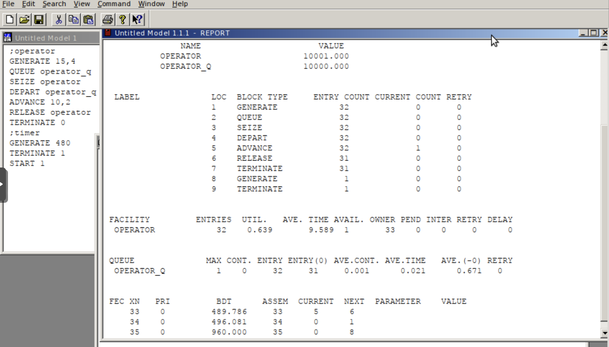{#fig-001 width=70%}

Переписываем код с учетом задания из упражнения: интервалы поступления заказов распределены равномерно с интервалом 3.14 ± 1.7 мин; время оформления заказа также распределено равномерно на интер- вале 6.66 ± 1.7 мин([рис. @fig-002]).

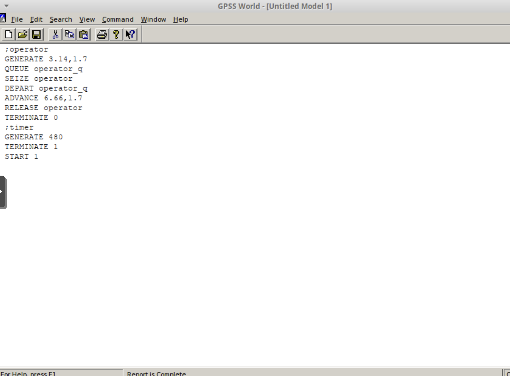{#fig-002 width=70%}

Получаем отчет и анализируем его.
– модельное время в начале моделирования: START TIME=0.0;
– абсолютное время или момент, когда счетчик завершений принял значение 0:
END TIME=480.0;
– количество блоков, использованных в текущей модели, к моменту завершения
моделирования: BLOCKS=9;
– количество одноканальных устройств, использованных в модели к моменту за-
вершения моделирования: FACILITIES=1;
– количество многоканальных устройств, использованных в текущей модели к мо-
менту завершения моделирования: STORAGES=0.

Затем идёт информация об одноканальном устройстве FACILITY (оператор, оформляющий заказ), откуда видим, что к оператору попало 71 заказа от клиентов
(значение поля OWNER=71), но одну заявку оператор не успел принять в обработку до окончания рабочего времени (значение поля ENTRIES=70). Полезность работы оператора составила 0, 991. При этом среднее время занятости оператора составило 6, 796 мин.

Далее информация об очереди:
QUEUE=operator_q — имя объекта типа «очередь»;
MAX=82 — в очереди находилось не более одной ожидающей заявки от клиента; CONT=82 — на момент завершения моделирования очередь была пуста; ENTRIES=152 — общее число заявок от клиентов, прошедших через очередь в течение периода моделирования;
ENTRIES(O)=1 — число заявок от клиентов, попавших к оператору без ожидания в очереди;
AVE.CONT=39,096 заявок от клиентов в среднем были в очереди; AVE.TIME=123,461 минут в среднем заявки от клиентов провели в очереди (с учётом всех входов в очередь);
AVE.(–0)=124,279 минут в среднем заявки от клиентов провели в очереди (без учета «нулевых» входов в очередь).
В конце отчёта идёт информация о будущих событиях:
XN=71 — порядковый номер заявки от клиента, ожидающей поступления для оформления заказа у оператора;
PRI=0 — все клиенты (из заявки) равноправны;
BDT=480,405 — время назначенного события, связанного с данным транзактом; ASSEM=33 — номер семейства транзактов;
CURRENT=5 — номер блока, в котором находится транзакт;
NEXT=6 — номер блока, в который должен войти транзакт([рис. @fig-003]).

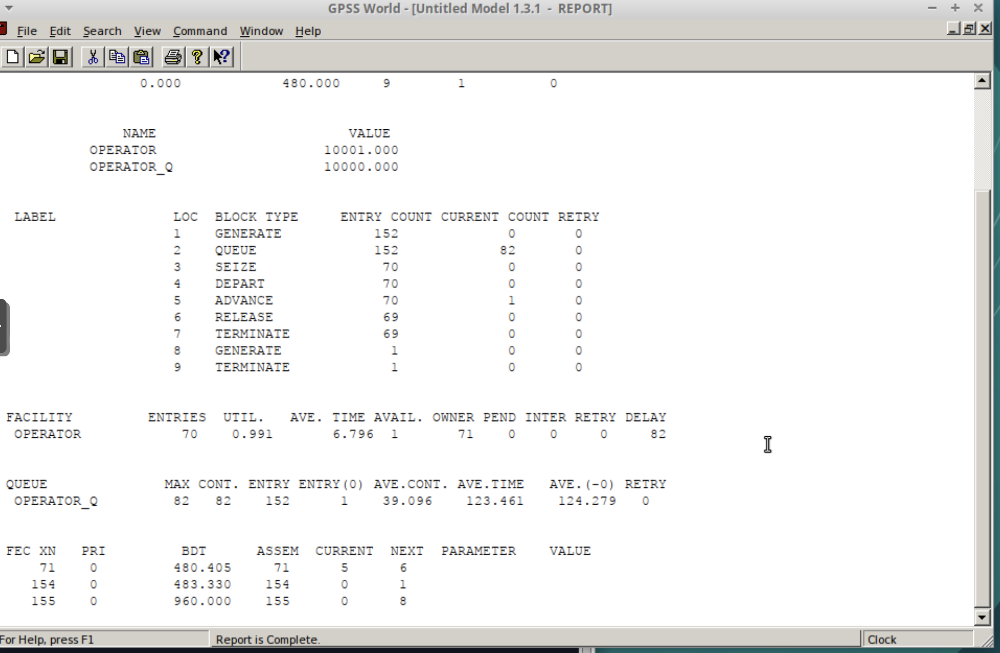{#fig-003 width=70%}

Вводим новый код для построения гистограммы:
Waittime  QTABLE    operator_q,0,2,15
          GENERATE  3.34,1.7
          TEST      LE Q$operator_q,1,Fin
          SAVEVALUE Custnum+,1
          ASSIGN    Custnum,X$Custnum
          QUEUE     operator_q
          SEIZE     operator
          DEPART    operator_q
          ADVANCE   6.66,1.7
          RELEASE   operator
Fin       TERMINATE 1
И получаем отчет по работе этой модели([рис. @fig-004]).

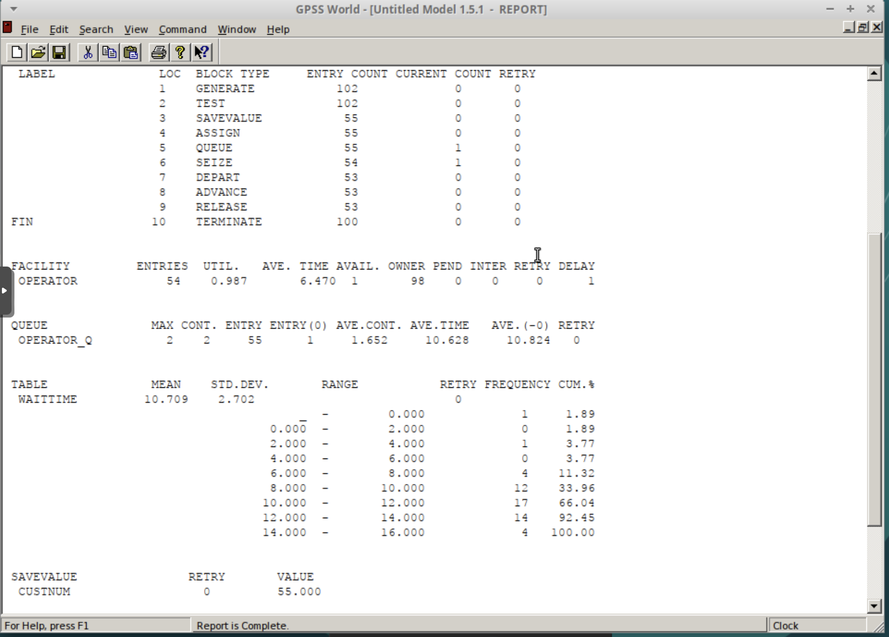{#fig-004 width=70%}

Затем запускаем START 100 и знакомимся с гистограммой([рис. @fig-005]).

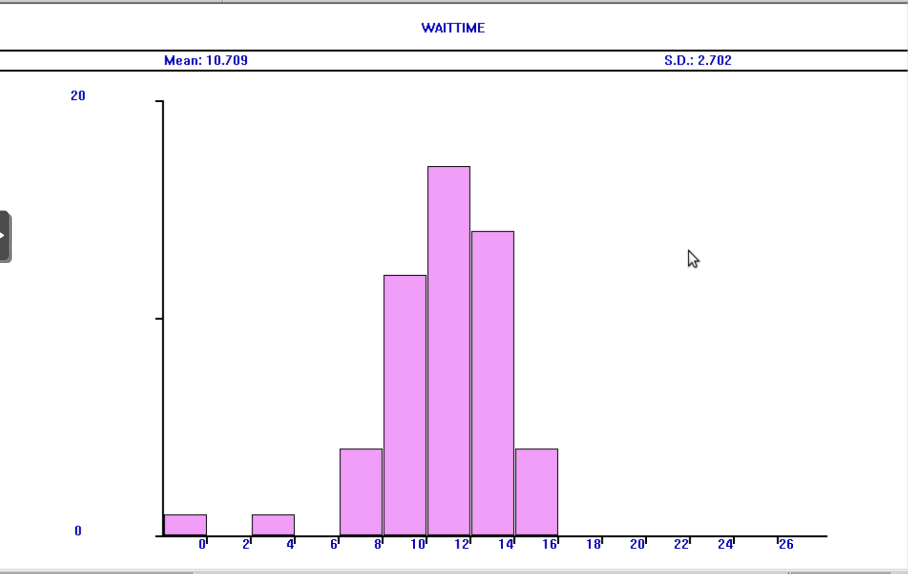{#fig-005 width=70%}

Скорректируйте модель так, чтобы учитывалось условие, что число заказов с дополнительным пакетом услуг составляет 30% от общего числа заказов. Используйте оператор TRANSFER.([рис. @fig-006]).

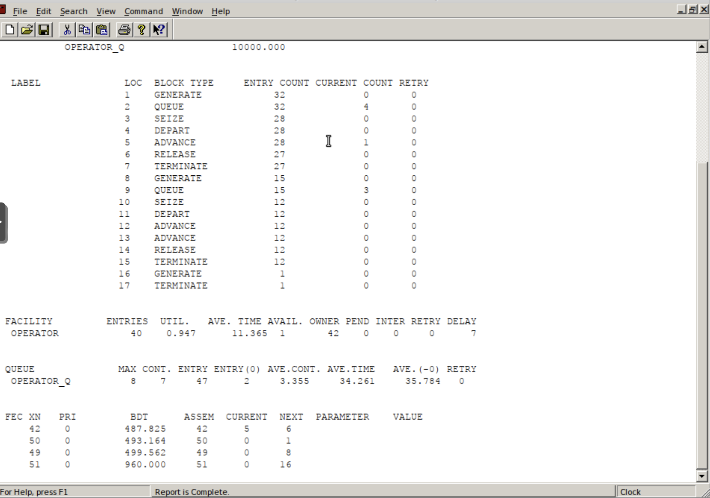{#fig-006 width=70%}

Далее необходимо реализовать отличие в оформлении обычных заказов и заказов с допол- нительным пакетом услуг. Такую систему можно промоделировать с помощью двух сегментов. Один из них моделирует оформление обычных заказов, а второй — зака- зов с дополнительным пакетом услуг. В каждом из сегментов пара QUEUE–DEPART должна описывать одну и ту же очередь, а пара блоков SEIZE–RELEASE должна описывать в каждом из двух сегментов одно и то же устройство и моделировать работу оператора. Получаем отчет([рис. @fig-007]).

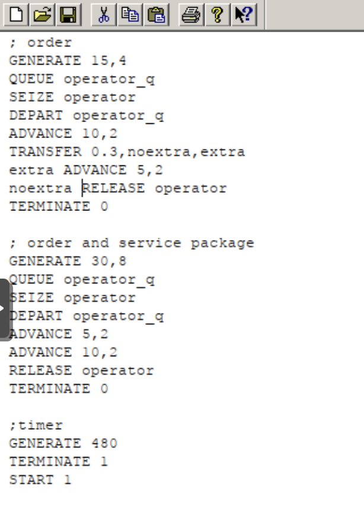{#fig-007 width=70%}

А так выглядит код для вышеуказанной модели[рис. @fig-008]).

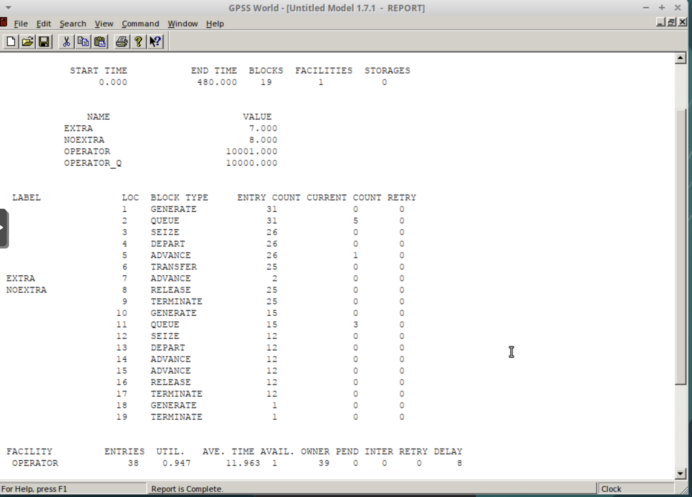{#fig-008 width=70%}

Отчет по данной задаче: В интернет-магазине заказы принимают 4 оператора. Интервалы поступления зака- зов распределены равномерно с интервалом 5 ± 2 мин. Время оформления заказа каждым оператором также распределено равномерно на интервале 10 ± 2 мин. Об- работка поступивших заказов происходит в порядке очереди (FIFO). Требуется определить характеристики очереди заявок на оформление заказов при условии, что заявка может обрабатываться одним из 4-х операторов в течение восьмичасового рабочего дня.([рис. @fig-009]).

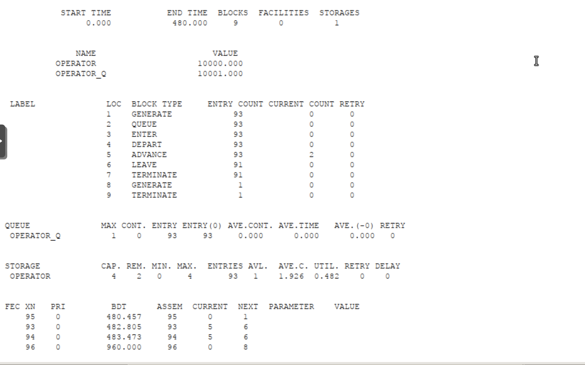{#fig-009 width=70%}

Выполняем задание. Прописываем код([рис. @fig-010]).

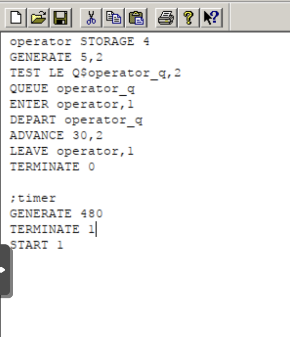{#fig-010 width=70%}

Получаем отчет по модели из задания. Меняем модель: требуется учесть в ней возможные отказы клиентов от заказа
— когда при подаче заявки на заказ клиент видит в очереди более двух других заявок, он отказывается от подачи заявки, то есть отказывается от обслуживания (используйте блок TEST и стандартный числовой атрибут Qj текущей длины очереди j)([рис. @fig-011]).

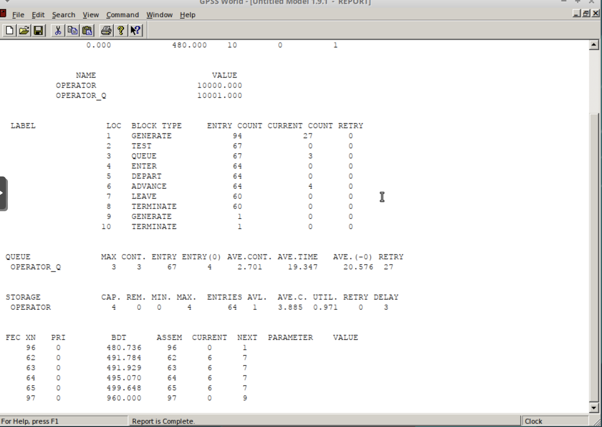{#fig-011 width=70%}

# Выводы

Мы ознакомились с работой в GPSS. Реализовали несколько задач:

1) В интернет-магазине заказы принимает один оператор. Интервалы поступления заказов распределены равномерно с интервалом 15 ± 4 мин. Время оформления заказа также распределено равномерно на интервале 10 ± 2 мин. Обработка по- ступивших заказов происходит в порядке очереди (FIFO). Требуется разработать модель обработки заказов в течение 8 часов.

2) В интернет-магазин к одному оператору поступают два типа заявок от клиентов — обычный заказ и заказ с оформление дополнительного пакета услуг. Заявки первого типа поступают каждые 15 ± 4 мин. Заявки второго типа — каждые 30 ± 8 мин. Оператор обрабатывает заявки по принципу FIFO («первым пришел — первым обслужился»). Время, затраченное на оформление обычного заказа, составляет 10 ± 2 мин, а на оформление дополнительного пакета услуг — 5 ± 2 мин. Требуется разработать модель обработки заказов в течение 8 часов, обеспечив сбор данных об очереди заявок от клиентов.

3) В интернет-магазине заказы принимают 4 оператора. Интервалы поступления зака- зов распределены равномерно с интервалом 5 ± 2 мин. Время оформления заказа каждым оператором также распределено равномерно на интервале 10 ± 2 мин. Об- работка поступивших заказов происходит в порядке очереди (FIFO). Требуется определить характеристики очереди заявок на оформление заказов при условии, что заявка может обрабатываться одним из 4-х операторов в течение восьмичасового рабочего дня.

 А также построили гистограмму.
