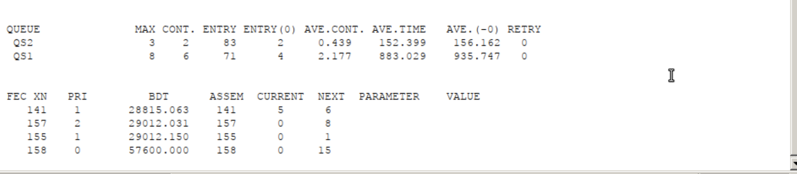
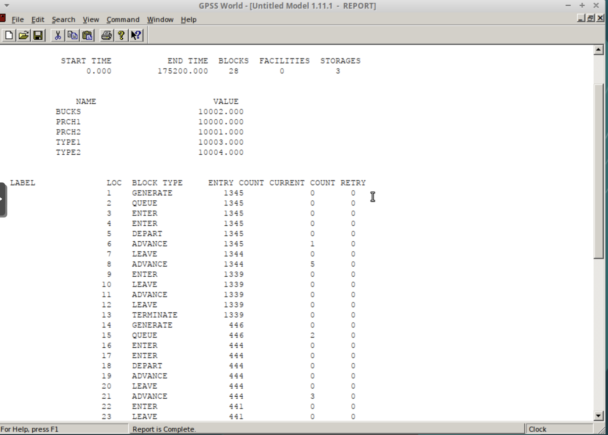
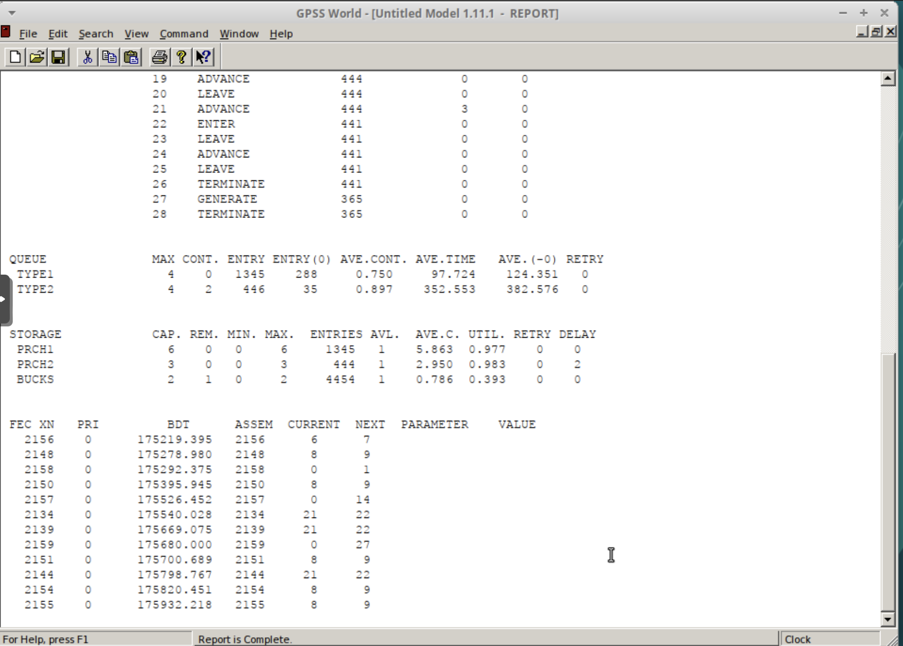

---
# Preamble

## Author
author:
  - name: Шубнякова Дарья НКНбд-01-22
    email: 1132226452@pfur.ru
    affiliation:
      - name: Российский университет дружбы народов
        country: Российская Федерация
        postal-code: 117198
        city: Москва
        address: ул. Миклухо-Маклая, д. 6

## Title
title: "Лабораторная работа №15"
subtitle: "Модели обслуживания с приоритетами"
license: "CC BY"

## Generic options
lang: ru-RU
number-sections: true
toc: true
toc-title: "Содержание"
toc-depth: 2

## Formats
format:
  ### Pdf output format
  pdf:
    toc: true
    number-sections: true
    colorlinks: false
    toc-depth: 2
    documentclass: article
    papersize: a4
    fontsize: 12pt
    linestretch: 1.5
    babel-lang: russian
    babel-otherlangs: english
    indent: true
    header-includes: |
      \usepackage{indentfirst}
      \usepackage{float}
      \floatplacement{figure}{H}
      \usepackage{fontspec}
      \setmainfont{Times New Roman}
      \usepackage{titling}
      \renewcommand{\maketitlehooka}{\null\vfill}
      \renewcommand{\maketitlehookd}{\vfill\null\newpage}

  ### Docx output format
  docx:
    toc: true
    number-sections: true
    toc-depth: 2
---

\newpage

# Цель работы

Ознакомится с двумя моделями обслуживания с приоритетами:

1) Модель обслуживания механиков на складе

2) Модель обслуживания в порту судов двух типов

# Задание

Получить и проанализировать два отчета по обеим задачам

# Теоретическое введение

В данной лабораторной работе мы знакомимся с двумя задачами по моделям с приоритетами.

# Выполнение лабораторной работы

## Задача №1

На фабрике на складе работает один кладовщик, который выдает запасные части механикам, обслуживающим станки. Время, необходимое для удовлетворения за- проса, зависит от типа запасной части. Запросы бывают двух категорий. Для первой категории интервалы времени прихода механиков 420 ± 360 сек., время обслужива- ния — 300 ± 90 сек. Для второй категории интервалы времени прихода механиков 360 ± 240 сек., время обслуживания — 100 ± 30 сек.
Порядок обслуживания механиков кладовщиком такой: запросы первой категории обслуживаются только в том случае, когда в очереди нет ни одного запроса второй категории. Внутри одной категории дисциплина обслуживания — «первым пришел – первым обслужился». Необходимо создать модель работы кладовой, моделирование выполнять в течение восьмичасового рабочего дня.

Вводим код для первой задачи, предоставленный в лабораторной работе, знакомимся с отчетом. Результаты работы модели:
– модельное время в начале моделирования: START TIME=0.0;
– абсолютное время или момент, когда счетчик завершений принял значение 0:
END TIME=28800.0;
– количество блоков, использованных в текущей модели, к моменту завершения
моделирования: BLOCKS=16;
– количество одноканальных устройств, использованных в модели к моменту за-
вершения моделирования: FACILITIES=1;
– количество многоканальных устройств, использованных в текущей модели к мо-
менту завершения моделирования: STORAGES=0.

Затем идёт информация об одноканальном устройстве FACILITY, откуда видим, что попал 141 запрос (значение поля OWNER=141), но пять заказов не успели принять в обработку до окончания рабочего времени (значение поля ENTRIES=146). Полезность работы  составила 0, 967. При этом среднее время занятости составило 190,733 мин.

Далее информация об очереди:
QUEUE=QS2, QS1 — имена объекта типа «очередь»;

Для QS2: MAX=3 — в очереди находилось не более трех заказов; CONT=2 — на момент завершения моделирования очередь состояла из двух заказов; ENTRIES=83 — общее число заказов, прошедших через очередь в течение периода моделирования;
ENTRIES(O)=2 — число заказов, попавших к оператору без ожидания в очереди;
AVE.CONT=0.439 заказов в среднем были в очереди; AVE.TIME=152.399 минут в среднем заказы провели в очереди (с учётом всех входов в очередь);
AVE.(–0)=156.162 минут в среднем заказы провели в очереди (без учета «нулевых» входов в очередь).

Для QS1: MAX=8 — в очереди находилось не более трех заказов; CONT=6 — на момент завершения моделирования очередь состояла из двух заказов; ENTRIES=71 — общее число заказов, прошедших через очередь в течение периода моделирования;
ENTRIES(O)=4 — число заказов, попавших к оператору без ожидания в очереди;
AVE.CONT=2.177 заказов в среднем были в очереди; AVE.TIME=883.029 минут в среднем заказы провели в очереди (с учётом всех входов в очередь);
AVE.(–0)=935.747 минут в среднем заказы провели в очереди (без учета «нулевых» входов в очередь).

В конце отчёта идёт информация о будущих событиях:
XN=141,157,155,158 — порядковый номер заказа, ожидающей поступления для оформления;
PRI=1,2,1,0 — приоретет в очереди;
BDT=~28815,29012,29012,57600 — время назначенного события, связанного с данным транзактом; ASSEM=141,157,155,158 — номер семейства транзактов;
CURRENT=5,0,0,0 — номера блоков, в которых находится транзакт;
NEXT=6,8,1,15 — номера блоков, в которые должен войти транзакт([рис. @fig-001]) ([рис. @fig-002]).

{#fig-001 width=70%}

{#fig-002 width=70%}

## Задача №2

Морские суда двух типов прибывают в порт, где происходит их разгрузка. В порту есть два буксира, обеспечивающих ввод и вывод кораблей из порта. К первому типу судов относятся корабли малого тоннажа, которые требуют использования одного буксира. Корабли второго типа имеют большие размеры, и для их ввода и вывода из порта требуется два буксира. Из-за различия размеров двух типов кораблей необходимы и причалы различного размера. Кроме того, корабли имеют различное время погрузки/разгрузки.
Требуется построить модель системы, в которой можно оценить время ожидания кораблями каждого типа входа в порт. Время ожидания входа в порт включает время ожидания освобождения причала и буксира. Корабль, ожидающий освобождения причала, не обслуживается буксиром до тех пор, пока не будет предоставлен нужный причал. Корабль второго типа не займёт буксир до тех пор, пока ему не будут доступны оба буксира.

Параметры модели:
– для корабля первого типа:
– интервалприбытия:130±30мин;
– время входа в порт: 30 ± 7 мин;
– количество доступных причалов: 6;
– времяпогрузки/разгрузки:12±2час; – время выхода из порта: 20 ± 5 мин;
– для корабля второго типа:
– интервал прибытия:390±60мин;
– время входа в порт: 45 ± 12 мин;
– количество доступных причалов: 3;
– времяпогрузки/разгрузки:18±4час; – время выхода из порта: 35 ± 10 мин.
– время моделирования: 365 дней по 8 часов.

Получаем отчет и анализируем его.
– модельное время в начале моделирования: START TIME=0.0;
– абсолютное время или момент, когда счетчик завершений принял значение 0:
END TIME=175200.0;
– количество блоков, использованных в текущей модели, к моменту завершения
моделирования: BLOCKS=28;
– количество одноканальных устройств, использованных в модели к моменту за-
вершения моделирования: FACILITIES=0;
– количество многоканальных устройств, использованных в текущей модели к мо-
менту завершения моделирования: STORAGES=3.

Затем идёт информация об одноканальном устройстве FACILITY (оператор, оформляющий заказ), который здесь отсутсвует.

Далее информация об очереди:
QUEUE=TYPE1 — имя объекта типа «очередь»;
MAX=4 — в очереди находилось не более 4 кораблей; CONT=0 — на момент завершения моделирования очередь была пуста; ENTRIES=1345 — общее число кораблей, прошедших через очередь в течение периода моделирования;
ENTRIES(O)=288 — число кораблей, попавших к оператору без ожидания в очереди;
AVE.CONT=0.75 кораблей в в среднем были в очереди; AVE.TIME=97.724 минут в среднем корабли провели в очереди (с учётом всех входов в очередь);
AVE.(–0)=124.351 минут в среднем корабли провели в очереди (без учета «нулевых» входов в очередь).

QUEUE=TYPE2 — имя объекта типа «очередь»;
MAX=4 — в очереди находилось не более 4 кораблей; CONT=2 — на момент завершения моделирования в очереди было 2 корабля; ENTRIES=446 — общее число кораблей, прошедших через очередь в течение периода моделирования;
ENTRIES(O)=35 — число кораблей, попавших к оператору без ожидания в очереди;
AVE.CONT=0.897 кораблей в среднем были в очереди; AVE.TIME=352.553 минут в среднем корабли провели в очереди (с учётом всех входов в очередь);
AVE.(–0)=382.576 минут в среднем корабли провели в очереди (без учета «нулевых» входов в очередь).

Видим три хранилища STORAGE = PRCH1, PRCH2, BUCKS со своими значениями: причалы и буксиры.

В конце отчёта идёт информация о будущих событиях:
XN — порядковый номер корабля, ожидающей поступления;
PRI=0 — все клиенты (из заявки) равноправны;
BDT — время назначенного события, связанного с данным транзактом; ASSEM — номер семейства транзактов;
CURRENT — номера блоков, в которых находится транзакт;
NEXT — номера блоков, в который должен войти транзакт([рис. @fig-003]) ([рис. @fig-004]).

{#fig-003 width=70%}

{#fig-004 width=70%}

# Выводы

Мы ознакомились с работой с моделями обслуживания с приоритетами в GPSS. Реализовали две задачи:

1) Модель обслуживания механиков на складе

2) Модель обслуживания в порту судов двух типов
