---
# Preamble

## Author
author:
  name: Шубнякова Дарья НКНбд-01-22
  email: 1132226452@pfur.ru
  affiliation:
    - name: Российский университет дружбы народов
      country: Российская Федерация
      postal-code: 117198
      city: Москва
      address: ул. Миклухо-Маклая, д. 6
## Title
title: Лабораторная работа №6
subtitle: Модель «хищник–жертва»
license: CC BY
## Generic options
lang: ru-RU
crossref:
  fig-title: "Рисунок"
  tbl-title: "Таблица"
  lst-title: "Листинг"
## Formats
format:
### Pdf output format
  beamer:
    toc: true
    toc-title: Содержание
    number-sections: true
    colorlinks: false
    toc-depth: 2
    slide-level: 2
    aspectratio: 169
    section-titles: true
    theme: metropolis
    theme-options:
      - progressbar=frametitle
      - sectionpage=progressbar
      - numbering=fraction
    pdf-engine: xelatex
    include-in-header:
      text: |
        \usepackage{fontspec}
        \setmainfont{Times New Roman}
        \setsansfont{Arial}
        \setmonofont{Courier New}
        \usepackage{polyglossia}
        \setdefaultlanguage{russian}
        \setotherlanguage{english}
        \usepackage{caption}
        \captionsetup[figure]{name=Рисунок}

### Html output
  revealjs:
    transition: slide
    margin: 0.2
    smaller: false
    output-ext: html
    theme: beige
    logo: _resources/image/logo_rudn.png
---

# Вводная часть

## Цель работы

Реализовать с помощью gpss модели работы вычислительного центра, аэропорта и морского порта.

## Задание

Реализовать с помощью gpss:

- модель работы вычислительного центра;
- модель работы аэропорта;
- модель работы морского порта.

# Выполнение лабораторной работы

## Моделирование работы вычислительного центра

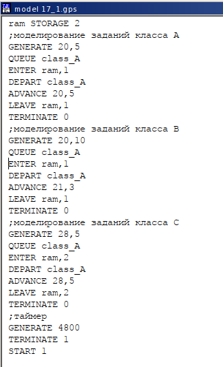{#fig:001 width=30%}

## Моделирование работы вычислительного центра

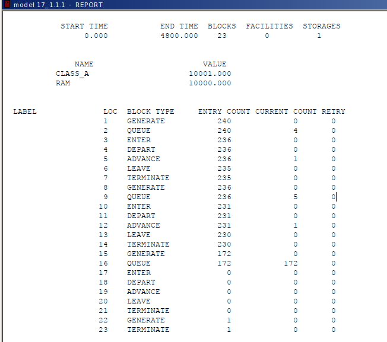{#fig:002 width=50%}

## Моделирование работы вычислительного центра

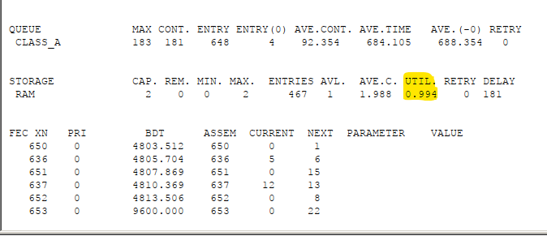{#fig:003 width=70%}

## Модель работы аэропорта

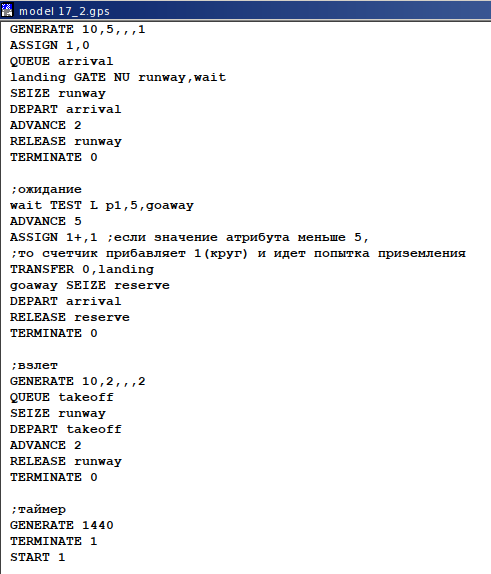{#fig:004 width=40%}

## Модель работы аэропорта

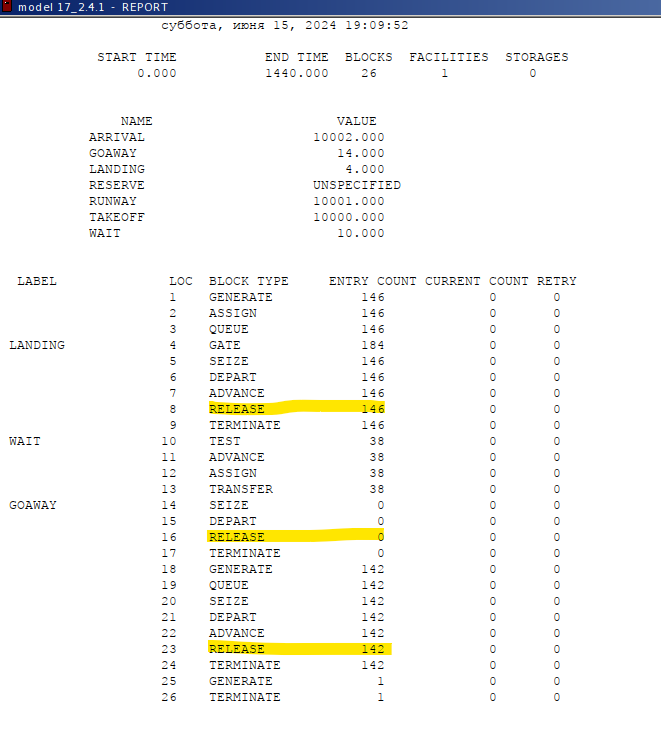{#fig:005 width=40%}

## Модель работы аэропорта

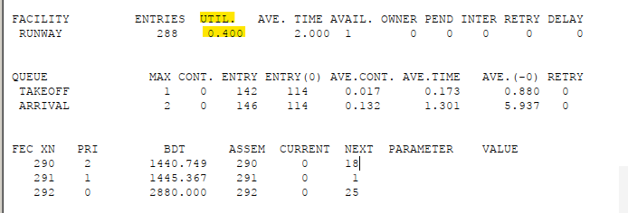{#fig:006 width=90%}

## Моделирование работы морского порта

Рассмотрим два варианта исходных данных:

1) $a = 20$ ч, $\delta = 5$ ч, $b = 10$ ч, $\varepsilon = 3$ ч, $N = 10$, $M = 3$;
2) $a = 30$ ч, $\delta = 10$ ч, $b = 8$ ч, $\varepsilon = 4$ ч, $N = 6$, $M = 2$.

## Моделирование работы морского порта. Первый вариант модели

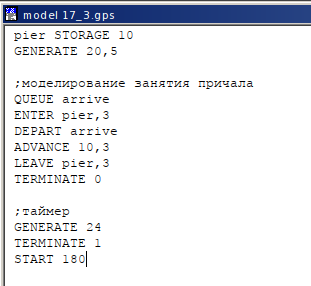{#fig:007 width=50%}

## Моделирование работы морского порта. Первый вариант модели

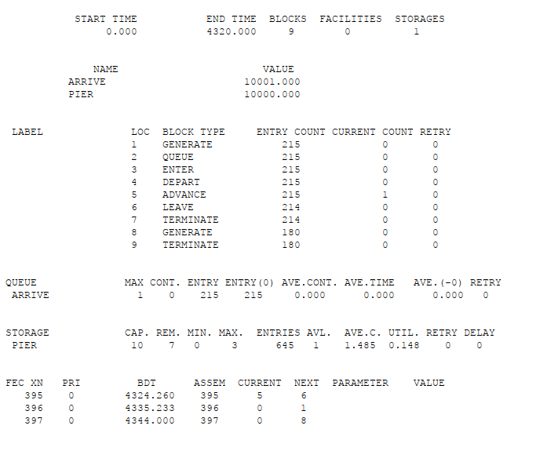{#fig:008 width=50%}

## Моделирование работы морского порта. Первый вариант модели

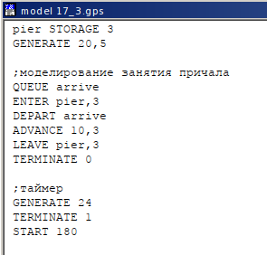{#fig:009 width=50%}

## Моделирование работы морского порта. Первый вариант модели

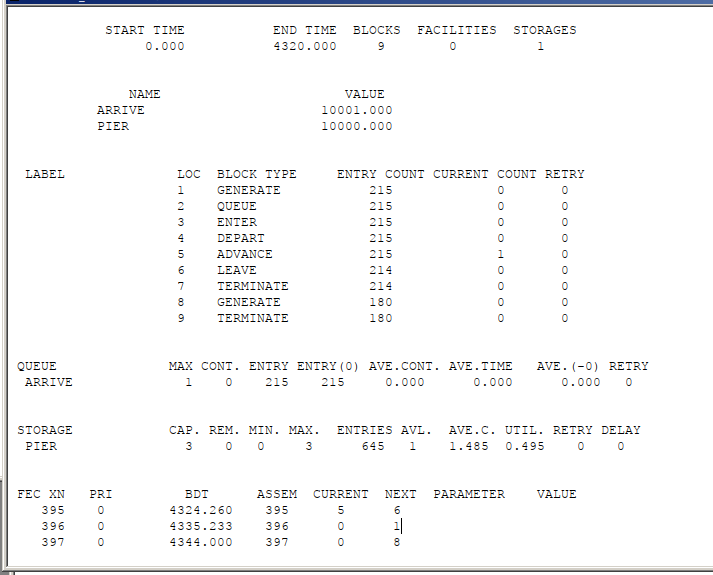{#fig:010 width=50%}

## Моделирование работы морского порта. Второй вариант модели

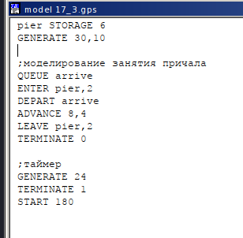{#fig:011 width=50%}

## Моделирование работы морского порта. Второй вариант модели

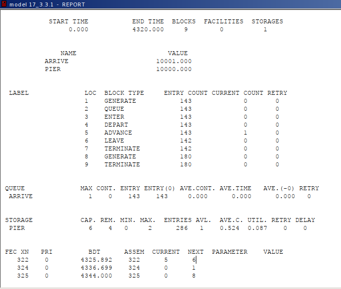{#fig:012 width=50%}

## Моделирование работы морского порта. Второй вариант модели

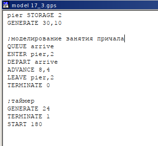{#fig:013 width=50%}

## Моделирование работы морского порта. Второй вариант модели

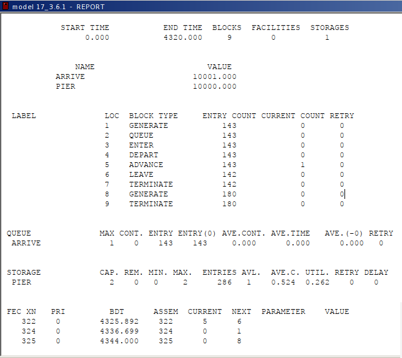{#fig:014 width=50%}

## Выводы

В результате выполнения данной лабораторной работы я реализовала с помощью gpss:

- модель работы вычислительного центра;
- модель работы аэропорта;
- модель работы морского порта.
